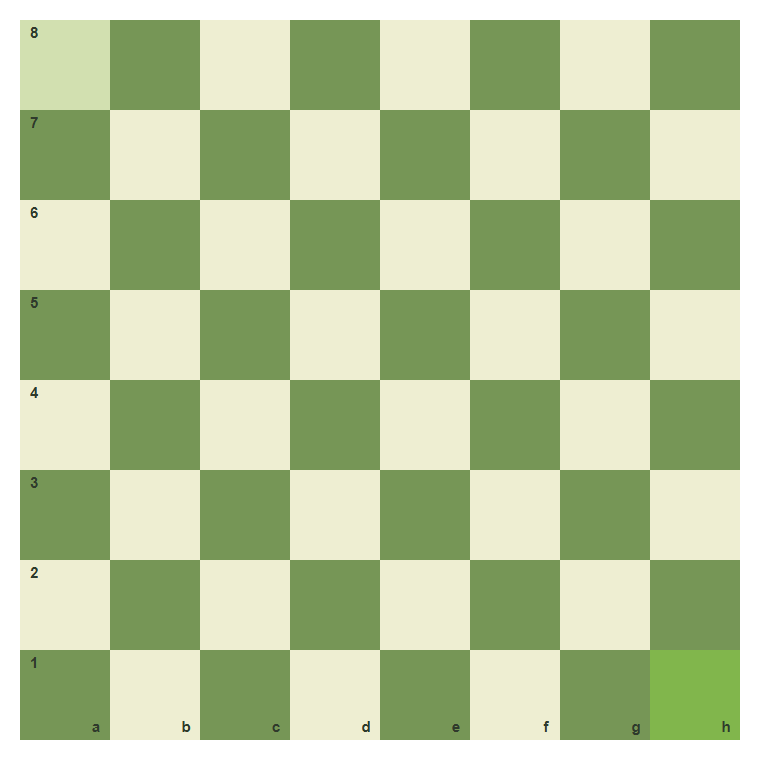
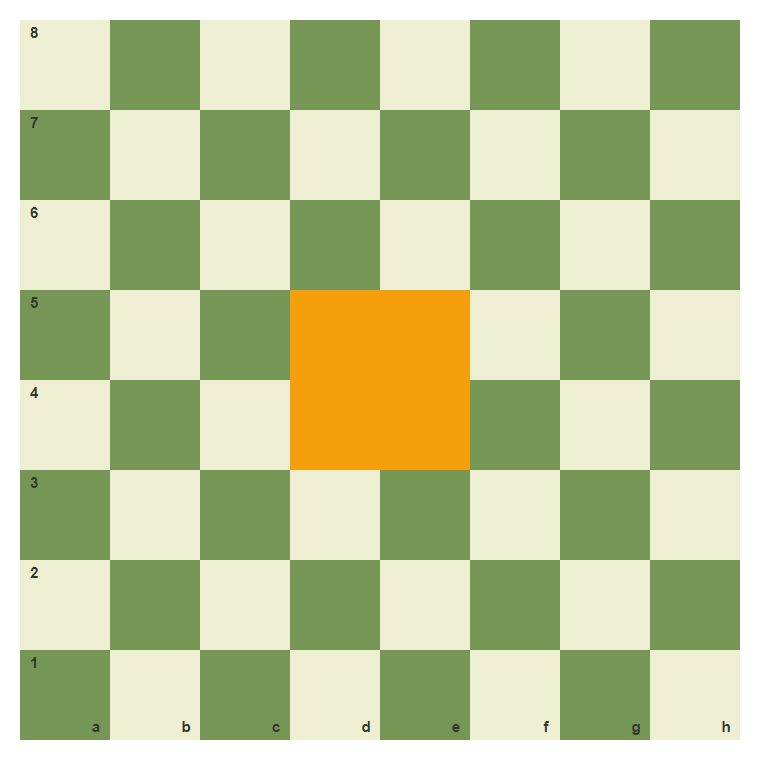
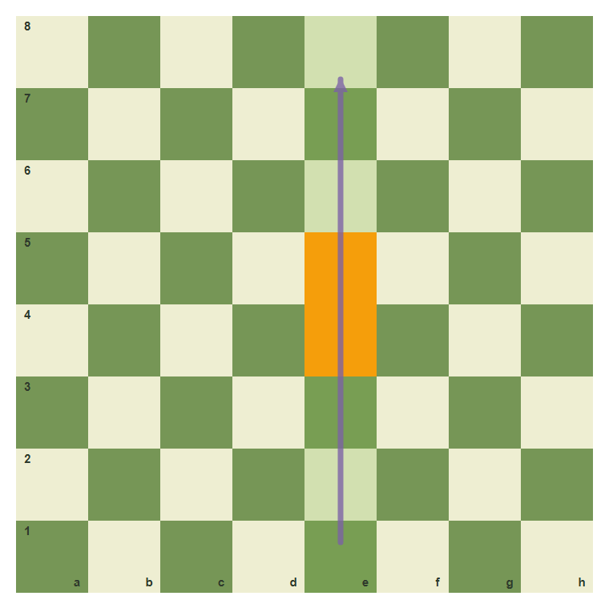
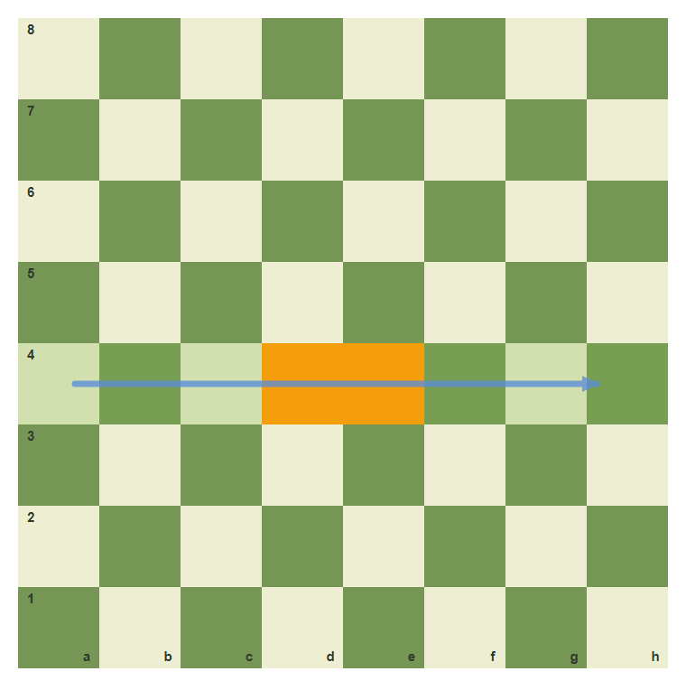
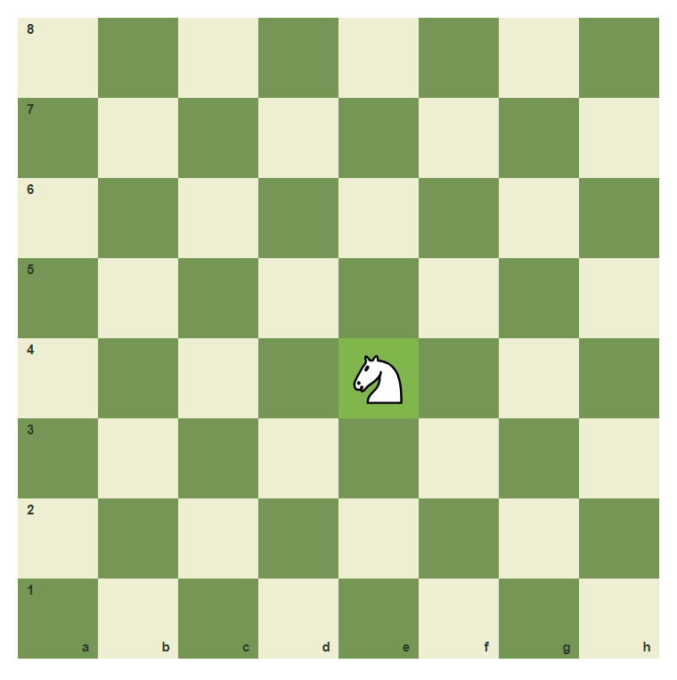
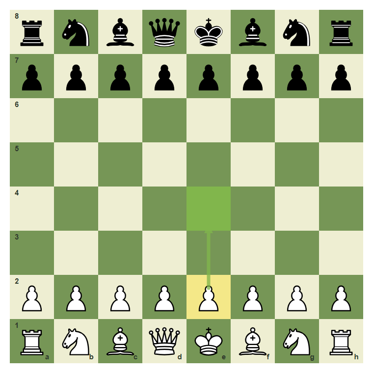
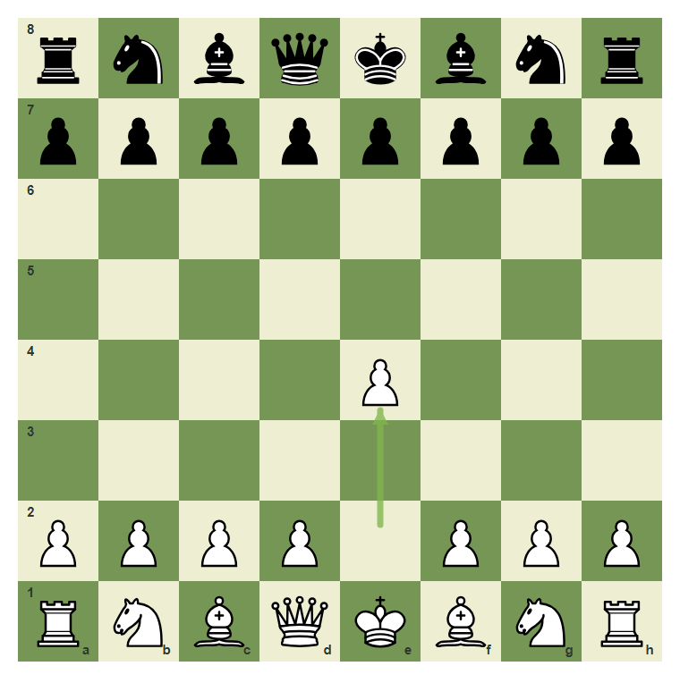
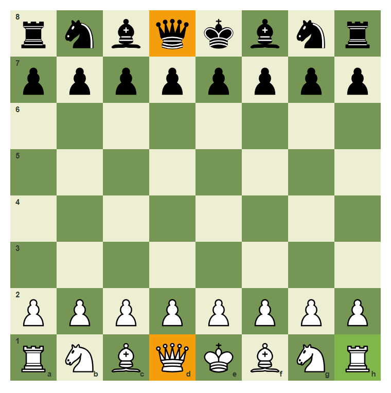

# Review Pack: Board Coordinates And The First Map

Book: The First Chessboard
Chapter: 01-board-coordinates
Source: ../../../chess-frontend/src/data/ebooks/v2/beginner-board-rules/chapters/01-board-coordinates.json
Generated: 2026-05-05T07:36:03.630Z
Status: PASS - deterministic checks clean

## Chapter Intent

ELO range: 0-300
Required tier: free
Estimated minutes: 18

Learning objectives:
- Recognize the correct board orientation.
- Name files, ranks, and coordinates.
- Read a move as from-square to to-square.
- Play 1.e4 from the starting position.

## Quality Gates

| Gate | Result | Detail |
| --- | --- | --- |
| Sections | PASS | 4 |
| Total blocks | PASS | 15 |
| Board-like blocks | PASS | 9 |
| Generated PNG exports | PASS | 8 |
| Interactive/check blocks | PASS | 4 |
| Deterministic warnings | PASS | 0 |
| minimum_board_diagrams >= 5 | PASS | 6 board_diagram block(s) |
| minimum_guided_moves >= 1 | PASS | 1 guided_move block(s) |
| minimum_quizzes >= 2 | PASS | 3 quiz block(s) |
| tier_allowed <= free | PASS | chapter tier is free |

## Block Review

### b01-c01-p01 - prose

Section: The Board Is A Map
Type: prose

Text under review:

```text
A chessboard is not only 64 squares. It is a map. Strong players do not say "move this pawn up two." They say **e2 to e4** because the square names let everyone see the same position in their mind.

In this chapter, you will learn the board language that every later lesson will use.
```

Reviewer flags: none from deterministic checks.

### b01-c01-d01 - The empty board

Section: The Board Is A Map
Type: board_diagram
FEN: `8/8/8/8/8/8/8/8 w - - 0 1`
Orientation: white
Arrows: none
Highlights: h1 (best), a8 (safe)
Assertions: highlight_exists h1
Text square claims: h1
Text move claims: none
Visual square evidence: h1, a8



PNG hash: `8e15916fb28f316a7d4626a173e86dd691102f2d3f10f5e703a93a68c13acc26`

Text under review:

```text
The empty board
Correct setup starts with a light square on White's bottom-right corner: h1.
```

Reviewer flags: none from deterministic checks.

### b01-c01-d02 - The four center squares

Section: The Board Is A Map
Type: board_diagram
FEN: `8/8/8/8/8/8/8/8 w - - 0 1`
Orientation: white
Arrows: none
Highlights: d4 (target), e4 (target), d5 (target), e5 (target)
Assertions: highlight_exists d4, highlight_exists e4, highlight_exists d5, highlight_exists e5
Text square claims: d4, e4, d5, e5
Text move claims: none
Visual square evidence: d4, e4, d5, e5



PNG hash: `4fe065eb857e45fcbbb1b94bb3926b26414fdd827b565fa8d4e4e7017d19fe51`

Text under review:

```text
The four center squares
The center squares d4, e4, d5, and e5 are marked because later your pieces will fight for them.
```

Reviewer flags: none from deterministic checks.

### b01-c01-p02 - prose

Section: Files, Ranks, And Square Names
Type: prose

Text under review:

```text
The vertical columns are **files**. They are named a through h from White's left to White's right.

The horizontal rows are **ranks**. They are numbered 1 through 8 from White's side toward Black's side.

A square name is file plus rank. The square **e4** means the e-file and the 4th rank.
```

Reviewer flags: none from deterministic checks.

### b01-c01-d03 - The e-file

Section: Files, Ranks, And Square Names
Type: board_diagram
FEN: `8/8/8/8/8/8/8/8 w - - 0 1`
Orientation: white
Arrows: e1-e8 (candidate)
Highlights: e1 (safe), e2 (safe), e3 (safe), e4 (target), e5 (target), e6 (safe), e7 (safe), e8 (safe)
Assertions: highlight_exists e4, arrow_exists e1-e8
Text square claims: e1, e2, e3
Text move claims: none
Visual square evidence: e1, e2, e3, e4, e5, e6, e7, e8



PNG hash: `8a7bb6d9d9a3a84e341de222033515111791d9d32201475f81a291aed5a46abf`

Text under review:

```text
The e-file
Every square in this column starts with e: e1, e2, e3, and so on.
```

Reviewer flags: none from deterministic checks.

### b01-c01-d04 - The 4th rank

Section: Files, Ranks, And Square Names
Type: board_diagram
FEN: `8/8/8/8/8/8/8/8 w - - 0 1`
Orientation: white
Arrows: a4-h4 (capture)
Highlights: a4 (safe), b4 (safe), c4 (safe), d4 (target), e4 (target), f4 (safe), g4 (safe), h4 (safe)
Assertions: highlight_exists d4, arrow_exists a4-h4
Text square claims: a4, b4, c4, d4, e4, f4, g4, h4
Text move claims: none
Visual square evidence: a4, b4, c4, d4, e4, f4, g4, h4



PNG hash: `0b74c517314927bccd3bf342c4f53b60fd608ff0958d28591d2d780561c13fd2`

Text under review:

```text
The 4th rank
Every square in this row ends with 4: a4, b4, c4, d4, e4, f4, g4, h4.
```

Reviewer flags: none from deterministic checks.

### b01-c01-d05 - A piece on e4

Section: Files, Ranks, And Square Names
Type: board_diagram
FEN: `8/8/8/8/4N3/8/8/8 w - - 0 1`
Orientation: white
Arrows: none
Highlights: e4 (best)
Assertions: piece_on white_knight e4, highlight_exists e4
Text square claims: e4
Text move claims: none
Visual square evidence: e4



PNG hash: `41cae0011629d50cbddb3111af6967f0d117cf568405e422905cd7290600085c`

Text under review:

```text
A piece on e4
The knight is on e4: e-file, 4th rank. Say it aloud before moving on.
```

Reviewer flags: none from deterministic checks.

### b01-c01-p03 - prose

Section: A Move Has Two Squares
Type: prose

Text under review:

```text
A written move often starts with two coordinates: the square the piece leaves and the square it lands on.

For example, **e2e4** means: take the piece on e2 and move it to e4. In a normal starting position, that piece is White's king pawn.
```

Reviewer flags: none from deterministic checks.

### b01-c01-d06 - Before 1.e4

Section: A Move Has Two Squares
Type: board_diagram
FEN: `rnbqkbnr/pppppppp/8/8/8/8/PPPPPPPP/RNBQKBNR w KQkq - 0 1`
Orientation: white
Arrows: e2-e4 (best)
Highlights: e2 (lastMove), e4 (best)
Assertions: side_to_move white, piece_on white_pawn e2, legal_move e2e4
Text square claims: e4, e2
Text move claims: none
Visual square evidence: a8, b8, c8, d8, e8, f8, g8, h8, a7, b7, c7, d7, e7, f7, g7, h7, a2, b2, c2, d2, e2, f2, g2, h2, a1, b1, c1, d1, e1, f1, g1, h1, e4



PNG hash: `cab16a7b8d27fb4b3f61ccfdd13a34adc4a7038d861a7844e4d9f9ced2de36ba`

Text under review:

```text
Before 1.e4
The arrow shows the pawn's first move: e2 to e4.
```

Reviewer flags: none from deterministic checks.

### b01-c01-g01 - Play e2 to e4

Section: A Move Has Two Squares
Type: guided_move
FEN: `rnbqkbnr/pppppppp/8/8/8/8/PPPPPPPP/RNBQKBNR w KQkq - 0 1`
Orientation: white
Arrows: e2-e4 (best)
Highlights: e2 (lastMove), e4 (best)
Assertions: legal_move e2e4
Text square claims: e2, e4
Text move claims: none
Visual square evidence: a8, b8, c8, d8, e8, f8, g8, h8, a7, b7, c7, d7, e7, f7, g7, h7, a2, b2, c2, d2, e2, f2, g2, h2, a1, b1, c1, d1, e1, f1, g1, h1, e4

Text under review:

```text
Play e2 to e4
Move the pawn from e2 to e4. Use the coordinates, not guesswork.
Correct. You read a move as from-square to to-square.
Use the e-file pawn and land on e4.
```

Reviewer flags: none from deterministic checks.

### b01-c01-a01 - The board after 1.e4

Section: A Move Has Two Squares
Type: board_animation
FEN: `rnbqkbnr/pppppppp/8/8/8/8/PPPPPPPP/RNBQKBNR w KQkq - 0 1`
Orientation: white
Arrows: e2-e4 (best), e2-e4 (best)
Highlights: none
Assertions: legal_move e2e4
Text square claims: e4, e2
Text move claims: e2e4
Visual square evidence: a8, b8, c8, d8, e8, f8, g8, h8, a7, b7, c7, d7, e7, f7, g7, h7, e4, a2, b2, c2, d2, f2, g2, h2, a1, b1, c1, d1, e1, f1, g1, h1, e2



PNG hash: `246d262d03f9a9e61a2e06fec5ba00b4cd579bee166f6495298cc875b9831bad`

Text under review:

```text
The board after 1.e4
After e2e4, the pawn leaves e2 and stands on e4. The move also opens lines for White's queen and bishop.
```

Reviewer flags: none from deterministic checks.

### b01-c01-m01 - Wrong board orientation ruins every square name

Section: Common Mistake: Trusting The Picture, Not The Coordinates
Type: mistake_refutation
FEN: `rnbqkbnr/pppppppp/8/8/8/8/PPPPPPPP/RNBQKBNR w KQkq - 0 1`
Orientation: white
Arrows: none
Highlights: h1 (best), d1 (target), d8 (target)
Assertions: piece_on white_rook h1, piece_on white_queen d1, piece_on black_queen d8
Text square claims: d1, d8, h1
Text move claims: none
Visual square evidence: a8, b8, c8, d8, e8, f8, g8, h8, a7, b7, c7, d7, e7, f7, g7, h7, a2, b2, c2, d2, e2, f2, g2, h2, a1, b1, c1, d1, e1, f1, g1, h1



PNG hash: `eb94c09513cedf2553070d22aabf9e0d0bfb1af59c14190d3331c346148cb9b1`

Text under review:

```text
Wrong board orientation ruins every square name
If the board is rotated incorrectly in real life, every coordinate becomes unreliable. The simple check is: **light square on the right** for White. Then queens start on their own color: White queen on d1, Black queen on d8.
h1 is the orientation check. d1 and d8 show the queen-on-own-color rule.
```

Reviewer flags: none from deterministic checks.

### b01-c01-q01 - Checkpoint: name the square

Section: Common Mistake: Trusting The Picture, Not The Coordinates
Type: quiz

Text under review:

```text
Checkpoint: name the square
A knight is placed on the e-file and the 4th rank. What square is it on?
Good. You can now read a basic coordinate.
```

Quiz options:
- [wrong] a: d4
- [correct] b: e4
- [wrong] c: 4e

Reviewer flags: none from deterministic checks.

### b01-c01-q02 - Which square is White's bottom-right corner?

Section: Chapter Checkpoint
Type: quiz

Text under review:

```text
Which square is White's bottom-right corner?
With White at the bottom, the bottom-right corner is:
```

Quiz options:
- [wrong] a: a1
- [correct] b: h1
- [wrong] c: h8

Reviewer flags: none from deterministic checks.

### b01-c01-q03 - How do you read e2e4?

Section: Chapter Checkpoint
Type: quiz

Text under review:

```text
How do you read e2e4?
The move e2e4 means:
```

Quiz options:
- [correct] a: Move from e2 to e4
- [wrong] b: Move from e4 to e2
- [wrong] c: Move any pawn two squares

Reviewer flags: none from deterministic checks.

## Human Signoff

- Chess analyst: pending
- Visual reviewer: pending
- Pedagogy reviewer: pending
- Final editor: pending
