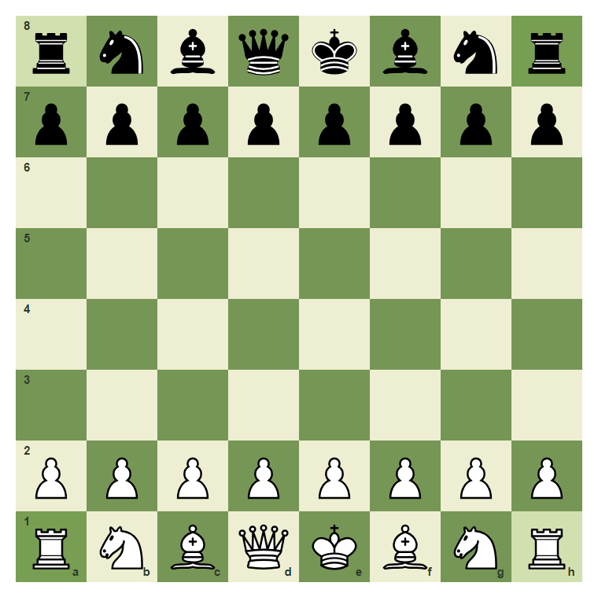
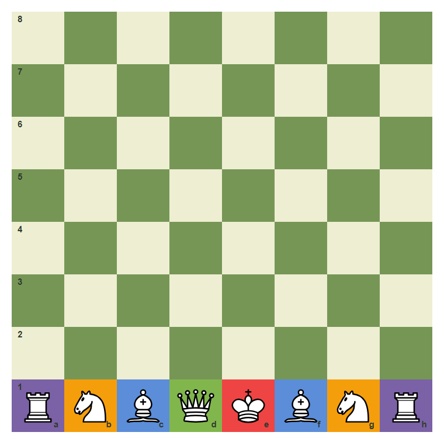
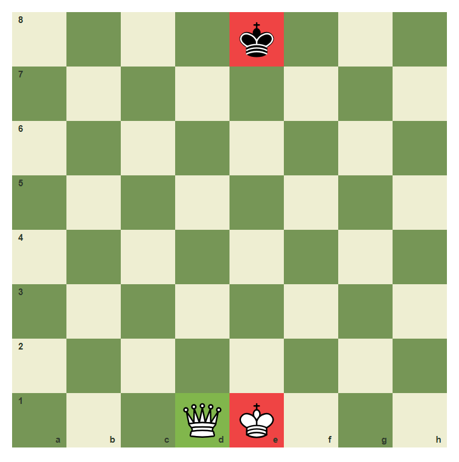
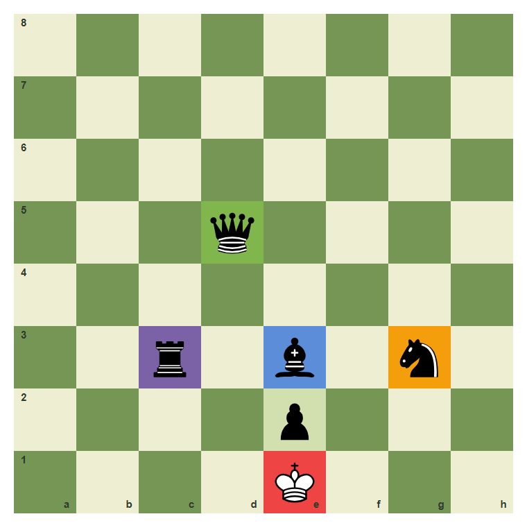
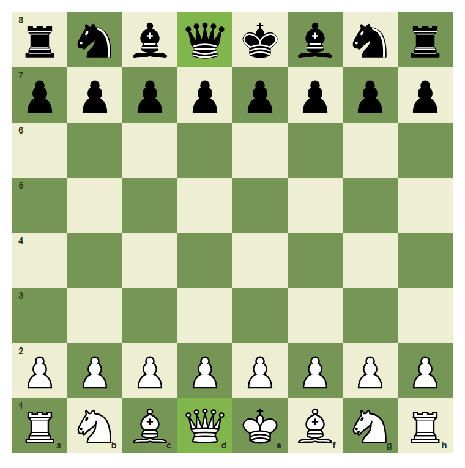
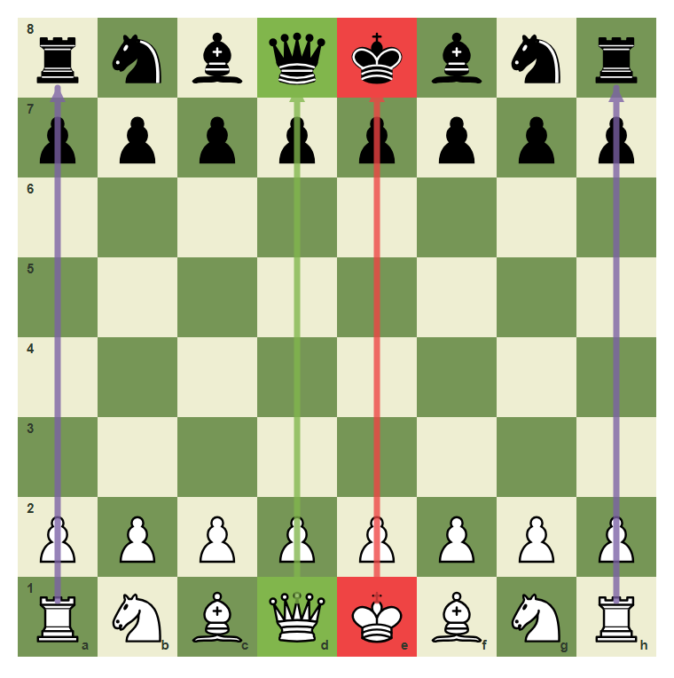
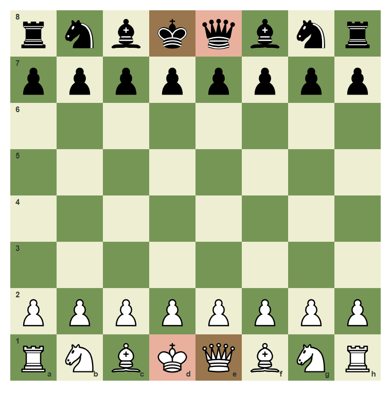
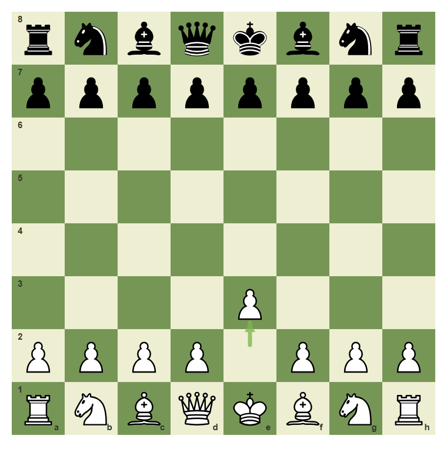

# Review Pack: Pieces, Values, And Setup

Book: The First Chessboard
Chapter: 02-pieces-values-setup
Source: ../../../chess-frontend/src/data/ebooks/v2/beginner-board-rules/chapters/02-pieces-values-setup.json
Generated: 2026-05-05T07:36:03.636Z
Status: PASS - deterministic checks clean

## Chapter Intent

ELO range: 0-300
Required tier: free
Estimated minutes: 22

Learning objectives:
- Name all six chess pieces.
- Set up White and Black correctly from the starting position.
- Use the queen-on-own-color rule.
- Remember simple material values without pricing the king.
- Identify and move White's e-pawn from the starting position.

## Quality Gates

| Gate | Result | Detail |
| --- | --- | --- |
| Sections | PASS | 4 |
| Total blocks | PASS | 18 |
| Board-like blocks | PASS | 10 |
| Generated PNG exports | PASS | 9 |
| Interactive/check blocks | PASS | 5 |
| Deterministic warnings | PASS | 0 |
| minimum_board_diagrams >= 7 | PASS | 7 board_diagram block(s) |
| minimum_guided_moves >= 1 | PASS | 1 guided_move block(s) |
| minimum_quizzes >= 3 | PASS | 4 quiz block(s) |
| tier_allowed <= free | PASS | chapter tier is free |

## Block Review

### b01-c02-p01 - prose

Section: The Two Armies
Type: prose

Text under review:

```text
Chess begins with two equal armies. White starts on the 1st and 2nd ranks. Black starts on the 8th and 7th ranks.

Each side has one king, one queen, two rooks, two bishops, two knights, and eight pawns.
```

Reviewer flags: none from deterministic checks.

### b01-c02-d01 - The starting position

Section: The Two Armies
Type: board_diagram
FEN: `rnbqkbnr/pppppppp/8/8/8/8/PPPPPPPP/RNBQKBNR w KQkq - 0 1`
Orientation: white
Arrows: none
Highlights: a1 (safe), h1 (safe), a8 (safe), h8 (safe)
Assertions: piece_on white_king e1, piece_on black_king e8, piece_on white_rook a1, piece_on black_rook h8
Text square claims: none
Text move claims: none
Visual square evidence: a8, b8, c8, d8, e8, f8, g8, h8, a7, b7, c7, d7, e7, f7, g7, h7, a2, b2, c2, d2, e2, f2, g2, h2, a1, b1, c1, d1, e1, f1, g1, h1



PNG hash: `c5ca68f484c9bae968c8663233c6361cd7e8ee2784f52a8e51bd8102a8473b5b`

Text under review:

```text
The starting position
This is the complete starting position: White pieces on ranks 1 and 2, Black pieces on ranks 8 and 7.
```

Reviewer flags: none from deterministic checks.

### b01-c02-d02 - White's back rank

Section: The Two Armies
Type: board_diagram
FEN: `8/8/8/8/8/8/8/RNBQKBNR w - - 0 1`
Orientation: white
Arrows: none
Highlights: a1 (candidate), b1 (target), c1 (capture), d1 (best), e1 (check), f1 (capture), g1 (target), h1 (candidate)
Assertions: piece_on white_rook a1, piece_on white_knight b1, piece_on white_bishop c1, piece_on white_queen d1, piece_on white_king e1, piece_on white_bishop f1, piece_on white_knight g1, piece_on white_rook h1
Text square claims: a1, h1
Text move claims: none
Visual square evidence: a1, b1, c1, d1, e1, f1, g1, h1



PNG hash: `7d6632444cab7e724b5e7cb045346f0ccef90cec925ad3d688735e3d6ab20711`

Text under review:

```text
White's back rank
From a1 to h1: rook, knight, bishop, queen, king, bishop, knight, rook.
```

Reviewer flags: none from deterministic checks.

### b01-c02-p02 - prose

Section: Piece Names And Simple Values
Type: prose

Text under review:

```text
The king is the most important piece because losing the king means losing the game. Do not give the king a point value.

For simple counting, use this first material scale: queen 9, rook 5, bishop 3, knight 3, pawn 1. These numbers are not the whole story, but they help you notice when a trade is obviously good or bad.
```

Reviewer flags: none from deterministic checks.

### b01-c02-d03 - The royal pieces

Section: Piece Names And Simple Values
Type: board_diagram
FEN: `4k3/8/8/8/8/8/8/3QK3 w - - 0 1`
Orientation: white
Arrows: none
Highlights: e1 (check), d1 (best), e8 (check)
Assertions: piece_on white_king e1, piece_on white_queen d1, piece_on black_king e8
Text square claims: e1, e8, d1
Text move claims: none
Visual square evidence: e8, d1, e1



PNG hash: `5b123692054c55a463d3f28370eba29a96db5e3bfe4b270257e42795be0ae2dc`

Text under review:

```text
The royal pieces
The kings are on e1 and e8 in a normal setup. White's queen begins on d1.
```

Reviewer flags: none from deterministic checks.

### b01-c02-d04 - A first material scale

Section: Piece Names And Simple Values
Type: board_diagram
FEN: `8/8/8/3q4/8/2r1b1n1/4p3/4K3 w - - 0 1`
Orientation: white
Arrows: none
Highlights: d5 (best), c3 (candidate), e3 (capture), g3 (target), e2 (safe), e1 (check)
Assertions: piece_on black_queen d5, piece_on black_rook c3, piece_on black_bishop e3, piece_on black_knight g3, piece_on black_pawn e2, piece_on white_king e1
Text square claims: d5, c3, e3, g3, e2, e1
Text move claims: none
Visual square evidence: d5, c3, e3, g3, e2, e1



PNG hash: `63d4dd8728cdfd3860f1dd2ab1e193ad409b59aa7b2209e743426591fc7cd5d7`

Text under review:

```text
A first material scale
Queen on d5 is 9, rook on c3 is 5, bishop on e3 is 3, knight on g3 is 3, pawn on e2 is 1, and king on e1 is priceless.
```

Reviewer flags: none from deterministic checks.

### b01-c02-p03 - prose

Section: The Setup Rules That Prevent Mistakes
Type: prose

Text under review:

```text
The fastest setup check is the queen rule: queen on her own color. The White queen starts on the light square d1. The Black queen starts on the dark square d8.

After the queen and king are correct, the bishops stand beside them, the knights stand beside the bishops, and the rooks go in the corners.
```

Reviewer flags: none from deterministic checks.

### b01-c02-d05 - Queen on her own color

Section: The Setup Rules That Prevent Mistakes
Type: board_diagram
FEN: `rnbqkbnr/pppppppp/8/8/8/8/PPPPPPPP/RNBQKBNR w KQkq - 0 1`
Orientation: white
Arrows: none
Highlights: d1 (best), d8 (best)
Assertions: piece_on white_queen d1, piece_on black_queen d8, highlight_exists d1, highlight_exists d8
Text square claims: d1, d8
Text move claims: none
Visual square evidence: a8, b8, c8, d8, e8, f8, g8, h8, a7, b7, c7, d7, e7, f7, g7, h7, a2, b2, c2, d2, e2, f2, g2, h2, a1, b1, c1, d1, e1, f1, g1, h1



PNG hash: `c3387818914dcfeb6f9d6347f01a41efb33267a7e89686be6099e3016be8e457`

Text under review:

```text
Queen on her own color
White queen on d1, Black queen on d8. Queen on her own color fixes the center of the back rank.
```

Reviewer flags: none from deterministic checks.

### b01-c02-d06 - The armies mirror each other

Section: The Setup Rules That Prevent Mistakes
Type: board_diagram
FEN: `rnbqkbnr/pppppppp/8/8/8/8/PPPPPPPP/RNBQKBNR w KQkq - 0 1`
Orientation: white
Arrows: d1-d8 (best), e1-e8 (check), a1-a8 (candidate), h1-h8 (candidate)
Highlights: d1 (best), d8 (best), e1 (check), e8 (check)
Assertions: piece_on white_queen d1, piece_on black_queen d8, piece_on white_king e1, piece_on black_king e8, arrow_exists d1-d8, arrow_exists e1-e8
Text square claims: none
Text move claims: none
Visual square evidence: a8, b8, c8, d8, e8, f8, g8, h8, a7, b7, c7, d7, e7, f7, g7, h7, a2, b2, c2, d2, e2, f2, g2, h2, a1, b1, c1, d1, e1, f1, g1, h1



PNG hash: `cf55e76d7f81e0efa450e47aa7043ed4ca9615461583dda3ef426d1a8801e480`

Text under review:

```text
The armies mirror each other
White and Black mirror each other: queens face queens on the d-file, kings face kings on the e-file, and rooks sit in the corners.
```

Reviewer flags: none from deterministic checks.

### b01-c02-m01 - Common mistake: swapping king and queen

Section: The Setup Rules That Prevent Mistakes
Type: mistake_refutation
FEN: `rnbkqbnr/pppppppp/8/8/8/8/PPPPPPPP/RNBKQBNR w - - 0 1`
Orientation: white
Arrows: none
Highlights: d1 (wrong), e1 (wrong), d8 (wrong), e8 (wrong)
Assertions: piece_on white_king d1, piece_on white_queen e1, piece_on black_king d8, piece_on black_queen e8
Text square claims: e1, d1, e8, d8
Text move claims: none
Visual square evidence: a8, b8, c8, d8, e8, f8, g8, h8, a7, b7, c7, d7, e7, f7, g7, h7, a2, b2, c2, d2, e2, f2, g2, h2, a1, b1, c1, d1, e1, f1, g1, h1



PNG hash: `1ec6274509eb81425a6fe6579036ee97ba3575b529e072c88de63cccd7674c9d`

Text under review:

```text
Common mistake: swapping king and queen
This setup looks close, but both queens and kings are swapped. White's queen has been put on e1 instead of d1. Black's queen has been put on e8 instead of d8.

Fix it by returning each queen to her own color.
The wrong setup places White queen on e1 and Black queen on e8. Both queens should be on the d-file.
```

Reviewer flags: none from deterministic checks.

### b01-c02-p04 - prose

Section: Identify A Piece, Then Move It
Type: prose

Text under review:

```text
When you know the setup, you can name a piece by its square. The piece on e2 at the start is White's e-pawn.

In the next board, move only that pawn one square forward to e3. The goal is not speed; the goal is matching the piece name, square name, and move.
```

Reviewer flags: none from deterministic checks.

### b01-c02-d07 - Find White's e-pawn

Section: Identify A Piece, Then Move It
Type: board_diagram
FEN: `rnbqkbnr/pppppppp/8/8/8/8/PPPPPPPP/RNBQKBNR w KQkq - 0 1`
Orientation: white
Arrows: e2-e3 (best)
Highlights: e2 (lastMove), e3 (best)
Assertions: side_to_move white, piece_on white_pawn e2, legal_move e2e3, arrow_exists e2-e3
Text square claims: e2, e3
Text move claims: none
Visual square evidence: a8, b8, c8, d8, e8, f8, g8, h8, a7, b7, c7, d7, e7, f7, g7, h7, a2, b2, c2, d2, e2, f2, g2, h2, a1, b1, c1, d1, e1, f1, g1, h1, e3


PNG hash: `955e0ec932f5663f41583b7995ea4e1814f67cb4896bdf4abbb23a94df7e1ee3`

Text under review:

```text
Find White's e-pawn
The e-pawn starts on e2. The arrow shows e2 to e3.
```

Reviewer flags: none from deterministic checks.

### b01-c02-g01 - Move the e-pawn to e3

Section: Identify A Piece, Then Move It
Type: guided_move
FEN: `rnbqkbnr/pppppppp/8/8/8/8/PPPPPPPP/RNBQKBNR w KQkq - 0 1`
Orientation: white
Arrows: e2-e3 (best)
Highlights: e2 (lastMove), e3 (best)
Assertions: legal_move e2e3, piece_on white_pawn e2
Text square claims: e3, e2
Text move claims: none
Visual square evidence: a8, b8, c8, d8, e8, f8, g8, h8, a7, b7, c7, d7, e7, f7, g7, h7, a2, b2, c2, d2, e2, f2, g2, h2, a1, b1, c1, d1, e1, f1, g1, h1, e3

Text under review:

```text
Move the e-pawn to e3
Move White's e-pawn from e2 to e3.
Correct. You identified the e-pawn and moved it to e3.
Use the pawn on e2 and move it to e3.
```

Reviewer flags: none from deterministic checks.

### b01-c02-a01 - After e2 to e3

Section: Identify A Piece, Then Move It
Type: board_animation
FEN: `rnbqkbnr/pppppppp/8/8/8/8/PPPPPPPP/RNBQKBNR w KQkq - 0 1`
Orientation: white
Arrows: e2-e3 (best), e2-e3 (best)
Highlights: none
Assertions: legal_move e2e3, piece_on white_pawn e2
Text square claims: e2, e3
Text move claims: e2e3
Visual square evidence: a8, b8, c8, d8, e8, f8, g8, h8, a7, b7, c7, d7, e7, f7, g7, h7, e3, a2, b2, c2, d2, f2, g2, h2, a1, b1, c1, d1, e1, f1, g1, h1, e2



PNG hash: `28716f42b91007bb1fdb530c4a7555fe1d59ff43eb50d0ce01279e9f71f73104`

Text under review:

```text
After e2 to e3
After e2e3, the pawn leaves e2 and stands on e3.
```

Reviewer flags: none from deterministic checks.

### b01-c02-q01 - Quick check: what moved?

Section: Identify A Piece, Then Move It
Type: quiz

Text under review:

```text
Quick check: what moved?
In the move e2e3, which piece moved?
Good. Setup knowledge now connects to a legal move.
```

Quiz options:
- [correct] a: White's e-pawn
- [wrong] b: White's queen
- [wrong] c: Black's e-pawn

Reviewer flags: none from deterministic checks.

### b01-c02-q02 - Where does White's queen start?

Section: Chapter Checkpoint
Type: quiz

Text under review:

```text
Where does White's queen start?
In the correct starting setup, White's queen begins on:
```

Quiz options:
- [correct] a: d1
- [wrong] b: e1
- [wrong] c: d8

Reviewer flags: none from deterministic checks.

### b01-c02-q03 - Which piece is priceless?

Section: Chapter Checkpoint
Type: quiz

Text under review:

```text
Which piece is priceless?
Which piece should not be assigned a normal material point value?
```

Quiz options:
- [correct] a: King
- [wrong] b: Queen
- [wrong] c: Rook

Reviewer flags: none from deterministic checks.

### b01-c02-q04 - What are the corner pieces?

Section: Chapter Checkpoint
Type: quiz

Text under review:

```text
What are the corner pieces?
At the start of the game, the pieces in the four corners are:
```

Quiz options:
- [correct] a: Rooks
- [wrong] b: Knights
- [wrong] c: Bishops

Reviewer flags: none from deterministic checks.

## Human Signoff

- Chess analyst: pending
- Visual reviewer: pending
- Pedagogy reviewer: pending
- Final editor: pending
