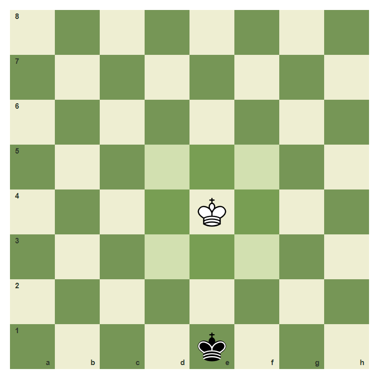
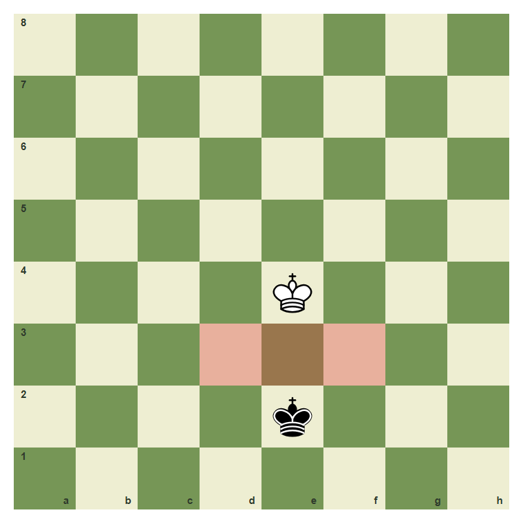
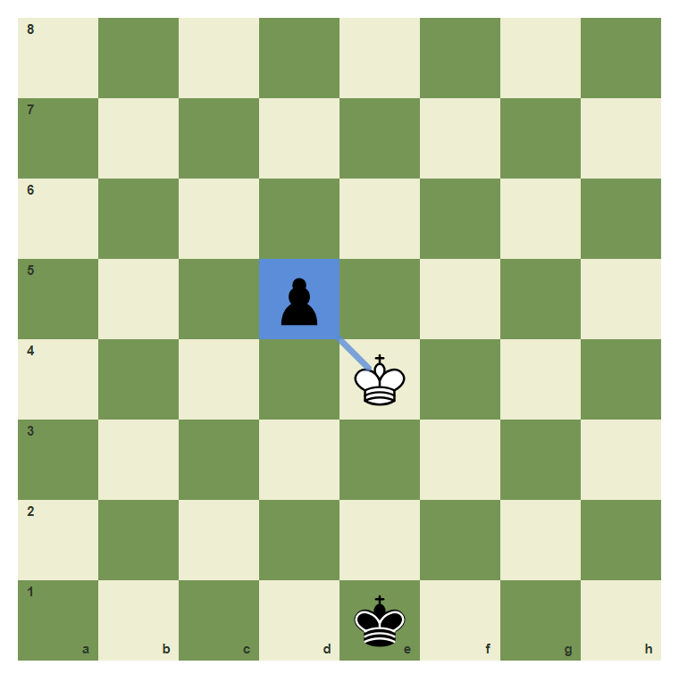
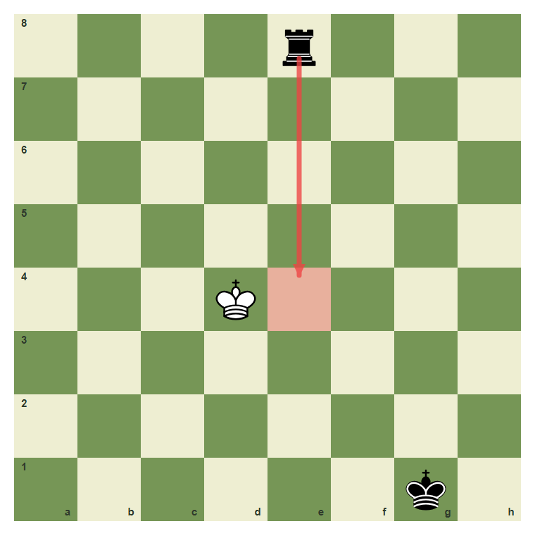
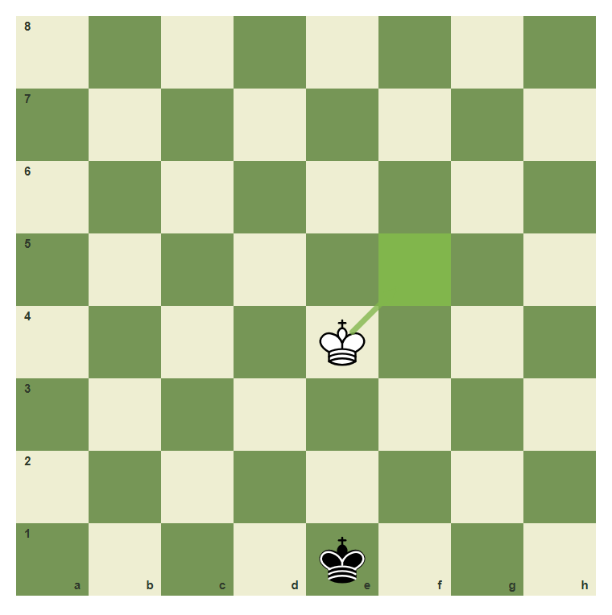

# Review Pack: The King And The Goal

Book: The First Chessboard
Chapter: 03-king-and-goal
Source: ../../../chess-frontend/src/data/ebooks/v2/beginner-board-rules/chapters/03-king-and-goal.json
Generated: 2026-05-05T07:36:03.641Z
Status: PASS - deterministic checks clean

## Chapter Intent

ELO range: 0-300
Required tier: free
Estimated minutes: 24

Learning objectives:
- Move the king one square in any direction.
- Know that kings may never stand next to each other.
- Understand that the king may not move into danger.
- Explain why the king is never traded or captured.

## Quality Gates

| Gate | Result | Detail |
| --- | --- | --- |
| Sections | PASS | 3 |
| Total blocks | PASS | 12 |
| Board-like blocks | PASS | 7 |
| Generated PNG exports | PASS | 6 |
| Interactive/check blocks | PASS | 4 |
| Deterministic warnings | PASS | 0 |
| minimum_board_diagrams >= 5 | PASS | 5 board_diagram block(s) |
| minimum_guided_moves >= 1 | PASS | 1 guided_move block(s) |
| minimum_quizzes >= 3 | PASS | 3 quiz block(s) |
| tier_allowed <= free | PASS | chapter tier is free |

## Block Review

### b01-c03-p01 - prose

Section: The King Is The Game
Type: prose

Text under review:

```text
Every piece can be traded except the king. You do not win by taking the king off the board. You win by attacking the king so strongly that there is no legal escape. That final position is checkmate.
```

Reviewer flags: none from deterministic checks.

### b01-c03-d01 - The king moves one square

Section: The King Is The Game
Type: board_diagram
FEN: `8/8/8/8/4K3/8/8/4k3 w - - 0 1`
Orientation: white
Arrows: none
Highlights: d5 (safe), e5 (safe), f5 (safe), d4 (safe), f4 (safe), d3 (safe), e3 (safe), f3 (safe)
Assertions: piece_on white_king e4, highlight_exists f5, highlight_exists d3
Text square claims: e4
Text move claims: none
Visual square evidence: e4, e1, d5, e5, f5, d4, f4, d3, e3, f3



PNG hash: `3b3267d7087d19eb8888c1e22871428280407dec226b0b8cd99a74bd14cbadf5`

Text under review:

```text
The king moves one square
From e4, the king can step to any adjacent highlighted square if that square is safe.
```

Reviewer flags: none from deterministic checks.

### b01-c03-d02 - Kings cannot touch

Section: The King Is The Game
Type: board_diagram
FEN: `8/8/8/8/4K3/8/4k3/8 w - - 0 1`
Orientation: white
Arrows: none
Highlights: e3 (wrong), d3 (wrong), f3 (wrong)
Assertions: piece_on white_king e4, piece_on black_king e2, highlight_exists e3
Text square claims: none
Text move claims: none
Visual square evidence: e4, e2, e3, d3, f3



PNG hash: `c380781c2c60592c6e903bb1909ba1f0d61a0f7fd4eceb325f84e8c20f04dc6d`

Text under review:

```text
Kings cannot touch
The kings control the squares beside them. White may not move next to the black king.
```

Reviewer flags: none from deterministic checks.

### b01-c03-p02 - prose

Section: Safe Squares Matter
Type: prose

Text under review:

```text
A king move has two questions. First, does the king move one square? Second, is the landing square safe? A one-square move is still illegal if the king walks into an attack.
```

Reviewer flags: none from deterministic checks.

### b01-c03-d03 - The king can capture a loose piece

Section: Safe Squares Matter
Type: board_diagram
FEN: `8/8/8/3p4/4K3/8/8/4k3 w - - 0 1`
Orientation: white
Arrows: e4-d5 (capture)
Highlights: d5 (capture)
Assertions: piece_on white_king e4, piece_on black_pawn d5, legal_move e4d5
Text square claims: d5
Text move claims: none
Visual square evidence: d5, e4, e1



PNG hash: `3abceca38b6647e45bb21af6bdd4997b8b7d9fa806ec82e5563421f395d2286d`

Text under review:

```text
The king can capture a loose piece
If the pawn on d5 is not protected, the king may capture it by moving one square diagonally.
```

Reviewer flags: none from deterministic checks.

### b01-c03-d04 - A rook controls the e-file

Section: Safe Squares Matter
Type: board_diagram
FEN: `4r3/8/8/8/3K4/8/8/6k1 w - - 0 1`
Orientation: white
Arrows: e8-e4 (check)
Highlights: e4 (wrong)
Assertions: piece_on white_king d4, piece_on black_rook e8, arrow_exists e8-e4
Text square claims: e4, d4
Text move claims: none
Visual square evidence: e8, d4, g1, e4



PNG hash: `ea7d325c41b5233768b8846037aeb93044345e73e948388fbb64128556e4599f`

Text under review:

```text
A rook controls the e-file
The black rook controls e4, so the white king on d4 may not step onto e4.
```

Reviewer flags: none from deterministic checks.

### b01-c03-d05 - A safe king step

Section: Safe Squares Matter
Type: board_diagram
FEN: `8/8/8/8/4K3/8/8/4k3 w - - 0 1`
Orientation: white
Arrows: e4-f5 (best)
Highlights: f5 (best)
Assertions: piece_on white_king e4, legal_move e4f5, arrow_exists e4-f5
Text square claims: e4, f5
Text move claims: none
Visual square evidence: e4, e1, f5



PNG hash: `3c3510f645715336206dc044e24963028afcf8de73b0d7f0f56d4bee5b994f0b`

Text under review:

```text
A safe king step
e4 to f5 is a normal one-square king move in this position.
```

Reviewer flags: none from deterministic checks.

### b01-c03-g01 - Move the king to f5

Section: Safe Squares Matter
Type: guided_move
FEN: `8/8/8/8/4K3/8/8/4k3 w - - 0 1`
Orientation: white
Arrows: e4-f5 (best)
Highlights: e4 (lastMove), f5 (best)
Assertions: legal_move e4f5
Text square claims: f5, e4
Text move claims: none
Visual square evidence: e4, e1, f5

Text under review:

```text
Move the king to f5
Move the white king from e4 to f5.
Correct. A king may step one square diagonally when the square is safe.
The king starts on e4 and should land on f5.
```

Reviewer flags: none from deterministic checks.

### b01-c03-m01 - Common mistake: walking into attack

Section: Common Mistake
Type: mistake_refutation
FEN: `4r3/8/8/8/3K4/8/8/6k1 w - - 0 1`
Orientation: white
Arrows: d4-e4 (wrong), e8-e4 (check)
Highlights: e4 (wrong)
Assertions: piece_on white_king d4, piece_on black_rook e8, arrow_exists e8-e4
Text square claims: d4, e4, e8
Text move claims: none
Visual square evidence: e8, d4, g1, e4


PNG hash: `fc5a23d10252be0eb0695315108128d6ccdcb3e6441d3dec2f96a0dadf42d055`

Text under review:

```text
Common mistake: walking into attack
The move from d4 to e4 looks like a legal one-square move, but e4 is controlled by the rook on e8. A king move must satisfy both rules: one square and safe.
The red square is not safe. The rook already controls it.
```

Reviewer flags: none from deterministic checks.

### b01-c03-q01 - How far does a king move?

Section: Chapter Checkpoint
Type: quiz

Text under review:

```text
How far does a king move?
A king normally moves:
```

Quiz options:
- [correct] a: One square in any direction
- [wrong] b: Any number of squares in a straight line
- [wrong] c: Only forward

Reviewer flags: none from deterministic checks.

### b01-c03-q02 - Can kings stand next to each other?

Section: Chapter Checkpoint
Type: quiz

Text under review:

```text
Can kings stand next to each other?
Two kings may stand on adjacent squares:
```

Quiz options:
- [correct] a: No
- [wrong] b: Yes, if no other pieces are nearby
- [wrong] c: Only in the endgame

Reviewer flags: none from deterministic checks.

### b01-c03-q03 - What makes a king move illegal?

Section: Chapter Checkpoint
Type: quiz

Text under review:

```text
What makes a king move illegal?
A one-square king move is illegal when:
```

Quiz options:
- [correct] a: The landing square is attacked
- [wrong] b: The king moves diagonally
- [wrong] c: The king captures a piece

Reviewer flags: none from deterministic checks.

## Human Signoff

- Chess analyst: pending
- Visual reviewer: pending
- Pedagogy reviewer: pending
- Final editor: pending
