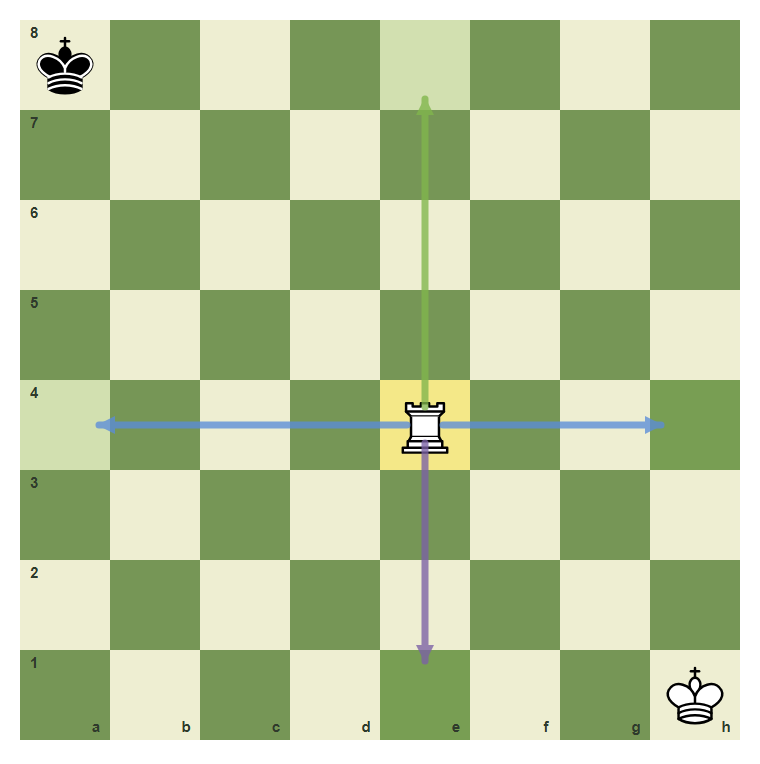
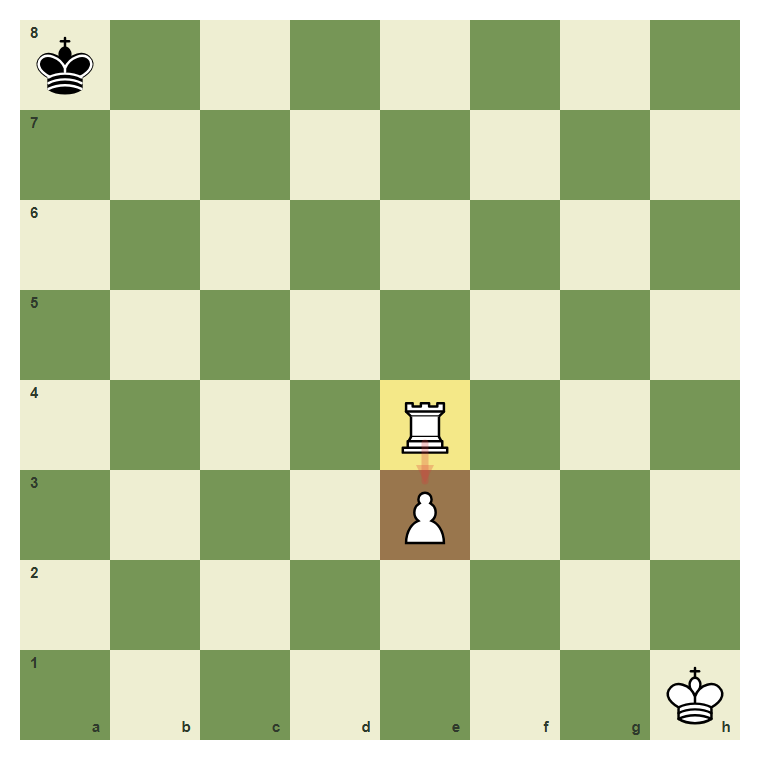
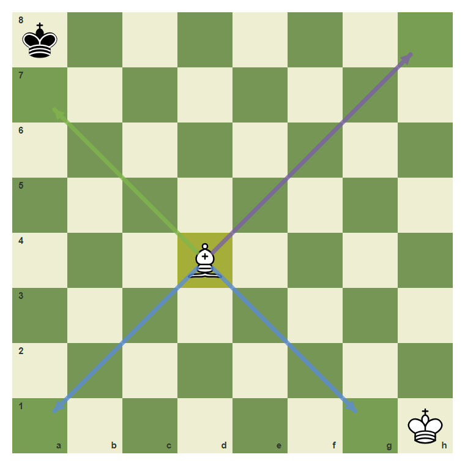
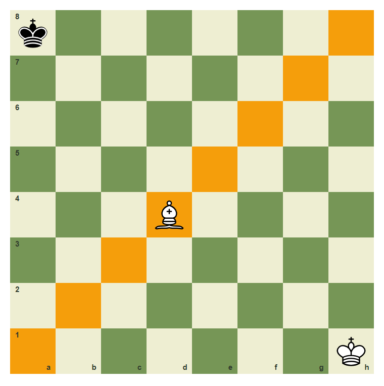
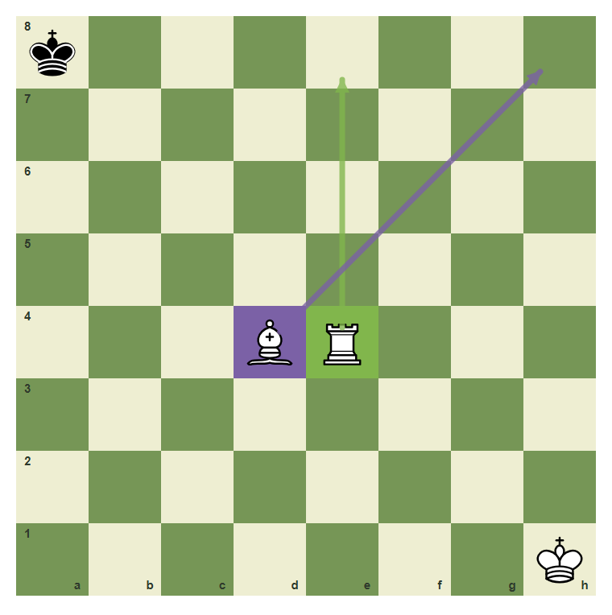
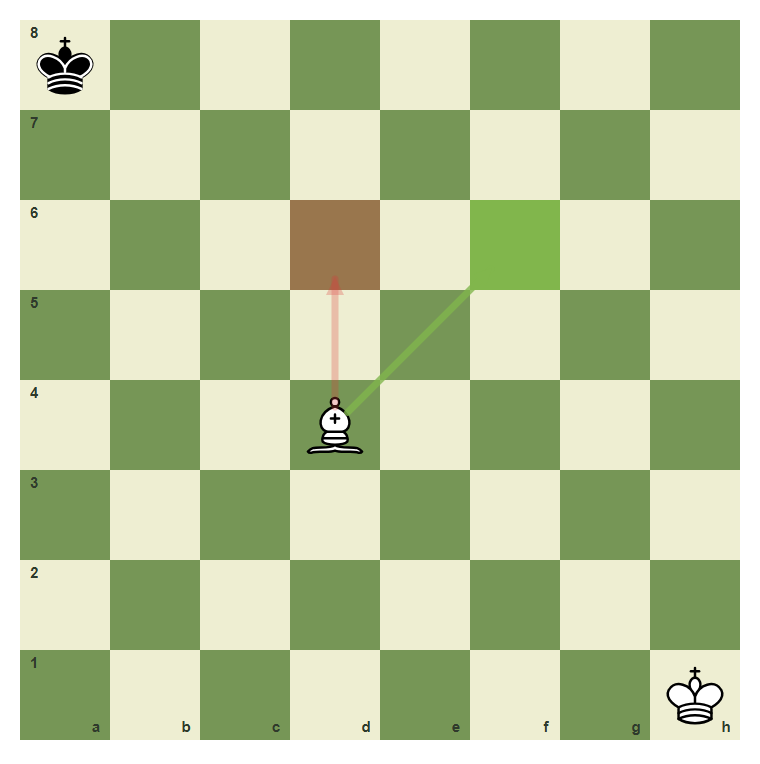

# Review Pack: Rooks And Bishops

Book: The First Chessboard
Chapter: 04-rook-and-bishop
Source: ../../../chess-frontend/src/data/ebooks/v2/beginner-board-rules/chapters/04-rook-and-bishop.json
Generated: 2026-05-05T07:36:03.644Z
Status: PASS - deterministic checks clean

## Chapter Intent

ELO range: 0-300
Required tier: free
Estimated minutes: 26

Learning objectives:
- Move a rook along ranks and files.
- Move a bishop along diagonals.
- Notice when friendly pieces block long-range pieces.
- Explain why bishops stay on one color complex.

## Quality Gates

| Gate | Result | Detail |
| --- | --- | --- |
| Sections | PASS | 3 |
| Total blocks | PASS | 12 |
| Board-like blocks | PASS | 7 |
| Generated PNG exports | PASS | 6 |
| Interactive/check blocks | PASS | 4 |
| Deterministic warnings | PASS | 0 |
| minimum_board_diagrams >= 5 | PASS | 5 board_diagram block(s) |
| minimum_guided_moves >= 1 | PASS | 1 guided_move block(s) |
| minimum_quizzes >= 3 | PASS | 3 quiz block(s) |
| tier_allowed <= free | PASS | chapter tier is free |

## Block Review

### b01-c04-p01 - prose

Section: Rooks Use Files And Ranks
Type: prose

Text under review:

```text
The rook is the straight-line piece. It moves up, down, left, or right as far as the path is clear. It cannot jump over pieces.
```

Reviewer flags: none from deterministic checks.

### b01-c04-d01 - Rook lines from e4

Section: Rooks Use Files And Ranks
Type: board_diagram
FEN: `k7/8/8/8/4R3/8/8/7K w - - 0 1`
Orientation: white
Arrows: e4-e8 (best), e4-e1 (candidate), e4-a4 (capture), e4-h4 (capture)
Highlights: e4 (lastMove), e8 (safe), e1 (safe), a4 (safe), h4 (safe)
Assertions: piece_on white_rook e4, arrow_exists e4-e8, arrow_exists e4-h4
Text square claims: e4
Text move claims: none
Visual square evidence: a8, e4, h1, e8, e1, a4, h4



PNG hash: `bd9ed5bd98bd15af72557d656945c72eff9b325f3f020e46212b1c80c4e0c38f`

Text under review:

```text
Rook lines from e4
From e4, a rook moves along the e-file or across the 4th rank.
```

Reviewer flags: none from deterministic checks.

### b01-c04-d02 - Own pieces block rooks

Section: Rooks Use Files And Ranks
Type: board_diagram
FEN: `k7/8/8/8/4R3/4P3/8/7K w - - 0 1`
Orientation: white
Arrows: e4-e3 (wrong)
Highlights: e3 (wrong), e4 (lastMove)
Assertions: piece_on white_rook e4, piece_on white_pawn e3, highlight_exists e3
Text square claims: e3
Text move claims: none
Visual square evidence: a8, e4, e3, h1



PNG hash: `28255826b99a70a1cd182356da094f1dcfbf1a84f833cc90d2c42e98e695e8d9`

Text under review:

```text
Own pieces block rooks
The white pawn on e3 blocks the rook. The rook cannot move through its own pawn.
```

Reviewer flags: none from deterministic checks.

### b01-c04-p02 - prose

Section: Bishops Use Diagonals
Type: prose

Text under review:

```text
The bishop is the diagonal long-range piece. Because every diagonal keeps the same square color, a bishop that starts on a light square always stays on light squares.
```

Reviewer flags: none from deterministic checks.

### b01-c04-d03 - Bishop diagonals from d4

Section: Bishops Use Diagonals
Type: board_diagram
FEN: `k7/8/8/8/3B4/8/8/7K w - - 0 1`
Orientation: white
Arrows: d4-a7 (best), d4-h8 (candidate), d4-a1 (capture), d4-g1 (capture)
Highlights: d4 (lastMove), a7 (safe), h8 (safe), a1 (safe), g1 (safe)
Assertions: piece_on white_bishop d4, arrow_exists d4-a7, arrow_exists d4-g1
Text square claims: d4
Text move claims: none
Visual square evidence: a8, d4, h1, a7, h8, a1, g1



PNG hash: `eaa9a470d3a23ad4185f7e9ba691e679c9134780bb4988b935e3f2c40c6f896a`

Text under review:

```text
Bishop diagonals from d4
A bishop on d4 moves only on diagonals.
```

Reviewer flags: none from deterministic checks.

### b01-c04-d04 - The bishop stays on one color

Section: Bishops Use Diagonals
Type: board_diagram
FEN: `k7/8/8/8/3B4/8/8/7K w - - 0 1`
Orientation: white
Arrows: none
Highlights: a1 (target), b2 (target), c3 (target), d4 (target), e5 (target), f6 (target), g7 (target), h8 (target)
Assertions: piece_on white_bishop d4, highlight_exists d4, highlight_exists h8
Text square claims: none
Text move claims: none
Visual square evidence: a8, d4, h1, a1, b2, c3, e5, f6, g7, h8



PNG hash: `245135cc0dc9aa68a5b0be8e503e75ac9dd6f487f0d54fa29ee1ba747f865eb9`

Text under review:

```text
The bishop stays on one color
This bishop is on a dark-square diagonal. It will never land on a light square.
```

Reviewer flags: none from deterministic checks.

### b01-c04-d05 - Rook and bishop side by side

Section: Bishops Use Diagonals
Type: board_diagram
FEN: `k7/8/8/8/3BR3/8/8/7K w - - 0 1`
Orientation: white
Arrows: e4-e8 (best), d4-h8 (candidate)
Highlights: e4 (best), d4 (candidate)
Assertions: piece_on white_rook e4, piece_on white_bishop d4, arrow_exists e4-e8
Text square claims: e4, d4
Text move claims: none
Visual square evidence: a8, d4, e4, h1, e8, h8



PNG hash: `6a2cdf9ff770bf21927ce96bb5f2de9d2d36998d0603e9f6b314b804ac4d8c63`

Text under review:

```text
Rook and bishop side by side
The rook on e4 uses straight lines. The bishop on d4 uses diagonals.
```

Reviewer flags: none from deterministic checks.

### b01-c04-g01 - Move the rook to e8

Section: Bishops Use Diagonals
Type: guided_move
FEN: `k7/8/8/8/4R3/8/8/7K w - - 0 1`
Orientation: white
Arrows: e4-e8 (best)
Highlights: e4 (lastMove), e8 (best)
Assertions: legal_move e4e8
Text square claims: e8, e4
Text move claims: none
Visual square evidence: a8, e4, h1, e8

Text under review:

```text
Move the rook to e8
Move the rook from e4 to e8 along the e-file.
Correct. Rooks move straight along files and ranks.
Use the rook on e4 and move it straight up to e8.
```

Reviewer flags: none from deterministic checks.

### b01-c04-m01 - Common mistake: moving a bishop straight

Section: Common Mistake
Type: mistake_refutation
FEN: `k7/8/8/8/3B4/8/8/7K w - - 0 1`
Orientation: white
Arrows: d4-d6 (wrong), d4-f6 (best)
Highlights: d6 (wrong), f6 (best)
Assertions: piece_on white_bishop d4, arrow_exists d4-d6, arrow_exists d4-f6
Text square claims: d4, d6, f6
Text move claims: none
Visual square evidence: a8, d4, h1, d6, f6



PNG hash: `bfe21459487a60d9ace4b03bcdfa076bb8084e23cc983fa2279cb288624ff1d5`

Text under review:

```text
Common mistake: moving a bishop straight
A bishop on d4 cannot move to d6. That is a straight-file move, and bishops only use diagonals.
d4 to d6 is wrong. d4 to f6 is diagonal and legal if the path is clear.
```

Reviewer flags: none from deterministic checks.

### b01-c04-q01 - Which lines does a rook use?

Section: Chapter Checkpoint
Type: quiz

Text under review:

```text
Which lines does a rook use?
A rook moves along:
```

Quiz options:
- [correct] a: Files and ranks
- [wrong] b: Only diagonals
- [wrong] c: Knight jumps

Reviewer flags: none from deterministic checks.

### b01-c04-q02 - Can a bishop change color?

Section: Chapter Checkpoint
Type: quiz

Text under review:

```text
Can a bishop change color?
A bishop that starts on a dark square can later land on a light square:
```

Quiz options:
- [correct] a: No
- [wrong] b: Yes, after a capture
- [wrong] c: Only near the edge

Reviewer flags: none from deterministic checks.

### b01-c04-q03 - What blocks a rook?

Section: Chapter Checkpoint
Type: quiz

Text under review:

```text
What blocks a rook?
A rook is blocked by:
```

Quiz options:
- [correct] a: Any piece on its path
- [wrong] b: Only enemy pieces
- [wrong] c: Only the king

Reviewer flags: none from deterministic checks.

## Human Signoff

- Chess analyst: pending
- Visual reviewer: pending
- Pedagogy reviewer: pending
- Final editor: pending
