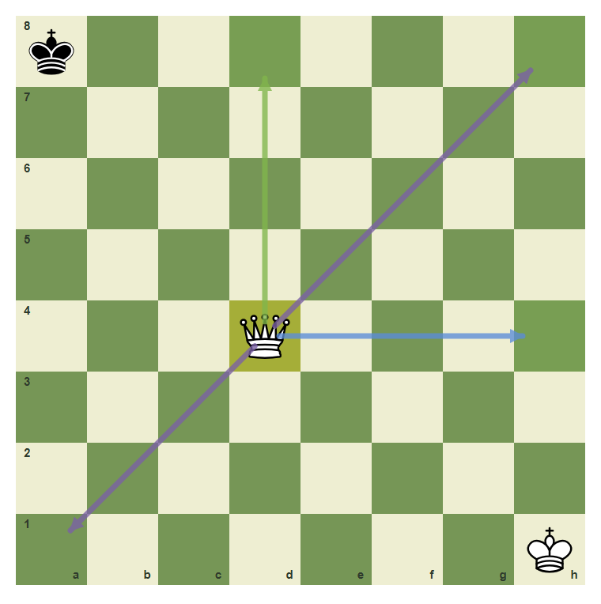
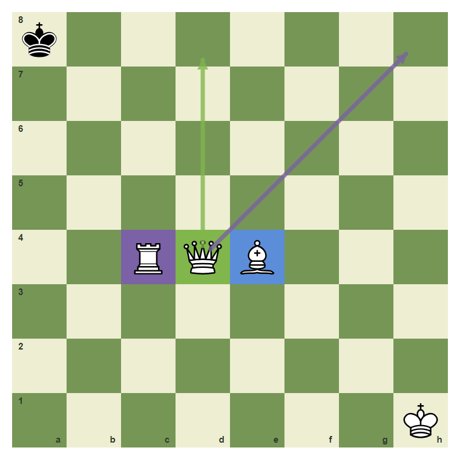
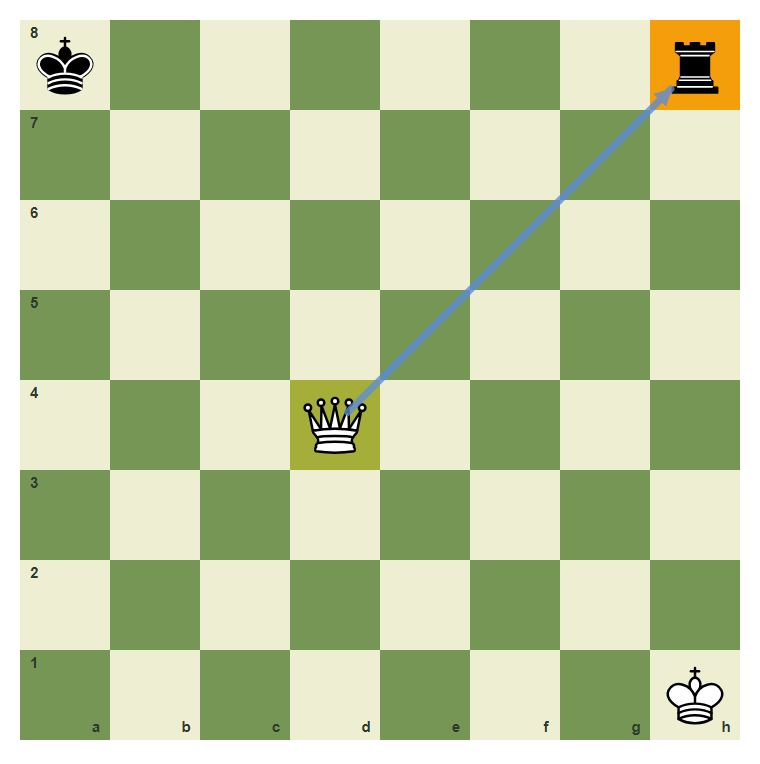
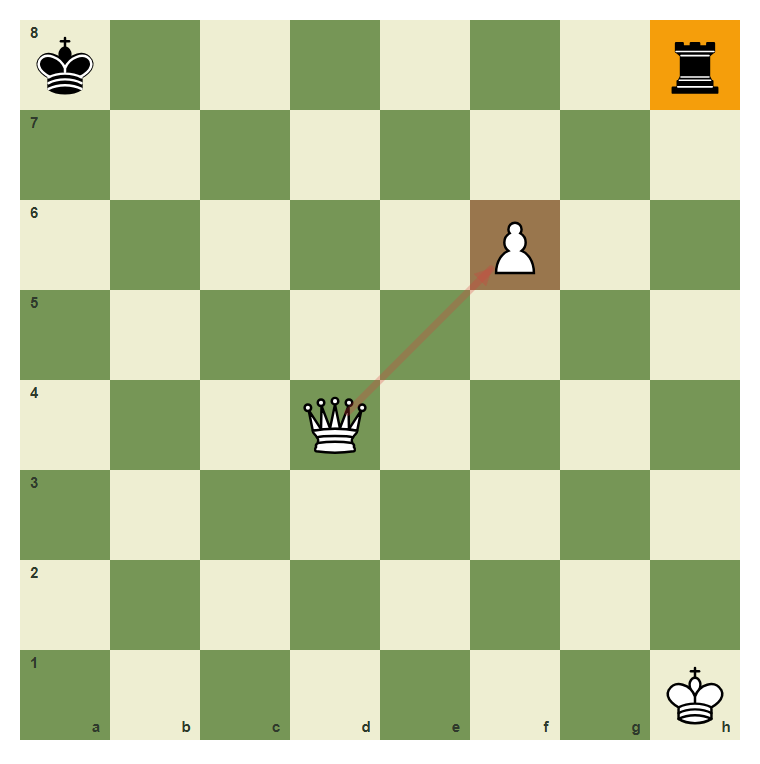
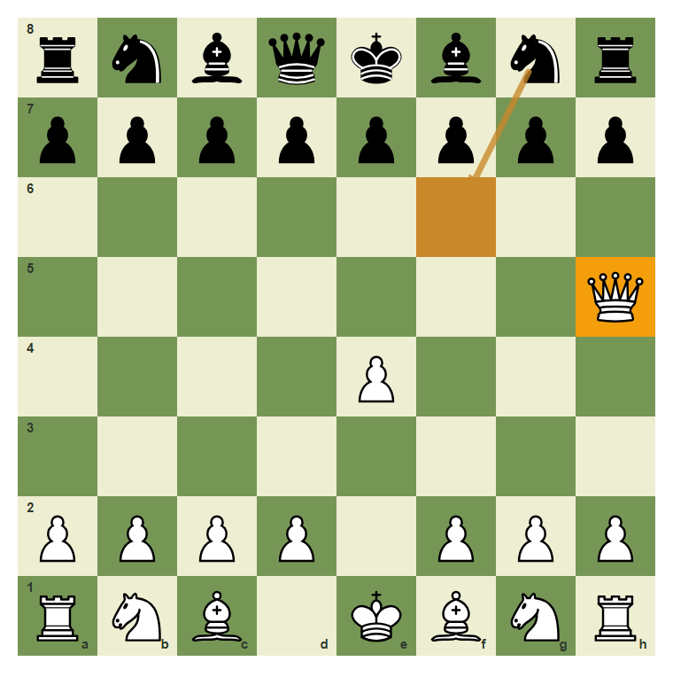
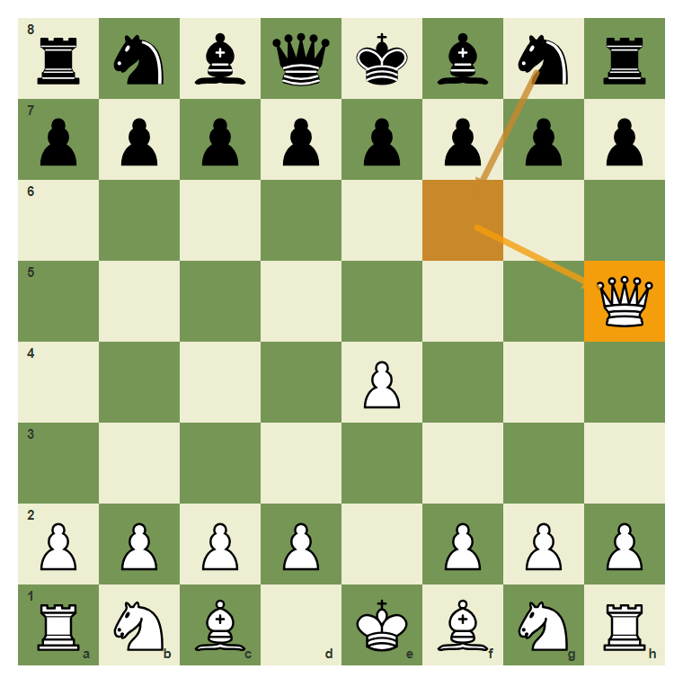

# Review Pack: The Queen And Long-Range Power

Book: The First Chessboard
Chapter: 05-queen-power
Source: ../../../chess-frontend/src/data/ebooks/v2/beginner-board-rules/chapters/05-queen-power.json
Generated: 2026-05-05T07:36:03.648Z
Status: PASS - deterministic checks clean

## Chapter Intent

ELO range: 0-300
Required tier: free
Estimated minutes: 24

Learning objectives:
- Move the queen along ranks, files, and diagonals.
- Recognize that the queen cannot jump.
- Use the queen to target weak squares.
- Avoid bringing the queen into easy attack too early.

## Quality Gates

| Gate | Result | Detail |
| --- | --- | --- |
| Sections | PASS | 3 |
| Total blocks | PASS | 12 |
| Board-like blocks | PASS | 7 |
| Generated PNG exports | PASS | 6 |
| Interactive/check blocks | PASS | 4 |
| Deterministic warnings | PASS | 0 |
| minimum_board_diagrams >= 5 | PASS | 5 board_diagram block(s) |
| minimum_guided_moves >= 1 | PASS | 1 guided_move block(s) |
| minimum_quizzes >= 3 | PASS | 3 quiz block(s) |
| tier_allowed <= free | PASS | chapter tier is free |

## Block Review

### b01-c05-p01 - prose

Section: The Queen Combines Two Pieces
Type: prose

Text under review:

```text
The queen is the strongest attacking piece because she moves like a rook and a bishop together. She can use files, ranks, and diagonals, but she still cannot jump.
```

Reviewer flags: none from deterministic checks.

### b01-c05-d01 - Queen lines from d4

Section: The Queen Combines Two Pieces
Type: board_diagram
FEN: `k7/8/8/8/3Q4/8/8/7K w - - 0 1`
Orientation: white
Arrows: d4-d8 (best), d4-h4 (capture), d4-h8 (candidate), d4-a1 (candidate)
Highlights: d4 (lastMove), d8 (safe), h4 (safe), h8 (safe)
Assertions: piece_on white_queen d4, arrow_exists d4-d8, arrow_exists d4-h8
Text square claims: d4
Text move claims: none
Visual square evidence: a8, d4, h1, d8, h4, h8, a1



PNG hash: `4005c40955249aa00e2bd56645e2af250b6ef18e48e6c1f9c6d5a563309f813f`

Text under review:

```text
Queen lines from d4
The queen can move vertically, horizontally, and diagonally from d4.
```

Reviewer flags: none from deterministic checks.

### b01-c05-d02 - Queen as rook plus bishop

Section: The Queen Combines Two Pieces
Type: board_diagram
FEN: `k7/8/8/8/2RQB3/8/8/7K w - - 0 1`
Orientation: white
Arrows: d4-d8 (best), d4-h8 (candidate)
Highlights: c4 (candidate), d4 (best), e4 (capture)
Assertions: piece_on white_queen d4, piece_on white_rook c4, piece_on white_bishop e4
Text square claims: d4
Text move claims: none
Visual square evidence: a8, c4, d4, e4, h1, d8, h8



PNG hash: `d4e325287cd597aa80378f71fcabdbc640145dc0086c398ab707eb2476d6e45f`

Text under review:

```text
Queen as rook plus bishop
The queen on d4 shares the straight-line idea of the rook and the diagonal idea of the bishop.
```

Reviewer flags: none from deterministic checks.

### b01-c05-p02 - prose

Section: Targets And Blocks
Type: prose

Text under review:

```text
A queen becomes powerful when she attacks a clear target. But if a piece sits on the path, the queen must stop before it or capture it if it is an enemy piece.
```

Reviewer flags: none from deterministic checks.

### b01-c05-d03 - The queen targets h8

Section: Targets And Blocks
Type: board_diagram
FEN: `k6r/8/8/8/3Q4/8/8/7K w - - 0 1`
Orientation: white
Arrows: d4-h8 (capture)
Highlights: h8 (target), d4 (lastMove)
Assertions: piece_on white_queen d4, piece_on black_rook h8, arrow_exists d4-h8
Text square claims: h8, d4
Text move claims: none
Visual square evidence: a8, h8, d4, h1



PNG hash: `2caf2305dc6b2fbf079c187bd17c27f432b66df96e2cad23b942df8125a2fef7`

Text under review:

```text
The queen targets h8
The queen on d4 attacks the rook on h8 along the diagonal.
```

Reviewer flags: none from deterministic checks.

### b01-c05-d04 - A blocked queen line

Section: Targets And Blocks
Type: board_diagram
FEN: `k6r/8/5P2/8/3Q4/8/8/7K w - - 0 1`
Orientation: white
Arrows: d4-f6 (wrong)
Highlights: f6 (wrong), h8 (target)
Assertions: piece_on white_queen d4, piece_on white_pawn f6, piece_on black_rook h8
Text square claims: f6, h8
Text move claims: none
Visual square evidence: a8, h8, f6, d4, h1



PNG hash: `dd805014d5c51213bef3e4327c892fb4ed2454a466fc61440f315b34a9d79cb7`

Text under review:

```text
A blocked queen line
The white pawn on f6 blocks the diagonal, so the queen no longer attacks h8.
```

Reviewer flags: none from deterministic checks.

### b01-c05-d05 - Early queen move

Section: Targets And Blocks
Type: board_diagram
FEN: `rnbqkbnr/pppppppp/8/7Q/4P3/8/PPPP1PPP/RNB1KBNR b KQkq - 1 1`
Orientation: white
Arrows: g8-f6 (threat)
Highlights: h5 (target), f6 (threat)
Assertions: piece_on white_queen h5, piece_on black_knight g8, legal_move g8f6
Text square claims: h5, f6
Text move claims: none
Visual square evidence: a8, b8, c8, d8, e8, f8, g8, h8, a7, b7, c7, d7, e7, f7, g7, h7, h5, e4, a2, b2, c2, d2, f2, g2, h2, a1, b1, c1, e1, f1, g1, h1, f6



PNG hash: `a9583e2357a555b2ea83ebb074e9fc67aad2e9e6525e88ac594e861763816c5c`

Text under review:

```text
Early queen move
A queen on h5 can be useful, but Black can gain time by attacking her with Ng8 to f6.
```

Reviewer flags: none from deterministic checks.

### b01-c05-g01 - Move the queen to h5

Section: Targets And Blocks
Type: guided_move
FEN: `rnbqkbnr/pppppppp/8/8/4P3/8/PPPP1PPP/RNBQKBNR w KQkq - 0 1`
Orientation: white
Arrows: d1-h5 (best)
Highlights: d1 (lastMove), h5 (best)
Assertions: legal_move d1h5
Text square claims: h5, d1
Text move claims: none
Visual square evidence: a8, b8, c8, d8, e8, f8, g8, h8, a7, b7, c7, d7, e7, f7, g7, h7, e4, a2, b2, c2, d2, f2, g2, h2, a1, b1, c1, d1, e1, f1, g1, h1, h5

Text under review:

```text
Move the queen to h5
Move the queen from d1 to h5 along the diagonal.
Correct. The queen used a clear diagonal.
The queen starts on d1 and travels diagonally to h5.
```

Reviewer flags: none from deterministic checks.

### b01-c05-m01 - Common mistake: ignoring attacks on the queen

Section: Common Mistake
Type: mistake_refutation
FEN: `rnbqkbnr/pppppppp/8/7Q/4P3/8/PPPP1PPP/RNB1KBNR b KQkq - 1 1`
Orientation: white
Arrows: g8-f6 (threat), f6-h5 (target)
Highlights: h5 (target), f6 (threat)
Assertions: piece_on white_queen h5, piece_on black_knight g8, legal_move g8f6
Text square claims: f6
Text move claims: none
Visual square evidence: a8, b8, c8, d8, e8, f8, g8, h8, a7, b7, c7, d7, e7, f7, g7, h7, h5, e4, a2, b2, c2, d2, f2, g2, h2, a1, b1, c1, e1, f1, g1, h1, f6



PNG hash: `2b71a8a4a29e58aa46349d7007bc4bd0cee28e9bc9045254677baaa3e5349cbd`

Text under review:

```text
Common mistake: ignoring attacks on the queen
Beginners often bring the queen out and forget that the opponent can attack it. Here Black can play Ng8 to f6 and make the queen move again.
The knight move attacks the queen. A queen move that loses time needs a clear reason.
```

Reviewer flags: none from deterministic checks.

### b01-c05-q01 - How does the queen move?

Section: Chapter Checkpoint
Type: quiz

Text under review:

```text
How does the queen move?
The queen moves like:
```

Quiz options:
- [correct] a: A rook and bishop combined
- [wrong] b: A knight and pawn combined
- [wrong] c: Only one square

Reviewer flags: none from deterministic checks.

### b01-c05-q02 - Can a queen jump?

Section: Chapter Checkpoint
Type: quiz

Text under review:

```text
Can a queen jump?
A queen can jump over pieces:
```

Quiz options:
- [correct] a: No
- [wrong] b: Yes, if she captures
- [wrong] c: Only diagonally

Reviewer flags: none from deterministic checks.

### b01-c05-q03 - Why can early queen moves be risky?

Section: Chapter Checkpoint
Type: quiz

Text under review:

```text
Why can early queen moves be risky?
Early queen moves can be risky because:
```

Quiz options:
- [correct] a: The queen may get attacked and lose time
- [wrong] b: The queen cannot capture
- [wrong] c: The queen is worth only one point

Reviewer flags: none from deterministic checks.

## Human Signoff

- Chess analyst: pending
- Visual reviewer: pending
- Pedagogy reviewer: pending
- Final editor: pending
