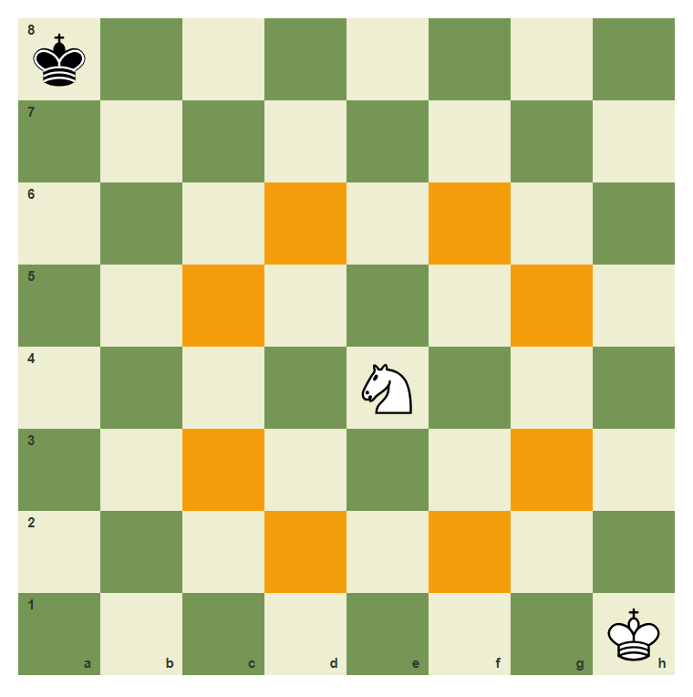
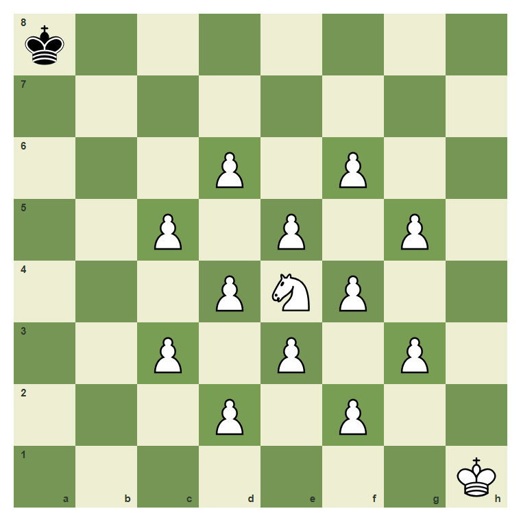
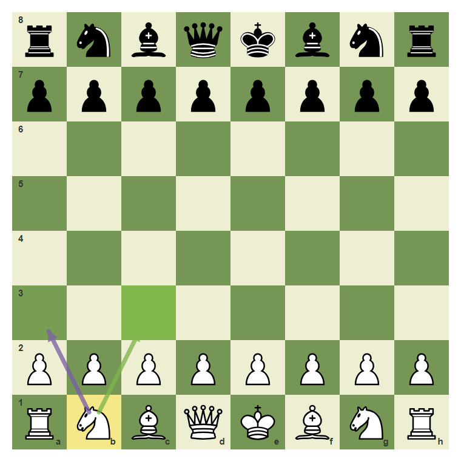
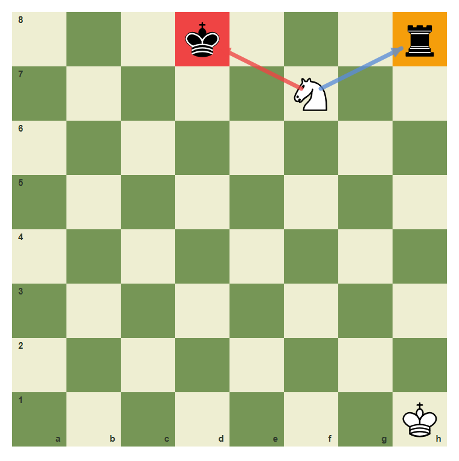
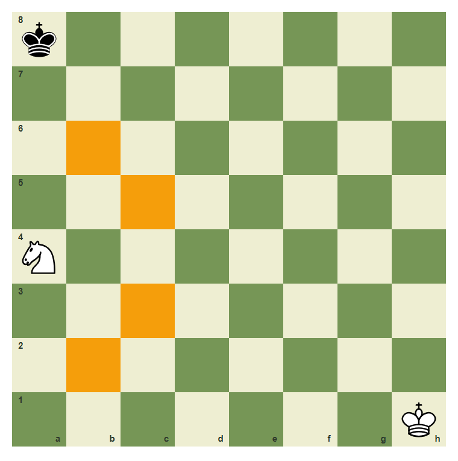
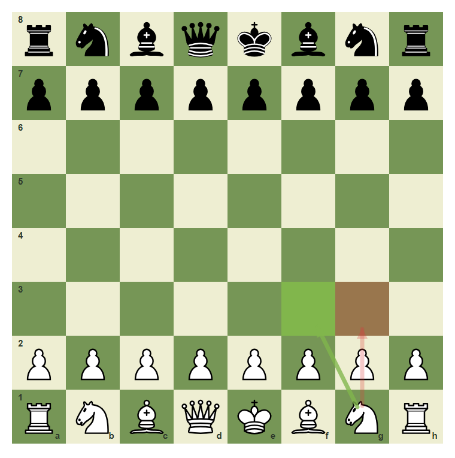

# Review Pack: The Knight And Jumps

Book: The First Chessboard
Chapter: 06-knight-jumps
Source: ../../../chess-frontend/src/data/ebooks/v2/beginner-board-rules/chapters/06-knight-jumps.json
Generated: 2026-05-05T07:36:03.652Z
Status: PASS - deterministic checks clean

## Chapter Intent

ELO range: 0-300
Required tier: free
Estimated minutes: 24

Learning objectives:
- Move a knight in an L shape.
- List the knight moves from a center square.
- Understand that knights jump over pieces but cannot land on friendly pieces.
- Recognize that edge knights have fewer moves.

## Quality Gates

| Gate | Result | Detail |
| --- | --- | --- |
| Sections | PASS | 3 |
| Total blocks | PASS | 12 |
| Board-like blocks | PASS | 7 |
| Generated PNG exports | PASS | 6 |
| Interactive/check blocks | PASS | 4 |
| Deterministic warnings | PASS | 0 |
| minimum_board_diagrams >= 5 | PASS | 5 board_diagram block(s) |
| minimum_guided_moves >= 1 | PASS | 1 guided_move block(s) |
| minimum_quizzes >= 3 | PASS | 3 quiz block(s) |
| tier_allowed <= free | PASS | chapter tier is free |

## Block Review

### b01-c06-p01 - prose

Section: The L Shape
Type: prose

Text under review:

```text
The knight moves in an L shape: two squares in one direction and one square sideways. It is the only piece that can jump over pieces.
```

Reviewer flags: none from deterministic checks.

### b01-c06-d01 - Knight moves from e4

Section: The L Shape
Type: board_diagram
FEN: `k7/8/8/8/4N3/8/8/7K w - - 0 1`
Orientation: white
Arrows: none
Highlights: c3 (target), c5 (target), d2 (target), d6 (target), f2 (target), f6 (target), g3 (target), g5 (target)
Assertions: piece_on white_knight e4, highlight_exists f6, highlight_exists c3
Text square claims: e4
Text move claims: none
Visual square evidence: a8, e4, h1, c3, c5, d2, d6, f2, f6, g3, g5



PNG hash: `8201066c7dbcd67e791d35651131fe9a64d0a3914de324b70afc4727aa053dee`

Text under review:

```text
Knight moves from e4
A knight on e4 has up to eight landing squares.
```

Reviewer flags: none from deterministic checks.

### b01-c06-d02 - The knight jumps over blockers

Section: The L Shape
Type: board_diagram
FEN: `k7/8/3P1P2/2P1P1P1/3PNP2/2P1P1P1/3P1P2/7K w - - 0 1`
Orientation: white
Arrows: none
Highlights: c3 (safe), c5 (safe), d2 (safe), d6 (safe), f2 (safe), f6 (safe), g3 (safe), g5 (safe)
Assertions: piece_on white_knight e4, piece_on white_pawn e5, highlight_exists g5
Text square claims: e4
Text move claims: none
Visual square evidence: a8, d6, f6, c5, e5, g5, d4, e4, f4, c3, e3, g3, d2, f2, h1



PNG hash: `80cc62bbb139c2962a2592c058e12d654bfa95a0369de0109ba08800e5594eb4`

Text under review:

```text
The knight jumps over blockers
Even when surrounded, the knight on e4 can jump to its L-shaped landing squares.
```

Reviewer flags: none from deterministic checks.

### b01-c06-p02 - prose

Section: Knights From The Starting Position
Type: prose

Text under review:

```text
From the starting position, the knight is the first piece that can move without a pawn moving first. The knight jumps over the pawns.
```

Reviewer flags: none from deterministic checks.

### b01-c06-d03 - The b1 knight can jump

Section: Knights From The Starting Position
Type: board_diagram
FEN: `rnbqkbnr/pppppppp/8/8/8/8/PPPPPPPP/RNBQKBNR w KQkq - 0 1`
Orientation: white
Arrows: b1-a3 (candidate), b1-c3 (best)
Highlights: b1 (lastMove), a3 (safe), c3 (best)
Assertions: piece_on white_knight b1, legal_move b1c3, legal_move b1a3
Text square claims: b1, a3, c3
Text move claims: none
Visual square evidence: a8, b8, c8, d8, e8, f8, g8, h8, a7, b7, c7, d7, e7, f7, g7, h7, a2, b2, c2, d2, e2, f2, g2, h2, a1, b1, c1, d1, e1, f1, g1, h1, a3, c3



PNG hash: `c641d9bf6c6f560e1bc460aaaa3642e7a1a8f9307ff9f1cd3441e0c7123cb331`

Text under review:

```text
The b1 knight can jump
The knight on b1 can jump to a3 or c3 at the start.
```

Reviewer flags: none from deterministic checks.

### b01-c06-d04 - A knight fork pattern

Section: Knights From The Starting Position
Type: board_diagram
FEN: `3k3r/5N2/8/8/8/8/8/7K w - - 0 1`
Orientation: white
Arrows: f7-d8 (check), f7-h8 (capture)
Highlights: d8 (check), h8 (target)
Assertions: piece_on white_knight f7, piece_on black_king d8, piece_on black_rook h8
Text square claims: f7, d8, h8
Text move claims: none
Visual square evidence: d8, h8, f7, h1



PNG hash: `af412a2a6ae0d4fff8cb512407f0719e80c8533756a2bd2a7d1dbb4256652b49`

Text under review:

```text
A knight fork pattern
A knight on f7 attacks the king on d8 and the rook on h8 at the same time.
```

Reviewer flags: none from deterministic checks.

### b01-c06-d05 - Edge knights have fewer moves

Section: Knights From The Starting Position
Type: board_diagram
FEN: `k7/8/8/8/N7/8/8/7K w - - 0 1`
Orientation: white
Arrows: none
Highlights: b6 (target), c5 (target), c3 (target), b2 (target)
Assertions: piece_on white_knight a4, highlight_exists b6, highlight_exists c3
Text square claims: a4
Text move claims: none
Visual square evidence: a8, a4, h1, b6, c5, c3, b2



PNG hash: `1f579288432c91df1bb098502e96b93a7389be3b7f4a4a97346bdb7831efb8d6`

Text under review:

```text
Edge knights have fewer moves
A knight on a4 has only four legal landing squares instead of eight.
```

Reviewer flags: none from deterministic checks.

### b01-c06-g01 - Develop the knight to f3

Section: Knights From The Starting Position
Type: guided_move
FEN: `rnbqkbnr/pppppppp/8/8/8/8/PPPPPPPP/RNBQKBNR w KQkq - 0 1`
Orientation: white
Arrows: g1-f3 (best)
Highlights: g1 (lastMove), f3 (best)
Assertions: legal_move g1f3
Text square claims: f3, g1
Text move claims: none
Visual square evidence: a8, b8, c8, d8, e8, f8, g8, h8, a7, b7, c7, d7, e7, f7, g7, h7, a2, b2, c2, d2, e2, f2, g2, h2, a1, b1, c1, d1, e1, f1, g1, h1, f3

Text under review:

```text
Develop the knight to f3
Move the knight from g1 to f3.
Correct. The knight jumped over the pawns.
Use the knight on g1 and land on f3.
```

Reviewer flags: none from deterministic checks.

### b01-c06-m01 - Common mistake: sliding the knight

Section: Common Mistake
Type: mistake_refutation
FEN: `rnbqkbnr/pppppppp/8/8/8/8/PPPPPPPP/RNBQKBNR w KQkq - 0 1`
Orientation: white
Arrows: g1-g3 (wrong), g1-f3 (best)
Highlights: g3 (wrong), f3 (best)
Assertions: piece_on white_knight g1, legal_move g1f3, arrow_exists g1-g3
Text square claims: g1, g3, f3
Text move claims: none
Visual square evidence: a8, b8, c8, d8, e8, f8, g8, h8, a7, b7, c7, d7, e7, f7, g7, h7, a2, b2, c2, d2, e2, f2, g2, h2, a1, b1, c1, d1, e1, f1, g1, h1, g3, f3



PNG hash: `00e6633829b9df274777ac33243470bbecee46ecd08213f7a79c2aa13da4fb52`

Text under review:

```text
Common mistake: sliding the knight
A knight on g1 cannot slide to g3. Knights do not move straight; they move in an L shape.
g1 to f3 is a knight move. g1 to g3 is not.
```

Reviewer flags: none from deterministic checks.

### b01-c06-q01 - What shape is a knight move?

Section: Chapter Checkpoint
Type: quiz

Text under review:

```text
What shape is a knight move?
A knight moves:
```

Quiz options:
- [correct] a: In an L shape
- [wrong] b: Only diagonally
- [wrong] c: Only one square

Reviewer flags: none from deterministic checks.

### b01-c06-q02 - Can knights jump?

Section: Chapter Checkpoint
Type: quiz

Text under review:

```text
Can knights jump?
A knight can jump over pieces:
```

Quiz options:
- [correct] a: Yes
- [wrong] b: No
- [wrong] c: Only over pawns

Reviewer flags: none from deterministic checks.

### b01-c06-q03 - Where can the g1 knight move at the start?

Section: Chapter Checkpoint
Type: quiz

Text under review:

```text
Where can the g1 knight move at the start?
From the starting position, the knight on g1 can move to:
```

Quiz options:
- [correct] a: f3
- [wrong] b: g3
- [wrong] c: g2

Reviewer flags: none from deterministic checks.

## Human Signoff

- Chess analyst: pending
- Visual reviewer: pending
- Pedagogy reviewer: pending
- Final editor: pending
