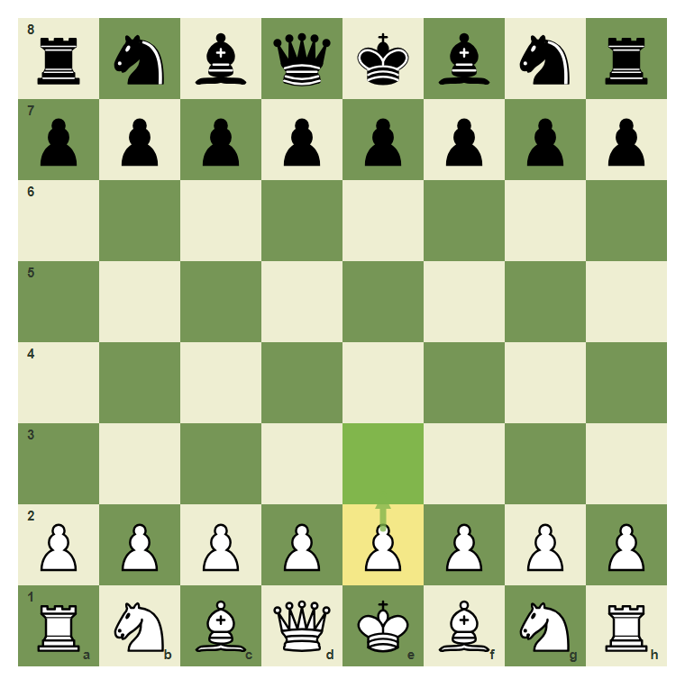
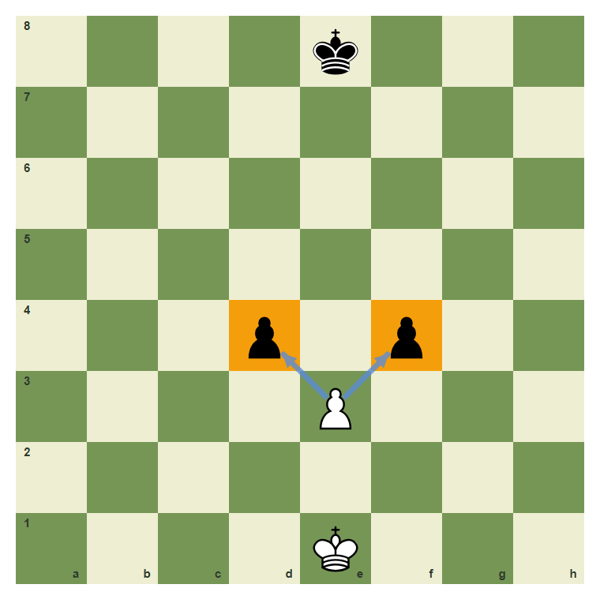
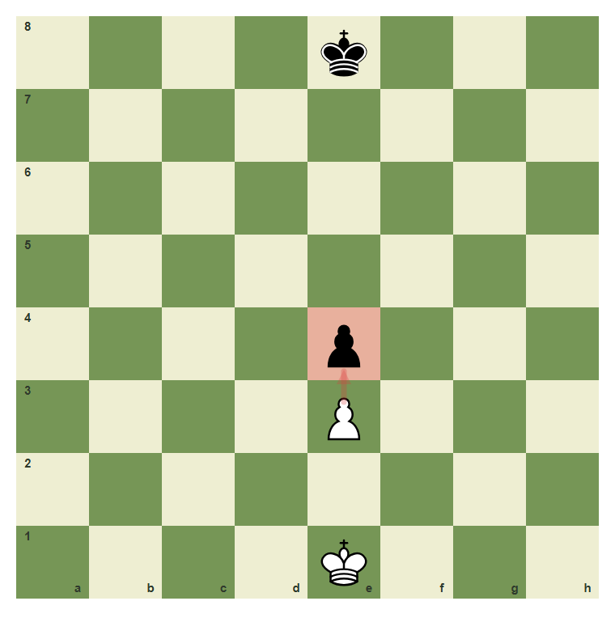
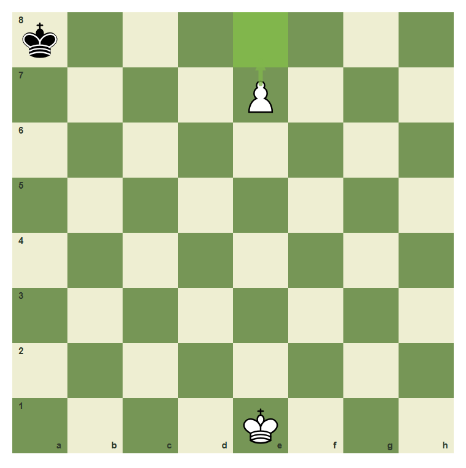
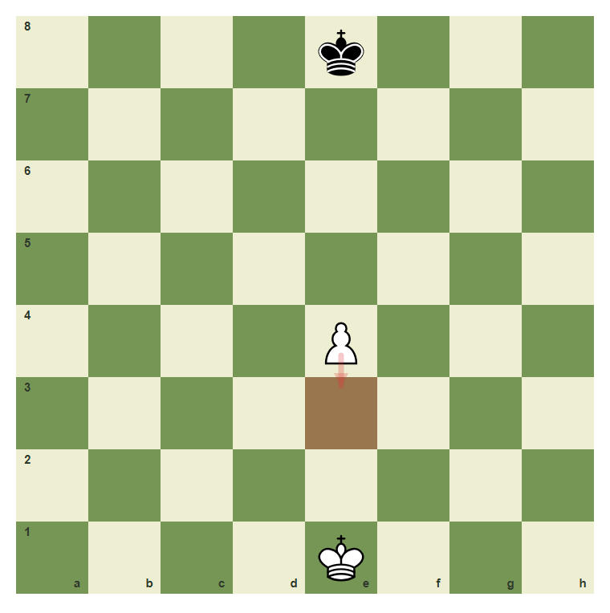

# Review Pack: Pawn Moves, Captures, And Promotion

Book: The First Chessboard
Chapter: 07-pawn-rules
Source: ../../../chess-frontend/src/data/ebooks/v2/beginner-board-rules/chapters/07-pawn-rules.json
Generated: 2026-05-05T07:36:03.656Z
Status: PASS - deterministic checks clean

## Chapter Intent

ELO range: 0-300
Required tier: free
Estimated minutes: 28

Learning objectives:
- Move pawns one square forward.
- Use the two-square first move.
- Capture diagonally with pawns.
- Reject backward pawn moves.
- Understand promotion on the last rank.

## Quality Gates

| Gate | Result | Detail |
| --- | --- | --- |
| Sections | PASS | 3 |
| Total blocks | PASS | 12 |
| Board-like blocks | PASS | 7 |
| Generated PNG exports | PASS | 6 |
| Interactive/check blocks | PASS | 4 |
| Deterministic warnings | PASS | 0 |
| minimum_board_diagrams >= 5 | PASS | 5 board_diagram block(s) |
| minimum_guided_moves >= 1 | PASS | 1 guided_move block(s) |
| minimum_quizzes >= 3 | PASS | 3 quiz block(s) |
| tier_allowed <= free | PASS | chapter tier is free |

## Block Review

### b01-c07-p01 - prose

Section: Forward Movement
Type: prose

Text under review:

```text
Pawns move forward, but they capture diagonally. White pawns move toward rank 8. Black pawns move toward rank 1.
```

Reviewer flags: none from deterministic checks.

### b01-c07-d01 - White pawn one step

Section: Forward Movement
Type: board_diagram
FEN: `rnbqkbnr/pppppppp/8/8/8/8/PPPPPPPP/RNBQKBNR w KQkq - 0 1`
Orientation: white
Arrows: e2-e3 (best)
Highlights: e2 (lastMove), e3 (best)
Assertions: piece_on white_pawn e2, legal_move e2e3, arrow_exists e2-e3
Text square claims: e2, e3
Text move claims: none
Visual square evidence: a8, b8, c8, d8, e8, f8, g8, h8, a7, b7, c7, d7, e7, f7, g7, h7, a2, b2, c2, d2, e2, f2, g2, h2, a1, b1, c1, d1, e1, f1, g1, h1, e3



PNG hash: `955e0ec932f5663f41583b7995ea4e1814f67cb4896bdf4abbb23a94df7e1ee3`

Text under review:

```text
White pawn one step
The white e-pawn can move one square from e2 to e3.
```

Reviewer flags: none from deterministic checks.

### b01-c07-d02 - Two-square first move

Section: Forward Movement
Type: board_diagram
FEN: `rnbqkbnr/pppppppp/8/8/8/8/PPPPPPPP/RNBQKBNR w KQkq - 0 1`
Orientation: white
Arrows: e2-e4 (best)
Highlights: e2 (lastMove), e4 (best)
Assertions: piece_on white_pawn e2, legal_move e2e4, arrow_exists e2-e4
Text square claims: e4
Text move claims: none
Visual square evidence: a8, b8, c8, d8, e8, f8, g8, h8, a7, b7, c7, d7, e7, f7, g7, h7, a2, b2, c2, d2, e2, f2, g2, h2, a1, b1, c1, d1, e1, f1, g1, h1, e4


PNG hash: `cab16a7b8d27fb4b3f61ccfdd13a34adc4a7038d861a7844e4d9f9ced2de36ba`

Text under review:

```text
Two-square first move
From its starting square, the e-pawn can move two squares to e4 if the path is clear.
```

Reviewer flags: none from deterministic checks.

### b01-c07-p02 - prose

Section: Captures And Promotion
Type: prose

Text under review:

```text
A pawn does not capture straight ahead. It captures one square diagonally forward. If a pawn reaches the last rank, it promotes, usually to a queen.
```

Reviewer flags: none from deterministic checks.

### b01-c07-d03 - Pawn captures diagonally

Section: Captures And Promotion
Type: board_diagram
FEN: `4k3/8/8/8/3p1p2/4P3/8/4K3 w - - 0 1`
Orientation: white
Arrows: e3-d4 (capture), e3-f4 (capture)
Highlights: d4 (target), f4 (target)
Assertions: piece_on white_pawn e3, piece_on black_pawn d4, piece_on black_pawn f4, legal_move e3d4
Text square claims: e3, d4, f4
Text move claims: none
Visual square evidence: e8, d4, f4, e3, e1



PNG hash: `60da04ae846f57e730eb0d6b72536dc2eaf7ddf5186bf37e0bf21051e03ee224`

Text under review:

```text
Pawn captures diagonally
The pawn on e3 can capture the enemy pawns on d4 or f4.
```

Reviewer flags: none from deterministic checks.

### b01-c07-d04 - Pawns do not capture forward

Section: Captures And Promotion
Type: board_diagram
FEN: `4k3/8/8/8/4p3/4P3/8/4K3 w - - 0 1`
Orientation: white
Arrows: e3-e4 (wrong)
Highlights: e4 (wrong)
Assertions: piece_on white_pawn e3, piece_on black_pawn e4, highlight_exists e4
Text square claims: e3, e4
Text move claims: none
Visual square evidence: e8, e4, e3, e1



PNG hash: `3037741221dbb47e396582ba885eb43eaa90932cb1109bb13b0423a4424be8d2`

Text under review:

```text
Pawns do not capture forward
The pawn on e3 cannot capture the enemy pawn directly in front of it on e4.
```

Reviewer flags: none from deterministic checks.

### b01-c07-d05 - Promotion square

Section: Captures And Promotion
Type: board_diagram
FEN: `k7/4P3/8/8/8/8/8/4K3 w - - 0 1`
Orientation: white
Arrows: e7-e8 (best)
Highlights: e8 (best)
Assertions: piece_on white_pawn e7, legal_move e7e8q, arrow_exists e7-e8
Text square claims: e7, e8
Text move claims: none
Visual square evidence: a8, e7, e1, e8



PNG hash: `f3004c763dfd0d35e53c236b2e86acb1ed1bbd29f24df487656c3298e844969a`

Text under review:

```text
Promotion square
When the pawn moves from e7 to e8, it promotes. The usual choice is a queen.
```

Reviewer flags: none from deterministic checks.

### b01-c07-g01 - Play the two-square pawn move

Section: Captures And Promotion
Type: guided_move
FEN: `rnbqkbnr/pppppppp/8/8/8/8/PPPPPPPP/RNBQKBNR w KQkq - 0 1`
Orientation: white
Arrows: e2-e4 (best)
Highlights: e2 (lastMove), e4 (best)
Assertions: legal_move e2e4
Text square claims: e2, e4
Text move claims: none
Visual square evidence: a8, b8, c8, d8, e8, f8, g8, h8, a7, b7, c7, d7, e7, f7, g7, h7, a2, b2, c2, d2, e2, f2, g2, h2, a1, b1, c1, d1, e1, f1, g1, h1, e4

Text under review:

```text
Play the two-square pawn move
Move the White e-pawn from e2 to e4.
Correct. A pawn can move two squares from its starting square.
Use the pawn on e2 and move it to e4.
```

Reviewer flags: none from deterministic checks.

### b01-c07-m01 - Common mistake: moving backward

Section: Common Mistake
Type: mistake_refutation
FEN: `4k3/8/8/8/4P3/8/8/4K3 w - - 0 1`
Orientation: white
Arrows: e4-e3 (wrong)
Highlights: e3 (wrong)
Assertions: piece_on white_pawn e4, arrow_exists e4-e3
Text square claims: e4, e3
Text move claims: none
Visual square evidence: e8, e4, e1, e3



PNG hash: `b5d9a5f72f50146cad95d04323c2c330ab02636135dacae3ed66af10060e8a17`

Text under review:

```text
Common mistake: moving backward
A white pawn on e4 cannot move backward to e3. Pawns only move forward unless they are promoting or capturing diagonally forward.
Backward pawn moves are not legal.
```

Reviewer flags: none from deterministic checks.

### b01-c07-q01 - How does a white pawn move?

Section: Chapter Checkpoint
Type: quiz

Text under review:

```text
How does a white pawn move?
A white pawn normally moves:
```

Quiz options:
- [correct] a: Toward higher ranks
- [wrong] b: Backward toward rank 1
- [wrong] c: Sideways

Reviewer flags: none from deterministic checks.

### b01-c07-q02 - How does a pawn capture?

Section: Chapter Checkpoint
Type: quiz

Text under review:

```text
How does a pawn capture?
A pawn captures:
```

Quiz options:
- [correct] a: One square diagonally forward
- [wrong] b: Straight forward
- [wrong] c: Like a knight

Reviewer flags: none from deterministic checks.

### b01-c07-q03 - What happens on the last rank?

Section: Chapter Checkpoint
Type: quiz

Text under review:

```text
What happens on the last rank?
A pawn that reaches the last rank:
```

Quiz options:
- [correct] a: Promotes
- [wrong] b: Disappears
- [wrong] c: Must become a king

Reviewer flags: none from deterministic checks.

## Human Signoff

- Chess analyst: pending
- Visual reviewer: pending
- Pedagogy reviewer: pending
- Final editor: pending
