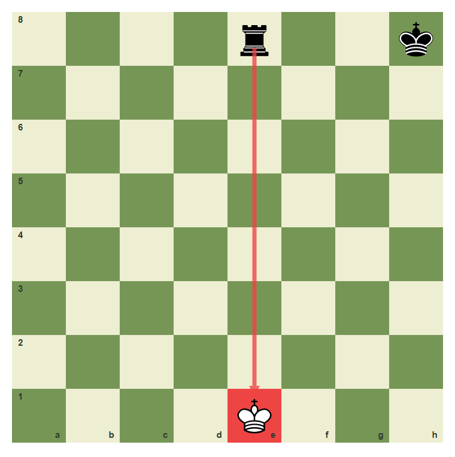
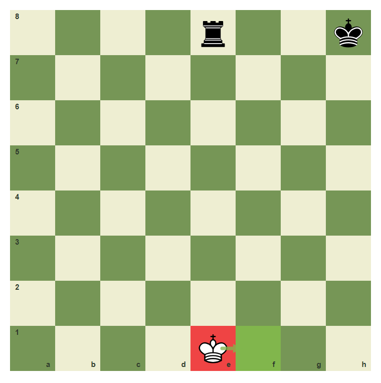
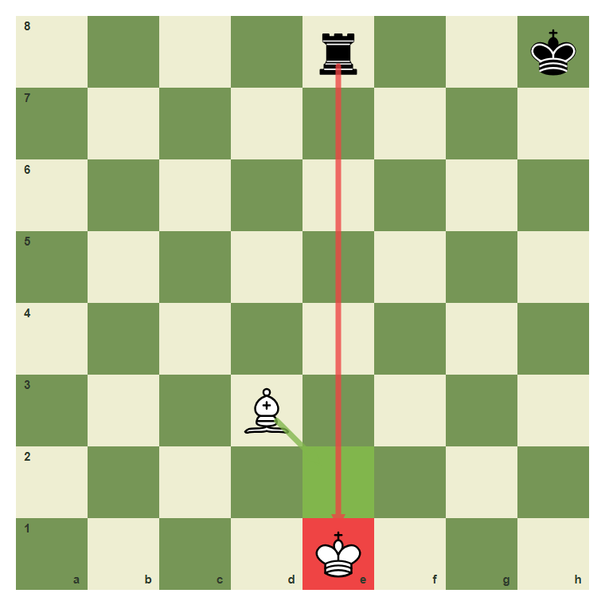
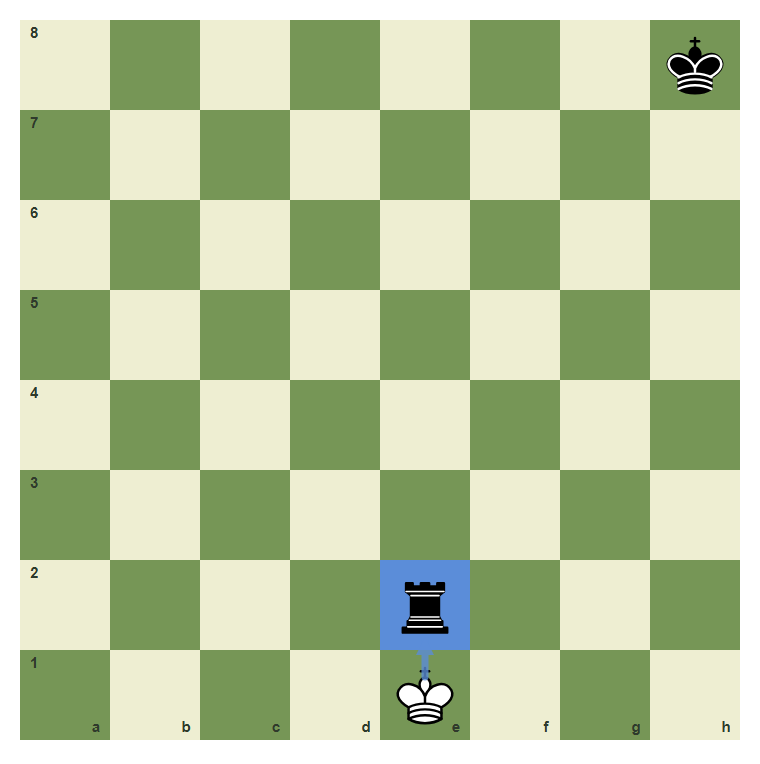
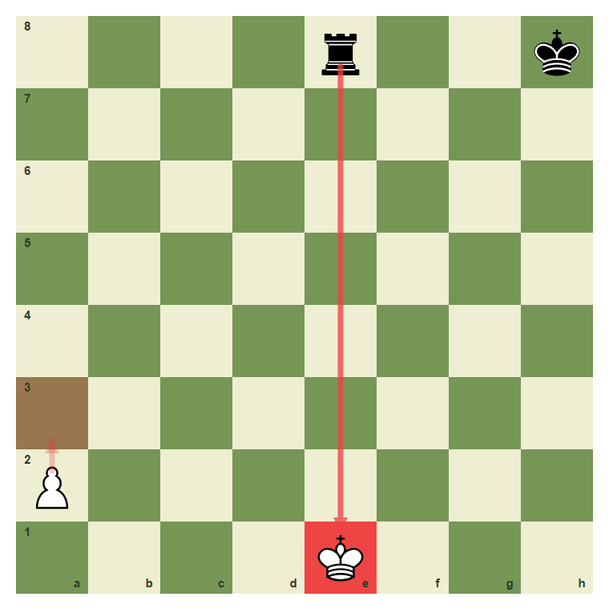

# Review Pack: Check And Escaping Check

Book: The First Chessboard
Chapter: 08-check-and-escape
Source: ../../../chess-frontend/src/data/ebooks/v2/beginner-board-rules/chapters/08-check-and-escape.json
Generated: 2026-05-05T07:36:03.660Z
Status: PASS - deterministic checks clean

## Chapter Intent

ELO range: 0-300
Required tier: free
Estimated minutes: 28

Learning objectives:
- Recognize when a king is in check.
- Escape check by moving the king.
- Escape check by blocking the attack.
- Escape check by capturing the checking piece.
- Reject moves that ignore check.

## Quality Gates

| Gate | Result | Detail |
| --- | --- | --- |
| Sections | PASS | 3 |
| Total blocks | PASS | 12 |
| Board-like blocks | PASS | 7 |
| Generated PNG exports | PASS | 6 |
| Interactive/check blocks | PASS | 4 |
| Deterministic warnings | PASS | 0 |
| minimum_board_diagrams >= 5 | PASS | 5 board_diagram block(s) |
| minimum_guided_moves >= 1 | PASS | 1 guided_move block(s) |
| minimum_quizzes >= 3 | PASS | 3 quiz block(s) |
| tier_allowed <= free | PASS | chapter tier is free |

## Block Review

### b01-c08-p01 - prose

Section: A Direct Attack On The King
Type: prose

Text under review:

```text
Check means the king is under attack. When your king is in check, you do not get to play any move you like. Your move must make the king safe.
```

Reviewer flags: none from deterministic checks.

### b01-c08-d01 - The rook gives check

Section: A Direct Attack On The King
Type: board_diagram
FEN: `4r2k/8/8/8/8/8/8/4K3 w - - 0 1`
Orientation: white
Arrows: e8-e1 (check)
Highlights: e1 (check)
Assertions: side_to_move white, piece_on white_king e1, piece_on black_rook e8, arrow_exists e8-e1
Text square claims: e8, e1
Text move claims: none
Visual square evidence: e8, h8, e1



PNG hash: `b90ded14f9846bc0acc59adff5a1b36fe05de7c1fd9a5c875b27279b5aaa03ed`

Text under review:

```text
The rook gives check
The rook on e8 attacks the king on e1 along the open e-file.
```

Reviewer flags: none from deterministic checks.

### b01-c08-d02 - Escape by moving the king

Section: A Direct Attack On The King
Type: board_diagram
FEN: `4r2k/8/8/8/8/8/8/4K3 w - - 0 1`
Orientation: white
Arrows: e1-f1 (best)
Highlights: f1 (best), e1 (check)
Assertions: piece_on white_king e1, legal_move e1f1, arrow_exists e1-f1
Text square claims: e1, f1
Text move claims: none
Visual square evidence: e8, h8, e1, f1



PNG hash: `ae58b0c2b2ed62fe7002e2a3d9840af9ba77dfeb12421895ddbcef5ad434bf4b`

Text under review:

```text
Escape by moving the king
White can move the king from e1 to f1 to leave the rook line.
```

Reviewer flags: none from deterministic checks.

### b01-c08-p02 - prose

Section: Three Ways To Escape
Type: prose

Text under review:

```text
There are three normal ways to answer check: move the king, block the line, or capture the checking piece. Some checks allow only one of these.
```

Reviewer flags: none from deterministic checks.

### b01-c08-d03 - Escape by blocking

Section: Three Ways To Escape
Type: board_diagram
FEN: `4r2k/8/8/8/8/3B4/8/4K3 w - - 0 1`
Orientation: white
Arrows: d3-e2 (best), e8-e1 (check)
Highlights: e2 (best), e1 (check)
Assertions: piece_on white_king e1, piece_on white_bishop d3, legal_move d3e2
Text square claims: e2
Text move claims: none
Visual square evidence: e8, h8, d3, e1, e2



PNG hash: `97bc5144bb5b465a5f6ee49cb0e308d34ade2ab16f0357992a2aeff084af3f6c`

Text under review:

```text
Escape by blocking
The bishop can move to e2 and block the rook line.
```

Reviewer flags: none from deterministic checks.

### b01-c08-d04 - Escape by capturing

Section: Three Ways To Escape
Type: board_diagram
FEN: `7k/8/8/8/8/8/4r3/4K3 w - - 0 1`
Orientation: white
Arrows: e1-e2 (capture)
Highlights: e2 (capture)
Assertions: piece_on white_king e1, piece_on black_rook e2, legal_move e1e2
Text square claims: e2
Text move claims: none
Visual square evidence: h8, e2, e1



PNG hash: `8fa7a64b11a77b76ddf7bfdcffc950333e060efd41c011c25775e0875959bf6b`

Text under review:

```text
Escape by capturing
If the checking rook is unprotected, the king can capture it on e2.
```

Reviewer flags: none from deterministic checks.

### b01-c08-d05 - You may not ignore check

Section: Three Ways To Escape
Type: board_diagram
FEN: `4r2k/8/8/8/8/8/P7/4K3 w - - 0 1`
Orientation: white
Arrows: a2-a3 (wrong), e8-e1 (check)
Highlights: e1 (check), a3 (wrong)
Assertions: piece_on white_king e1, piece_on white_pawn a2, arrow_exists e8-e1
Text square claims: a2, a3
Text move claims: none
Visual square evidence: e8, h8, a2, e1, a3



PNG hash: `56a44ffad60f227450dafbfbc9fd1bff61d4a0c34ca4aaf4399a4b604ea02466`

Text under review:

```text
You may not ignore check
The move a2 to a3 does not answer the check, so it is illegal here.
```

Reviewer flags: none from deterministic checks.

### b01-c08-g01 - Move out of check

Section: Three Ways To Escape
Type: guided_move
FEN: `4r2k/8/8/8/8/8/8/4K3 w - - 0 1`
Orientation: white
Arrows: e1-f1 (best)
Highlights: e1 (check), f1 (best)
Assertions: legal_move e1f1
Text square claims: e8, e1, f1
Text move claims: none
Visual square evidence: e8, h8, e1, f1

Text under review:

```text
Move out of check
White is in check from the rook on e8. Move the king from e1 to f1.
Correct. The king moved out of the rook line.
The king must leave the e-file. Move e1 to f1.
```

Reviewer flags: none from deterministic checks.

### b01-c08-m01 - Common mistake: playing a normal move in check

Section: Common Mistake
Type: mistake_refutation
FEN: `4r2k/8/8/8/8/8/P7/4K3 w - - 0 1`
Orientation: white
Arrows: a2-a3 (wrong), e8-e1 (check)
Highlights: e1 (check), a3 (wrong)
Assertions: piece_on white_king e1, piece_on black_rook e8, arrow_exists a2-a3
Text square claims: a2, a3, e1
Text move claims: none
Visual square evidence: e8, h8, a2, e1, a3


PNG hash: `56a44ffad60f227450dafbfbc9fd1bff61d4a0c34ca4aaf4399a4b604ea02466`

Text under review:

```text
Common mistake: playing a normal move in check
The pawn move a2 to a3 may be legal in a quiet position, but not while the king on e1 is in check. Check must be answered immediately.
A move that ignores check is not legal.
```

Reviewer flags: none from deterministic checks.

### b01-c08-q01 - What is check?

Section: Chapter Checkpoint
Type: quiz

Text under review:

```text
What is check?
Check means:
```

Quiz options:
- [correct] a: The king is attacked
- [wrong] b: A queen was captured
- [wrong] c: A pawn promoted

Reviewer flags: none from deterministic checks.

### b01-c08-q02 - What must you do in check?

Section: Chapter Checkpoint
Type: quiz

Text under review:

```text
What must you do in check?
When your king is in check, your next move must:
```

Quiz options:
- [correct] a: Make the king safe
- [wrong] b: Capture any piece
- [wrong] c: Move a pawn

Reviewer flags: none from deterministic checks.

### b01-c08-q03 - Which is not a normal escape from check?

Section: Chapter Checkpoint
Type: quiz

Text under review:

```text
Which is not a normal escape from check?
Which answer does not normally escape check?
```

Quiz options:
- [correct] a: Ignore it and attack elsewhere
- [wrong] b: Move the king
- [wrong] c: Block the line

Reviewer flags: none from deterministic checks.

## Human Signoff

- Chess analyst: pending
- Visual reviewer: pending
- Pedagogy reviewer: pending
- Final editor: pending
