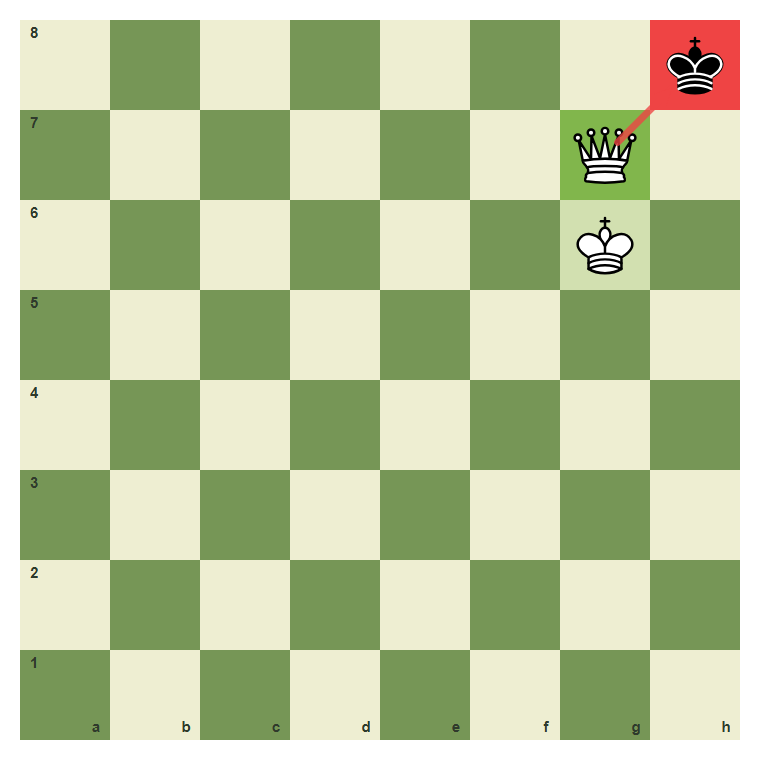
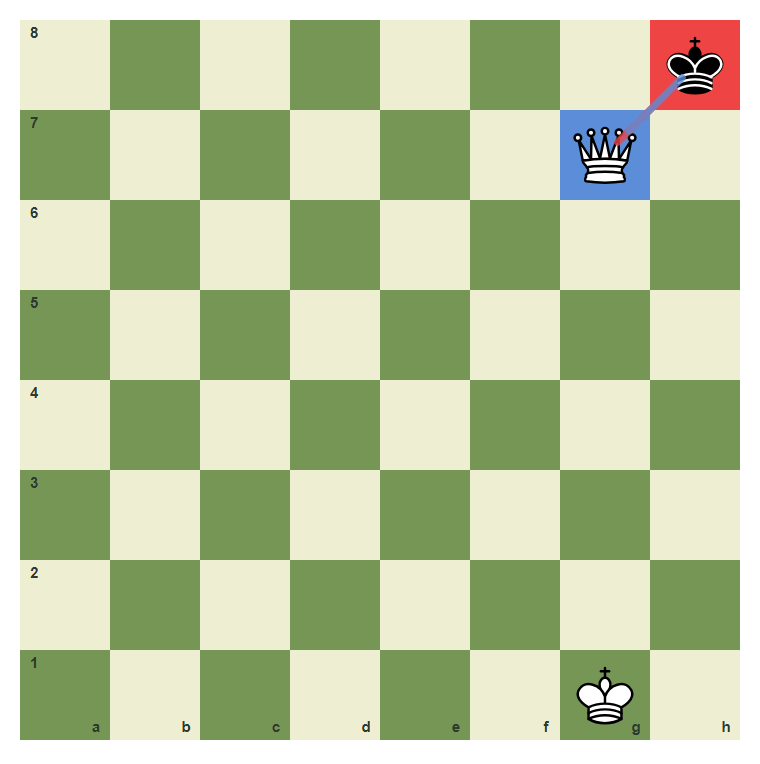
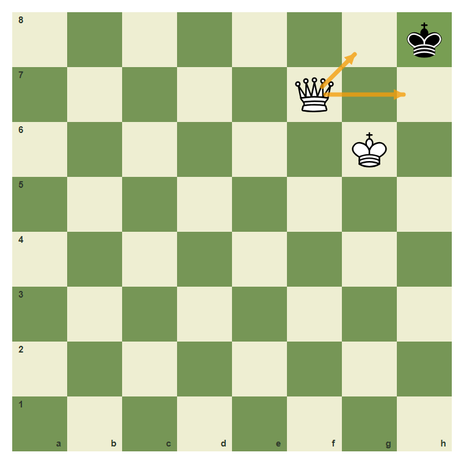
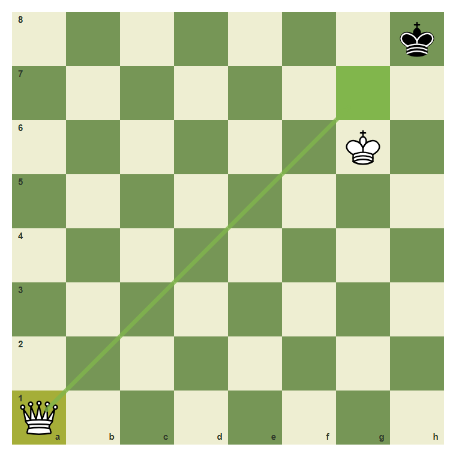
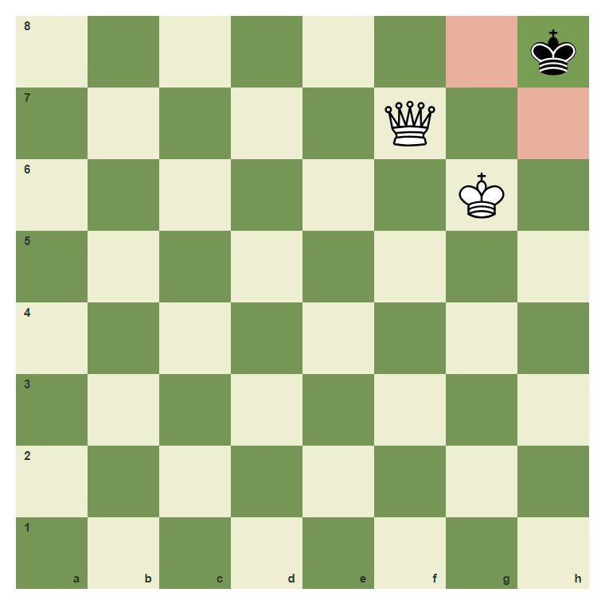

# Review Pack: Checkmate And Stalemate

Book: The First Chessboard
Chapter: 09-checkmate-and-stalemate
Source: ../../../chess-frontend/src/data/ebooks/v2/beginner-board-rules/chapters/09-checkmate-and-stalemate.json
Generated: 2026-05-05T07:36:03.662Z
Status: PASS - deterministic checks clean

## Chapter Intent

ELO range: 0-300
Required tier: free
Estimated minutes: 30

Learning objectives:
- Define checkmate as check with no legal escape.
- Recognize stalemate as no legal move but no check.
- Avoid stalemating a winning position.
- Deliver a simple queen-assisted mate.

## Quality Gates

| Gate | Result | Detail |
| --- | --- | --- |
| Sections | PASS | 3 |
| Total blocks | PASS | 12 |
| Board-like blocks | PASS | 7 |
| Generated PNG exports | PASS | 6 |
| Interactive/check blocks | PASS | 4 |
| Deterministic warnings | PASS | 0 |
| minimum_board_diagrams >= 5 | PASS | 5 board_diagram block(s) |
| minimum_guided_moves >= 1 | PASS | 1 guided_move block(s) |
| minimum_quizzes >= 3 | PASS | 3 quiz block(s) |
| tier_allowed <= free | PASS | chapter tier is free |

## Block Review

### b01-c09-p01 - prose

Section: Check Plus No Escape
Type: prose

Text under review:

```text
Checkmate means the king is in check and there is no legal escape. If the king is not in check, the position is not checkmate.
```

Reviewer flags: none from deterministic checks.

### b01-c09-d01 - Queen-supported checkmate

Section: Check Plus No Escape
Type: board_diagram
FEN: `7k/6Q1/6K1/8/8/8/8/8 b - - 0 1`
Orientation: white
Arrows: g7-h8 (check)
Highlights: h8 (check), g7 (best), g6 (safe)
Assertions: side_to_move black, piece_on black_king h8, piece_on white_queen g7, piece_on white_king g6
Text square claims: h8, g6
Text move claims: none
Visual square evidence: h8, g7, g6



PNG hash: `21430e4d20a7b424bad8a538c63b2bfa43fc97856dab24ff5f550bda220cbefb`

Text under review:

```text
Queen-supported checkmate
The queen checks h8, and the king on g6 supports the queen. Black has no escape.
```

Reviewer flags: none from deterministic checks.

### b01-c09-d02 - Check but not mate

Section: Check Plus No Escape
Type: board_diagram
FEN: `7k/6Q1/8/8/8/8/8/6K1 b - - 0 1`
Orientation: white
Arrows: g7-h8 (check), h8-g7 (capture)
Highlights: h8 (check), g7 (capture)
Assertions: piece_on black_king h8, piece_on white_queen g7, legal_move h8g7
Text square claims: none
Text move claims: none
Visual square evidence: h8, g7, g1



PNG hash: `5c8b9324e67c3cd10445a0f43087a57a0a190c72a96392d3134032dcf982265b`

Text under review:

```text
Check but not mate
This is check, but the queen is not protected. Black can capture it.
```

Reviewer flags: none from deterministic checks.

### b01-c09-p02 - prose

Section: Stalemate Is Not A Win
Type: prose

Text under review:

```text
Stalemate happens when the player to move is not in check but has no legal move. Stalemate is a draw. Beginners lose many winning positions by forgetting this difference.
```

Reviewer flags: none from deterministic checks.

### b01-c09-d03 - Stalemate pattern

Section: Stalemate Is Not A Win
Type: board_diagram
FEN: `7k/5Q2/6K1/8/8/8/8/8 b - - 0 1`
Orientation: white
Arrows: none
Highlights: h8 (safe), g8 (wrong), h7 (wrong)
Assertions: side_to_move black, piece_on black_king h8, piece_on white_queen f7, piece_on white_king g6
Text square claims: none
Text move claims: none
Visual square evidence: h8, f7, g6, g8, h7


PNG hash: `db56ce6b07951cd5a11b7b07cdc16827efb239f76095c4b78ded856e6ceb7997`

Text under review:

```text
Stalemate pattern
Black is not in check, but every black king move is controlled. This is stalemate, not checkmate.
```

Reviewer flags: none from deterministic checks.

### b01-c09-d04 - The missing check

Section: Stalemate Is Not A Win
Type: board_diagram
FEN: `7k/5Q2/6K1/8/8/8/8/8 b - - 0 1`
Orientation: white
Arrows: f7-h7 (target), f7-g8 (target)
Highlights: h8 (safe)
Assertions: piece_on black_king h8, piece_on white_queen f7, arrow_exists f7-g8
Text square claims: h8
Text move claims: none
Visual square evidence: h8, f7, g6, h7, g8



PNG hash: `cffe0aa3737e0dc769ee863a6220ee375f8f744fb839cb293e88684cbaa0173e`

Text under review:

```text
The missing check
The queen controls escape squares, but she does not attack h8. No check means no checkmate.
```

Reviewer flags: none from deterministic checks.

### b01-c09-d05 - Mate move available

Section: Stalemate Is Not A Win
Type: board_diagram
FEN: `7k/8/6K1/8/8/8/8/Q7 w - - 0 1`
Orientation: white
Arrows: a1-g7 (best)
Highlights: a1 (lastMove), g7 (best)
Assertions: piece_on white_queen a1, piece_on white_king g6, legal_move a1g7
Text square claims: g7
Text move claims: none
Visual square evidence: h8, g6, a1, g7



PNG hash: `0a9d0d259821bc567a2466848d24109fe66ed4d1f4d1644dd3548be49f7b5987`

Text under review:

```text
Mate move available
White can play Qa1 to g7, giving a protected queen checkmate.
```

Reviewer flags: none from deterministic checks.

### b01-c09-g01 - Deliver queen-supported mate

Section: Stalemate Is Not A Win
Type: guided_move
FEN: `7k/8/6K1/8/8/8/8/Q7 w - - 0 1`
Orientation: white
Arrows: a1-g7 (best)
Highlights: a1 (lastMove), g7 (best)
Assertions: legal_move a1g7
Text square claims: a1, g7
Text move claims: none
Visual square evidence: h8, g6, a1, g7

Text under review:

```text
Deliver queen-supported mate
Move the queen from a1 to g7 to give checkmate.
Correct. The queen gives check and the king supports her.
Use the queen on a1 and move along the diagonal to g7.
```

Reviewer flags: none from deterministic checks.

### b01-c09-m01 - Common mistake: stalemate instead of mate

Section: Common Mistake
Type: mistake_refutation
FEN: `7k/5Q2/6K1/8/8/8/8/8 b - - 0 1`
Orientation: white
Arrows: none
Highlights: h8 (safe), g8 (wrong), h7 (wrong)
Assertions: piece_on black_king h8, piece_on white_queen f7, piece_on white_king g6
Text square claims: h8
Text move claims: none
Visual square evidence: h8, f7, g6, g8, h7



PNG hash: `db56ce6b07951cd5a11b7b07cdc16827efb239f76095c4b78ded856e6ceb7997`

Text under review:

```text
Common mistake: stalemate instead of mate
This looks winning because the king is trapped, but the black king is not in check. Trapped without check is stalemate, so the game is drawn.
No check on h8 means this is stalemate, not mate.
```

Reviewer flags: none from deterministic checks.

### b01-c09-q01 - What is checkmate?

Section: Chapter Checkpoint
Type: quiz

Text under review:

```text
What is checkmate?
Checkmate means:
```

Quiz options:
- [correct] a: The king is in check with no legal escape
- [wrong] b: The king has no legal move but is not checked
- [wrong] c: The queen was captured

Reviewer flags: none from deterministic checks.

### b01-c09-q02 - What is stalemate?

Section: Chapter Checkpoint
Type: quiz

Text under review:

```text
What is stalemate?
Stalemate means:
```

Quiz options:
- [correct] a: No legal move and no check
- [wrong] b: Check with no escape
- [wrong] c: Both players have queens

Reviewer flags: none from deterministic checks.

### b01-c09-q03 - Is stalemate a win?

Section: Chapter Checkpoint
Type: quiz

Text under review:

```text
Is stalemate a win?
Stalemate is:
```

Quiz options:
- [correct] a: A draw
- [wrong] b: A win for the player with more pieces
- [wrong] c: A checkmate

Reviewer flags: none from deterministic checks.

## Human Signoff

- Chess analyst: pending
- Visual reviewer: pending
- Pedagogy reviewer: pending
- Final editor: pending
