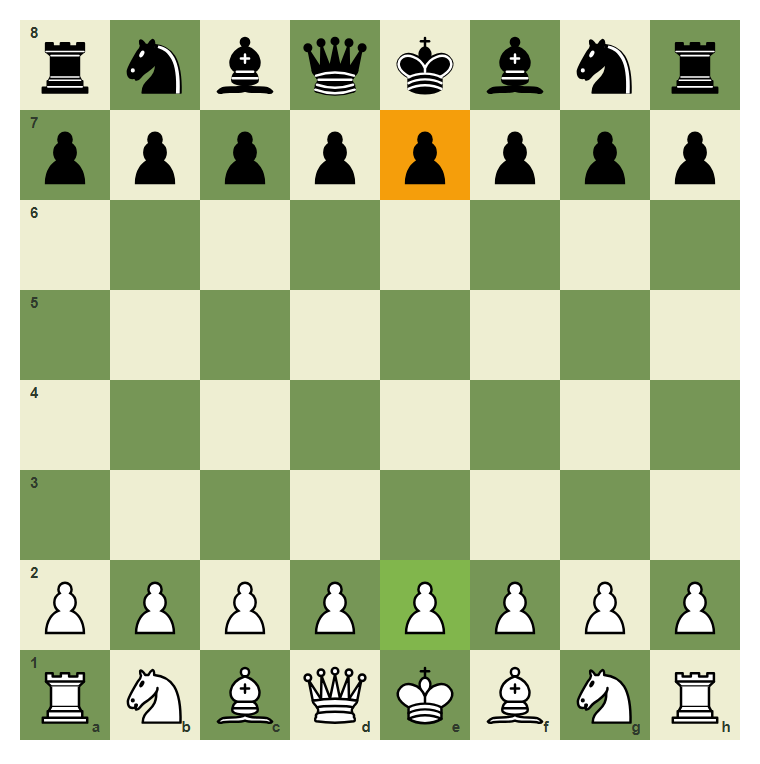
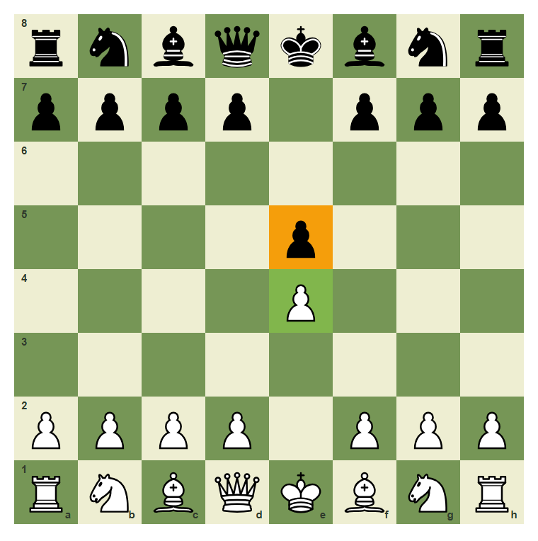
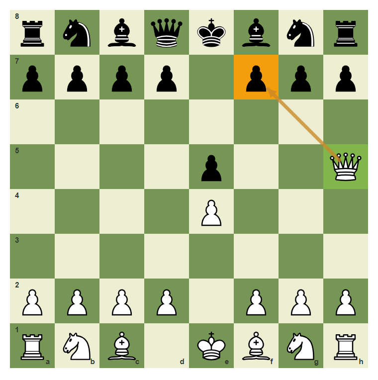
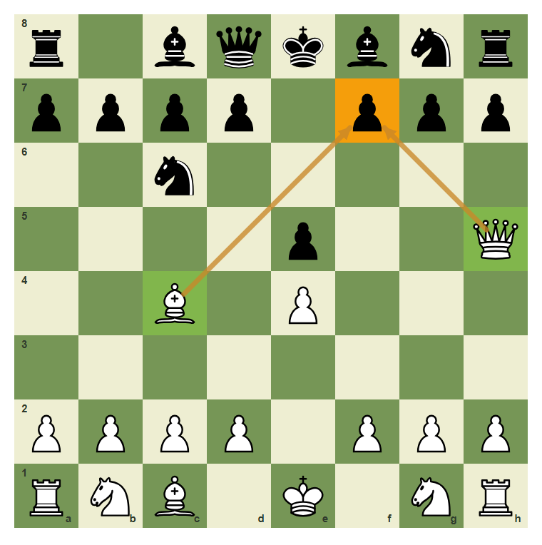
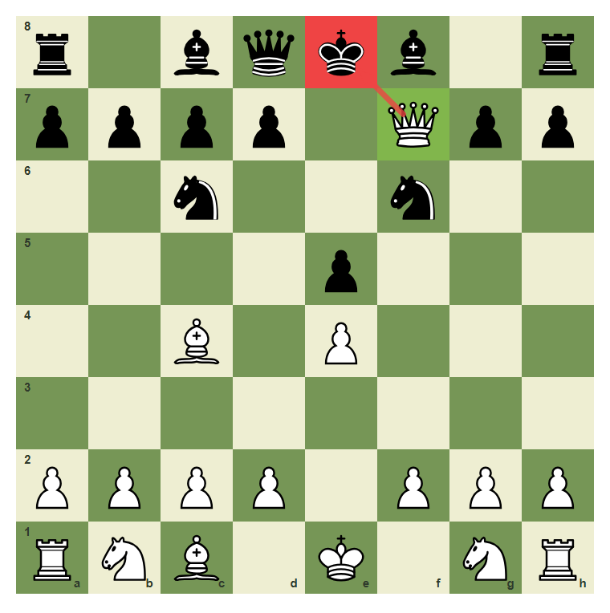
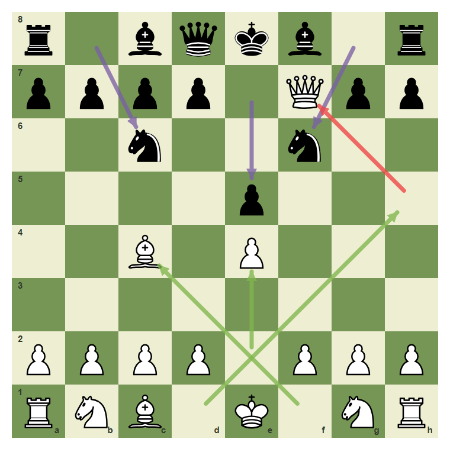
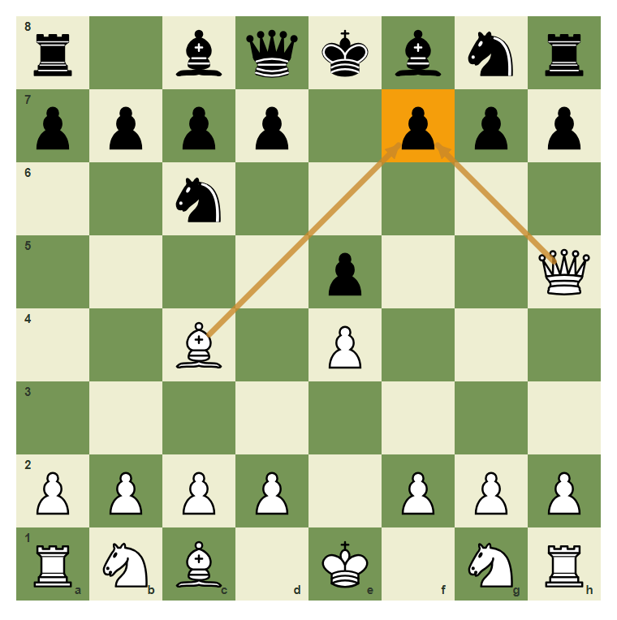

# Review Pack: Your First Guided Game

Book: The First Chessboard
Chapter: 10-first-guided-game
Source: ../../../chess-frontend/src/data/ebooks/v2/beginner-board-rules/chapters/10-first-guided-game.json
Generated: 2026-05-05T07:36:03.671Z
Status: PASS - deterministic checks clean

## Chapter Intent

ELO range: 0-300
Required tier: free
Estimated minutes: 32

Learning objectives:
- Play a legal opening sequence from the starting position.
- See how center control opens queen and bishop lines.
- Recognize a simple mate threat on f7.
- Complete a short guided game ending in checkmate.

## Quality Gates

| Gate | Result | Detail |
| --- | --- | --- |
| Sections | PASS | 3 |
| Total blocks | PASS | 13 |
| Board-like blocks | PASS | 8 |
| Generated PNG exports | PASS | 7 |
| Interactive/check blocks | PASS | 4 |
| Deterministic warnings | PASS | 0 |
| minimum_board_diagrams >= 5 | PASS | 5 board_diagram block(s) |
| minimum_guided_moves >= 1 | PASS | 1 guided_move block(s) |
| minimum_quizzes >= 3 | PASS | 3 quiz block(s) |
| tier_allowed <= free | PASS | chapter tier is free |

## Block Review

### b01-c10-p01 - prose

Section: A Short Legal Game
Type: prose

Text under review:

```text
Now we connect the first rules into a real sequence. This short game is not a full opening course. Its purpose is to show how legal moves, piece lines, check, and checkmate fit together.
```

Reviewer flags: none from deterministic checks.

### b01-c10-d01 - Start from the normal setup

Section: A Short Legal Game
Type: board_diagram
FEN: `rnbqkbnr/pppppppp/8/8/8/8/PPPPPPPP/RNBQKBNR w KQkq - 0 1`
Orientation: white
Arrows: none
Highlights: e2 (best), e7 (target)
Assertions: side_to_move white, piece_on white_pawn e2, piece_on black_pawn e7
Text square claims: none
Text move claims: none
Visual square evidence: a8, b8, c8, d8, e8, f8, g8, h8, a7, b7, c7, d7, e7, f7, g7, h7, a2, b2, c2, d2, e2, f2, g2, h2, a1, b1, c1, d1, e1, f1, g1, h1



PNG hash: `c624720f3072bb84469375c0e0423fd0af136200b28bf2efdb91ce1ac9a81e52`

Text under review:

```text
Start from the normal setup
The game begins from the correct starting position.
```

Reviewer flags: none from deterministic checks.

### b01-c10-d02 - Both players claim the center

Section: A Short Legal Game
Type: board_diagram
FEN: `rnbqkbnr/pppp1ppp/8/4p3/4P3/8/PPPP1PPP/RNBQKBNR w KQkq - 0 2`
Orientation: white
Arrows: none
Highlights: e4 (best), e5 (target)
Assertions: piece_on white_pawn e4, piece_on black_pawn e5
Text square claims: e4, e5
Text move claims: none
Visual square evidence: a8, b8, c8, d8, e8, f8, g8, h8, a7, b7, c7, d7, f7, g7, h7, e5, e4, a2, b2, c2, d2, f2, g2, h2, a1, b1, c1, d1, e1, f1, g1, h1



PNG hash: `70c280546465d6ccf96212d633c42ceb09f475a526fb689400a3d6d86efc28ea`

Text under review:

```text
Both players claim the center
After 1.e4 e5, both center pawns stand in the middle.
```

Reviewer flags: none from deterministic checks.

### b01-c10-p02 - prose

Section: Build The Mate Threat
Type: prose

Text under review:

```text
The weak f7 square is protected only by the Black king at the start. The White queen and bishop can team up on it.
```

Reviewer flags: none from deterministic checks.

### b01-c10-d03 - Queen eyes f7

Section: Build The Mate Threat
Type: board_diagram
FEN: `rnbqkbnr/pppp1ppp/8/4p2Q/4P3/8/PPPP1PPP/RNB1KBNR b KQkq - 1 2`
Orientation: white
Arrows: h5-f7 (threat)
Highlights: h5 (best), f7 (target)
Assertions: piece_on white_queen h5, piece_on black_pawn f7, arrow_exists h5-f7
Text square claims: f7
Text move claims: none
Visual square evidence: a8, b8, c8, d8, e8, f8, g8, h8, a7, b7, c7, d7, f7, g7, h7, e5, h5, e4, a2, b2, c2, d2, f2, g2, h2, a1, b1, c1, e1, f1, g1, h1



PNG hash: `419fb9da5104bbe01212476491929c3c6f7cf61a01ea1de402474f9dd696c8cd`

Text under review:

```text
Queen eyes f7
After Qh5, the queen attacks f7.
```

Reviewer flags: none from deterministic checks.

### b01-c10-d04 - Bishop joins the attack

Section: Build The Mate Threat
Type: board_diagram
FEN: `r1bqkbnr/pppp1ppp/2n5/4p2Q/2B1P3/8/PPPP1PPP/RNB1K1NR b KQkq - 3 3`
Orientation: white
Arrows: c4-f7 (threat), h5-f7 (threat)
Highlights: c4 (best), h5 (best), f7 (target)
Assertions: piece_on white_bishop c4, piece_on white_queen h5, piece_on black_pawn f7
Text square claims: c4, h5, f7
Text move claims: none
Visual square evidence: a8, c8, d8, e8, f8, g8, h8, a7, b7, c7, d7, f7, g7, h7, c6, e5, h5, c4, e4, a2, b2, c2, d2, f2, g2, h2, a1, b1, c1, e1, g1, h1



PNG hash: `621adfeec88e871df29a8810edf0cbbba0360327e8964fbb67e9f3f420af9832`

Text under review:

```text
Bishop joins the attack
The bishop on c4 and queen on h5 both point at f7.
```

Reviewer flags: none from deterministic checks.

### b01-c10-d05 - The final mate on f7

Section: Build The Mate Threat
Type: board_diagram
FEN: `r1bqkb1r/pppp1Qpp/2n2n2/4p3/2B1P3/8/PPPP1PPP/RNB1K1NR b KQkq - 0 4`
Orientation: white
Arrows: f7-e8 (check)
Highlights: f7 (best), e8 (check)
Assertions: side_to_move black, piece_on white_queen f7, piece_on black_king e8, piece_on white_bishop c4
Text square claims: f7
Text move claims: none
Visual square evidence: a8, c8, d8, e8, f8, h8, a7, b7, c7, d7, f7, g7, h7, c6, f6, e5, c4, e4, a2, b2, c2, d2, f2, g2, h2, a1, b1, c1, e1, g1, h1



PNG hash: `b7a3247093c7618319d2b6c780e6fc4c27af13d05d87dd6c00cca266639b7ab9`

Text under review:

```text
The final mate on f7
Qxf7 is checkmate in this beginner pattern because the queen is protected and the king has no good escape.
```

Reviewer flags: none from deterministic checks.

### b01-c10-a01 - The full guided sequence

Section: Build The Mate Threat
Type: board_animation
FEN: `rnbqkbnr/pppppppp/8/8/8/8/PPPPPPPP/RNBQKBNR w KQkq - 0 1`
Orientation: white
Arrows: e2-e4 (best), e2-e4 (best), e7-e5 (candidate), e7-e5 (best), d1-h5 (best), d1-h5 (best), b8-c6 (candidate), b8-c6 (best), f1-c4 (best), f1-c4 (best), g8-f6 (candidate), g8-f6 (best), h5-f7 (check), h5-f7 (best)
Highlights: none
Assertions: side_to_move white, piece_on white_pawn e2
Text square claims: e4, e5
Text move claims: none
Visual square evidence: a8, c8, d8, e8, f8, h8, a7, b7, c7, d7, f7, g7, h7, c6, f6, e5, c4, e4, a2, b2, c2, d2, f2, g2, h2, a1, b1, c1, e1, g1, h1, e2, e7, d1, h5, b8, f1, g8



PNG hash: `af06e81f9b5bd5299951d9a9b15e9c06f07911956de314290b5373b779d498b2`

Text under review:

```text
The full guided sequence
The sequence is 1.e4 e5 2.Qh5 Nc6 3.Bc4 Nf6 4.Qxf7#.
```

Reviewer flags: none from deterministic checks.

### b01-c10-g01 - Play the checkmate move

Section: Build The Mate Threat
Type: guided_move
FEN: `r1bqkb1r/pppp1ppp/2n2n2/4p2Q/2B1P3/8/PPPP1PPP/RNB1K1NR w KQkq - 4 4`
Orientation: white
Arrows: h5-f7 (check)
Highlights: h5 (lastMove), f7 (best), e8 (check)
Assertions: legal_move h5f7
Text square claims: f7, h5
Text move claims: none
Visual square evidence: a8, c8, d8, e8, f8, h8, a7, b7, c7, d7, f7, g7, h7, c6, f6, e5, h5, c4, e4, a2, b2, c2, d2, f2, g2, h2, a1, b1, c1, e1, g1, h1

Text under review:

```text
Play the checkmate move
White to move: capture f7 with the queen.
Correct. Qxf7 is checkmate in this beginner pattern.
Use the queen on h5 to capture f7.
```

Reviewer flags: none from deterministic checks.

### b01-c10-m01 - Common mistake: moving without checking threats

Section: Common Mistake
Type: mistake_refutation
FEN: `r1bqkbnr/pppp1ppp/2n5/4p2Q/2B1P3/8/PPPP1PPP/RNB1K1NR b KQkq - 3 3`
Orientation: white
Arrows: h5-f7 (threat), c4-f7 (threat)
Highlights: f7 (target)
Assertions: piece_on white_queen h5, piece_on white_bishop c4, piece_on black_pawn f7
Text square claims: f7
Text move claims: none
Visual square evidence: a8, c8, d8, e8, f8, g8, h8, a7, b7, c7, d7, f7, g7, h7, c6, e5, h5, c4, e4, a2, b2, c2, d2, f2, g2, h2, a1, b1, c1, e1, g1, h1



PNG hash: `e74a2ce59a791cb5220557a6cbb41036f7104c9a2ecf06528f9eadd8088ffd53`

Text under review:

```text
Common mistake: moving without checking threats
Black must notice the threat on f7. A move that ignores both queen and bishop pressure can allow Qxf7 mate.
Both attacking pieces point to f7. The threat should be checked before moving.
```

Reviewer flags: none from deterministic checks.

### b01-c10-q01 - What did 1.e4 open?

Section: Chapter Checkpoint
Type: quiz

Text under review:

```text
What did 1.e4 open?
The move 1.e4 helps open lines for:
```

Quiz options:
- [correct] a: The queen and bishop
- [wrong] b: Only the rook on a1
- [wrong] c: Only the king

Reviewer flags: none from deterministic checks.

### b01-c10-q02 - Which square was targeted?

Section: Chapter Checkpoint
Type: quiz

Text under review:

```text
Which square was targeted?
In the guided game, White attacked:
```

Quiz options:
- [correct] a: f7
- [wrong] b: a8
- [wrong] c: h1

Reviewer flags: none from deterministic checks.

### b01-c10-q03 - What was the final move?

Section: Chapter Checkpoint
Type: quiz

Text under review:

```text
What was the final move?
The final move of the guided game was:
```

Quiz options:
- [correct] a: Qxf7#
- [wrong] b: Nf3
- [wrong] c: a3

Reviewer flags: none from deterministic checks.

## Human Signoff

- Chess analyst: pending
- Visual reviewer: pending
- Pedagogy reviewer: pending
- Final editor: pending
