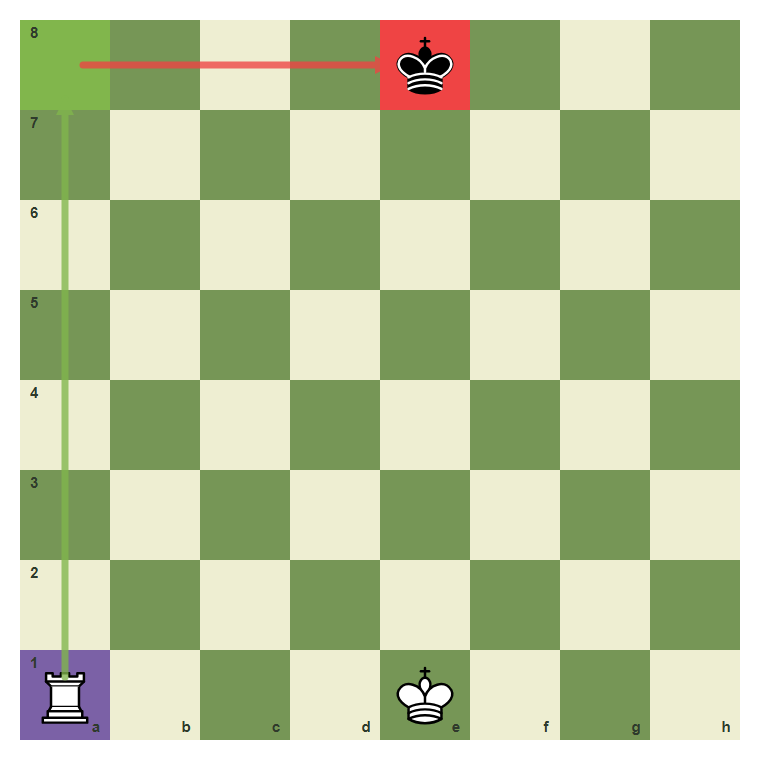
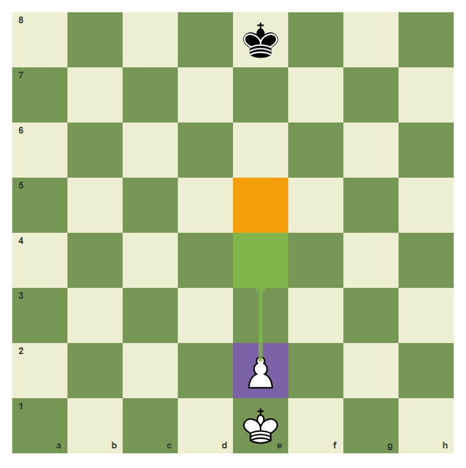
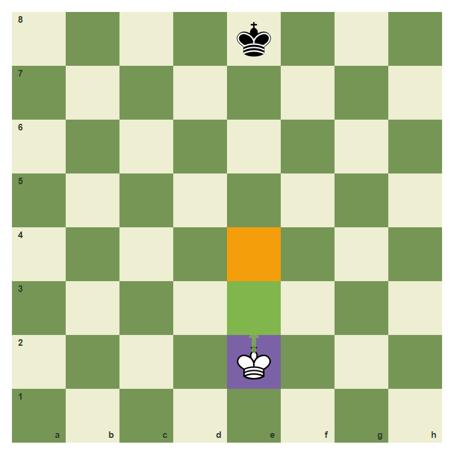
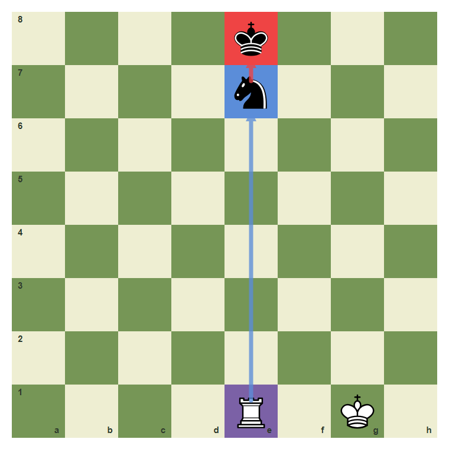
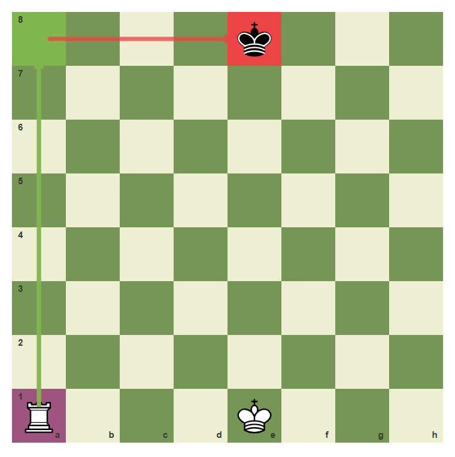

# Review Pack: Endgame Tactics

Book: Calculation II - Depth And Quiet Moves
Chapter: 08-endgame-tactics
Source: ../../../chess-frontend/src/data/ebooks/v2/calculation-depth-quiet-moves/chapters/08-endgame-tactics.json
Generated: 2026-05-05T07:36:03.778Z
Status: PASS - deterministic checks clean

## Chapter Intent

ELO range: 1900-2200
Required tier: gold
Estimated minutes: 28

Learning objectives:
- Recognize the visual signal for endgame tactics.
- Choose a move or plan that fits endgame tactics.
- Avoid the common beginner error connected with endgame tactics.
- Pass a checkpoint without relying on guesswork.

## Quality Gates

| Gate | Result | Detail |
| --- | --- | --- |
| Sections | PASS | 2 |
| Total blocks | PASS | 12 |
| Board-like blocks | PASS | 7 |
| Generated PNG exports | PASS | 7 |
| Interactive/check blocks | PASS | 4 |
| Deterministic warnings | PASS | 0 |
| minimum_board_diagrams >= 5 | PASS | 5 board_diagram block(s) |
| minimum_guided_moves >= 1 | PASS | 1 guided_move block(s) |
| minimum_quizzes >= 3 | PASS | 3 quiz block(s) |
| tier_allowed <= gold | PASS | chapter tier is gold |

## Block Review

### b10-c08-p01 - prose

Section: Goal And Pattern
Type: prose

Text under review:

```text
Endgame Tactics is not a memory trick. It is a way to organize the position. First name the signal, then compare candidate moves, then choose the move that improves your position without creating a new weakness.
```

Reviewer flags: none from deterministic checks.

### b10-c08-d01 - Training Diagram: main pattern

Section: Goal And Pattern
Type: board_diagram
FEN: `4k3/8/8/8/8/8/8/R3K3 w Q - 0 1`
Orientation: white
Arrows: a1-a8 (best), a8-e8 (check)
Highlights: a1 (candidate), a8 (best), e8 (check)
Assertions: piece_on white_rook a1, highlight_exists a8, arrow_exists a1-a8
Text square claims: none
Text move claims: none
Visual square evidence: e8, a1, e1, a8



PNG hash: `031f45e0008946de9642cfb6f9a496809731dac1dc716cb071b2a2fcb3cbce0a`

Text under review:

```text
Training Diagram: main pattern
Open files are highways for rooks, especially when a king or target is exposed. Study the highlighted relationship before reading the move.
```

Reviewer flags: none from deterministic checks.

### b10-c08-d02 - Training Diagram: candidate move

Section: Goal And Pattern
Type: board_diagram
FEN: `4k3/8/8/8/8/8/4P3/4K3 w - - 0 1`
Orientation: white
Arrows: e2-e4 (best)
Highlights: e2 (candidate), e4 (best), e5 (target)
Assertions: piece_on white_pawn e2, highlight_exists e4, arrow_exists e2-e4
Text square claims: none
Text move claims: none
Visual square evidence: e8, e2, e1, e4, e5



PNG hash: `ae5f0d1f381e60100ace69a06e95f3a98c5e4418bef6b7d757d82e9daaaa016c`

Text under review:

```text
Training Diagram: candidate move
In pawn endings, one tempo can decide whether the pawn advances or stalls. Study the highlighted relationship before reading the move.
```

Reviewer flags: none from deterministic checks.

### b10-c08-p02 - prose

Section: Analysis And Decision
Type: prose

Text under review:

```text
Use the diagram as a thinking board. Ask what is forcing, what is loose, and what changes after the move. Strong players do not only see a move; they see the reason the move works.
```

Reviewer flags: none from deterministic checks.

### b10-c08-d03 - Training Diagram: comparison position

Section: Analysis And Decision
Type: board_diagram
FEN: `4k3/8/8/8/8/8/4K3/8 w - - 0 1`
Orientation: white
Arrows: e2-e3 (best)
Highlights: e2 (candidate), e3 (best), e4 (target)
Assertions: piece_on white_king e2, highlight_exists e3, arrow_exists e2-e3
Text square claims: none
Text move claims: none
Visual square evidence: e8, e2, e3, e4



PNG hash: `ce2add3d0ab22977e9d511845aa867997857060430dd19ac47b00ed2c248b9ab`

Text under review:

```text
Training Diagram: comparison position
Not every best move is a capture; sometimes the quiet improving move is the point. Study the highlighted relationship before reading the move.
```

Reviewer flags: none from deterministic checks.

### b10-c08-d04 - Training Diagram: best practical choice

Section: Analysis And Decision
Type: board_diagram
FEN: `8/1r1k4/8/8/8/1N6/8/4K3 w - - 0 1`
Orientation: white
Arrows: b3-c5 (best), c5-d7 (check), c5-b7 (capture)
Highlights: b3 (candidate), c5 (best), d7 (check), b7 (capture)
Assertions: piece_on white_knight b3, highlight_exists c5, arrow_exists b3-c5
Text square claims: none
Text move claims: none
Visual square evidence: b7, d7, b3, e1, c5


PNG hash: `037958d91d2faf2faa3a36842ed3976e394627c7a7de0458643c3d9d73bfb777`

Text under review:

```text
Training Diagram: best practical choice
The best square creates two problems at once: king danger and material pressure. Study the highlighted relationship before reading the move.
```

Reviewer flags: none from deterministic checks.

### b10-c08-d05 - Training Diagram: review position

Section: Analysis And Decision
Type: board_diagram
FEN: `4k3/4n3/8/8/8/8/8/4R1K1 w - - 0 1`
Orientation: white
Arrows: e1-e7 (capture), e7-e8 (check)
Highlights: e1 (candidate), e7 (capture), e8 (check)
Assertions: piece_on white_rook e1, highlight_exists e7, arrow_exists e1-e7
Text square claims: none
Text move claims: none
Visual square evidence: e8, e7, e1, g1



PNG hash: `b541b43709ee57aaac40dbabc37a3f68b2aab49c80784568f3a02bd76877519c`

Text under review:

```text
Training Diagram: review position
The target cannot move freely because the king behind it matters. Study the highlighted relationship before reading the move.
```

Reviewer flags: none from deterministic checks.

### b10-c08-g01 - Try It: Find The Training Move

Section: Analysis And Decision
Type: guided_move
FEN: `4k3/8/8/8/8/8/8/R3K3 w Q - 0 1`
Orientation: white
Arrows: a1-a8 (best), a8-e8 (check)
Highlights: a1 (candidate), a8 (best), e8 (check)
Assertions: legal_move a1a8, piece_on white_rook a1, highlight_exists a8, arrow_exists a1-a8
Text square claims: a1, a8
Text move claims: none
Visual square evidence: e8, a1, e1, a8


PNG hash: `031f45e0008946de9642cfb6f9a496809731dac1dc716cb071b2a2fcb3cbce0a`

Text under review:

```text
Try It: Find The Training Move
The guided move turns the diagram idea into a playable habit.
Play the highlighted move from **a1** to **a8**. Do it only after saying the idea in words.
Correct. The move matches the chapter idea.
Pause, compare the arrows, and try the chapter idea again.
```

Reviewer flags: none from deterministic checks.

### b10-c08-m01 - Common Mistake: Missing The Diagram Signal

Section: Analysis And Decision
Type: mistake_refutation
FEN: `4k3/8/8/8/8/8/8/R3K3 w Q - 0 1`
Orientation: white
Arrows: a1-a8 (best), a8-e8 (check), a1-a8 (best)
Highlights: a1 (candidate), a8 (best), e8 (check), a1 (wrong)
Assertions: piece_on white_rook a1, highlight_exists a8, arrow_exists a1-a8
Text square claims: none
Text move claims: none
Visual square evidence: e8, a1, e1, a8



PNG hash: `8a871eaf4d444dace9ad937556ae37541ce909cc92e94e9f4bfe6fdd505b626a`

Text under review:

```text
Common Mistake: Missing The Diagram Signal
The common mistake is to move by habit and miss the chapter signal. The diagram marks the useful move and the important target so the error is visible before it happens.
The marked relationship is the reason the natural careless move fails.
```

Reviewer flags: none from deterministic checks.

### b10-c08-q01 - Endgame Tactics Check 1

Section: Chapter Checkpoint
Type: quiz

Text under review:

```text
Endgame Tactics Check 1
What should you do first in a position about **endgame tactics**?
```

Quiz options:
- [correct] a: Name the key signal before choosing a move.
- [wrong] b: Move instantly because the first idea is usually enough.
- [wrong] c: Ignore the diagram and choose by piece value only.

Reviewer flags: none from deterministic checks.

### b10-c08-q02 - Endgame Tactics Check 2

Section: Chapter Checkpoint
Type: quiz

Text under review:

```text
Endgame Tactics Check 2
Which answer best matches the chapter habit for **endgame tactics**?
```

Quiz options:
- [correct] a: Compare candidate moves and reject the unsafe one.
- [wrong] b: Move instantly because the first idea is usually enough.
- [wrong] c: Ignore the diagram and choose by piece value only.

Reviewer flags: none from deterministic checks.

### b10-c08-q03 - Endgame Tactics Check 3

Section: Chapter Checkpoint
Type: quiz

Text under review:

```text
Endgame Tactics Check 3
What is the biggest danger if you ignore **endgame tactics**?
```

Quiz options:
- [correct] a: You may miss a tactic, plan, or defensive resource.
- [wrong] b: Move instantly because the first idea is usually enough.
- [wrong] c: Ignore the diagram and choose by piece value only.

Reviewer flags: none from deterministic checks.

## Human Signoff

- Chess analyst: pending
- Visual reviewer: pending
- Pedagogy reviewer: pending
- Final editor: pending
