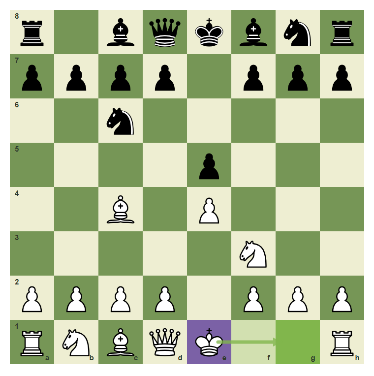
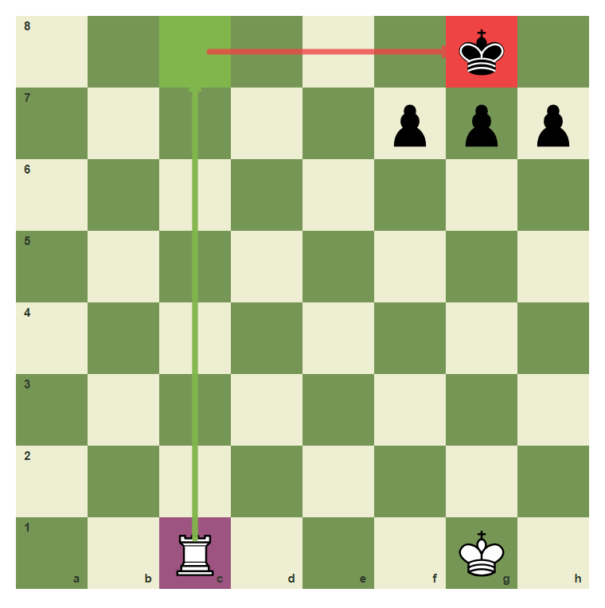

# Review Pack: Double Attacks

Book: Club Tactics
Chapter: 01-double-attacks
Source: ../../../chess-frontend/src/data/ebooks/v2/club-tactics/chapters/01-double-attacks.json
Generated: 2026-05-05T07:36:03.788Z
Status: PASS - deterministic checks clean

## Chapter Intent

ELO range: 1300-1600
Required tier: silver
Estimated minutes: 28

Learning objectives:
- Recognize the visual signal for double attacks.
- Choose a move or plan that fits double attacks.
- Avoid the common beginner error connected with double attacks.
- Pass a checkpoint without relying on guesswork.

## Quality Gates

| Gate | Result | Detail |
| --- | --- | --- |
| Sections | PASS | 2 |
| Total blocks | PASS | 12 |
| Board-like blocks | PASS | 7 |
| Generated PNG exports | PASS | 7 |
| Interactive/check blocks | PASS | 4 |
| Deterministic warnings | PASS | 0 |
| minimum_board_diagrams >= 5 | PASS | 5 board_diagram block(s) |
| minimum_guided_moves >= 1 | PASS | 1 guided_move block(s) |
| minimum_quizzes >= 3 | PASS | 3 quiz block(s) |
| tier_allowed <= silver | PASS | chapter tier is silver |

## Block Review

### b06-c01-p01 - prose

Section: Goal And Pattern
Type: prose

Text under review:

```text
Double Attacks is not a memory trick. It is a way to organize the position. First name the signal, then compare candidate moves, then choose the move that improves your position without creating a new weakness.
```

Reviewer flags: none from deterministic checks.

### b06-c01-d01 - Training Diagram: main pattern

Section: Goal And Pattern
Type: board_diagram
FEN: `6k1/5ppp/8/8/8/8/8/2R3K1 w - - 0 1`
Orientation: white
Arrows: c1-c8 (best), c8-g8 (check)
Highlights: c1 (candidate), c8 (best), g8 (check)
Assertions: piece_on white_rook c1, highlight_exists c8, arrow_exists c1-c8
Text square claims: none
Text move claims: none
Visual square evidence: g8, f7, g7, h7, c1, g1, c8


PNG hash: `e70871e69145e8c4af273344c446a777d1d89452c20750c7bace1361932ce4f7`

Text under review:

```text
Training Diagram: main pattern
A rook reaches the back rank when the escape squares are boxed in. Study the highlighted relationship before reading the move.
```

Reviewer flags: none from deterministic checks.

### b06-c01-d02 - Training Diagram: candidate move

Section: Goal And Pattern
Type: board_diagram
FEN: `4k3/5r2/8/8/2B5/8/8/4K3 w - - 0 1`
Orientation: white
Arrows: c4-f7 (capture)
Highlights: c4 (candidate), f7 (capture), e8 (target)
Assertions: piece_on white_bishop c4, highlight_exists f7, arrow_exists c4-f7
Text square claims: none
Text move claims: none
Visual square evidence: e8, f7, c4, e1


PNG hash: `8569b4e4fc02e0edcdc258f56ea0c9f1b0b8ae1debd137d3430b4156d82f94c2`

Text under review:

```text
Training Diagram: candidate move
The line to the target is clear, so the capture wins higher-value material. Study the highlighted relationship before reading the move.
```

Reviewer flags: none from deterministic checks.

### b06-c01-p02 - prose

Section: Analysis And Decision
Type: prose

Text under review:

```text
Use the diagram as a thinking board. Ask what is forcing, what is loose, and what changes after the move. Strong players do not only see a move; they see the reason the move works.
```

Reviewer flags: none from deterministic checks.

### b06-c01-d03 - Training Diagram: comparison position

Section: Analysis And Decision
Type: board_diagram
FEN: `4k3/8/8/8/3q4/5N2/8/4K3 w - - 0 1`
Orientation: white
Arrows: f3-d4 (capture)
Highlights: f3 (candidate), d4 (capture), e6 (target)
Assertions: piece_on white_knight f3, highlight_exists d4, arrow_exists f3-d4
Text square claims: none
Text move claims: none
Visual square evidence: e8, d4, f3, e1, e6


PNG hash: `aea6b7c053c73e4c85be700613d794ab0953babb82989dce6362a1defd6ec009`

Text under review:

```text
Training Diagram: comparison position
A high-value target changes the whole position when it is undefended. Study the highlighted relationship before reading the move.
```

Reviewer flags: none from deterministic checks.

### b06-c01-d04 - Training Diagram: best practical choice

Section: Analysis And Decision
Type: board_diagram
FEN: `r1bqkbnr/pppp1ppp/2n5/4p3/2B1P3/5N2/PPPP1PPP/RNBQK2R w KQkq - 2 3`
Orientation: white
Arrows: e1-g1 (best)
Highlights: e1 (candidate), g1 (best), f1 (safe)
Assertions: piece_on white_king e1, highlight_exists g1, arrow_exists e1-g1
Text square claims: none
Text move claims: none
Visual square evidence: a8, c8, d8, e8, f8, g8, h8, a7, b7, c7, d7, f7, g7, h7, c6, e5, c4, e4, f3, a2, b2, c2, d2, f2, g2, h2, a1, b1, c1, d1, e1, h1, g1, f1



PNG hash: `bd737dec6642befd1202e51c1319afdd38d26a2aa4c3c58aef29f163e40cb593`

Text under review:

```text
Training Diagram: best practical choice
King safety often beats a tempting pawn grab or one-move threat. Study the highlighted relationship before reading the move.
```

Reviewer flags: none from deterministic checks.

### b06-c01-d05 - Training Diagram: review position

Section: Analysis And Decision
Type: board_diagram
FEN: `rnbqkbnr/pppp1ppp/8/4p3/2B1P3/5N2/PPPP1PPP/RNBQK2R w KQkq - 1 3`
Orientation: white
Arrows: c4-f7 (check)
Highlights: c4 (candidate), f7 (check), e8 (check)
Assertions: piece_on white_bishop c4, highlight_exists f7, arrow_exists c4-f7
Text square claims: none
Text move claims: none
Visual square evidence: a8, b8, c8, d8, e8, f8, g8, h8, a7, b7, c7, d7, f7, g7, h7, e5, c4, e4, f3, a2, b2, c2, d2, f2, g2, h2, a1, b1, c1, d1, e1, h1


PNG hash: `39a15b2b6ae9d397dce46428e4bbd20629c2f84f94dbfb5de3cf7a471d9e81ef`

Text under review:

```text
Training Diagram: review position
Checks are forcing moves and should be examined before quieter ideas. Study the highlighted relationship before reading the move.
```

Reviewer flags: none from deterministic checks.

### b06-c01-g01 - Try It: Find The Training Move

Section: Analysis And Decision
Type: guided_move
FEN: `6k1/5ppp/8/8/8/8/8/2R3K1 w - - 0 1`
Orientation: white
Arrows: c1-c8 (best), c8-g8 (check)
Highlights: c1 (candidate), c8 (best), g8 (check)
Assertions: legal_move c1c8, piece_on white_rook c1, highlight_exists c8, arrow_exists c1-c8
Text square claims: c1, c8
Text move claims: none
Visual square evidence: g8, f7, g7, h7, c1, g1, c8


PNG hash: `e70871e69145e8c4af273344c446a777d1d89452c20750c7bace1361932ce4f7`

Text under review:

```text
Try It: Find The Training Move
The guided move turns the diagram idea into a playable habit.
Play the highlighted move from **c1** to **c8**. Do it only after saying the idea in words.
Correct. The move matches the chapter idea.
Pause, compare the arrows, and try the chapter idea again.
```

Reviewer flags: none from deterministic checks.

### b06-c01-m01 - Common Mistake: Missing The Diagram Signal

Section: Analysis And Decision
Type: mistake_refutation
FEN: `6k1/5ppp/8/8/8/8/8/2R3K1 w - - 0 1`
Orientation: white
Arrows: c1-c8 (best), c8-g8 (check), c1-c8 (best)
Highlights: c1 (candidate), c8 (best), g8 (check), c1 (wrong)
Assertions: piece_on white_rook c1, highlight_exists c8, arrow_exists c1-c8
Text square claims: none
Text move claims: none
Visual square evidence: g8, f7, g7, h7, c1, g1, c8



PNG hash: `676db88b7a85336baf5b6aa3f7691ac37eb618b844ef66537a2c338f3f2343b8`

Text under review:

```text
Common Mistake: Missing The Diagram Signal
The common mistake is to move by habit and miss the chapter signal. The diagram marks the useful move and the important target so the error is visible before it happens.
The marked relationship is the reason the natural careless move fails.
```

Reviewer flags: none from deterministic checks.

### b06-c01-q01 - Double Attacks Check 1

Section: Chapter Checkpoint
Type: quiz

Text under review:

```text
Double Attacks Check 1
What should you do first in a position about **double attacks**?
```

Quiz options:
- [correct] a: Name the key signal before choosing a move.
- [wrong] b: Move instantly because the first idea is usually enough.
- [wrong] c: Ignore the diagram and choose by piece value only.

Reviewer flags: none from deterministic checks.

### b06-c01-q02 - Double Attacks Check 2

Section: Chapter Checkpoint
Type: quiz

Text under review:

```text
Double Attacks Check 2
Which answer best matches the chapter habit for **double attacks**?
```

Quiz options:
- [correct] a: Compare candidate moves and reject the unsafe one.
- [wrong] b: Move instantly because the first idea is usually enough.
- [wrong] c: Ignore the diagram and choose by piece value only.

Reviewer flags: none from deterministic checks.

### b06-c01-q03 - Double Attacks Check 3

Section: Chapter Checkpoint
Type: quiz

Text under review:

```text
Double Attacks Check 3
What is the biggest danger if you ignore **double attacks**?
```

Quiz options:
- [correct] a: You may miss a tactic, plan, or defensive resource.
- [wrong] b: Move instantly because the first idea is usually enough.
- [wrong] c: Ignore the diagram and choose by piece value only.

Reviewer flags: none from deterministic checks.

## Human Signoff

- Chess analyst: pending
- Visual reviewer: pending
- Pedagogy reviewer: pending
- Final editor: pending
