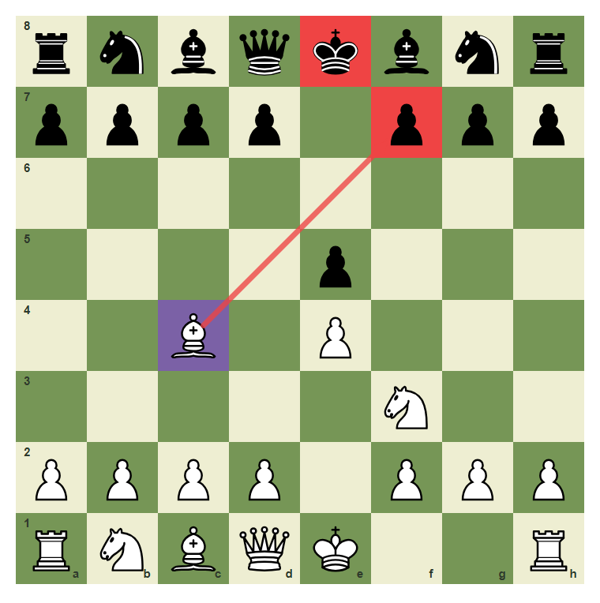
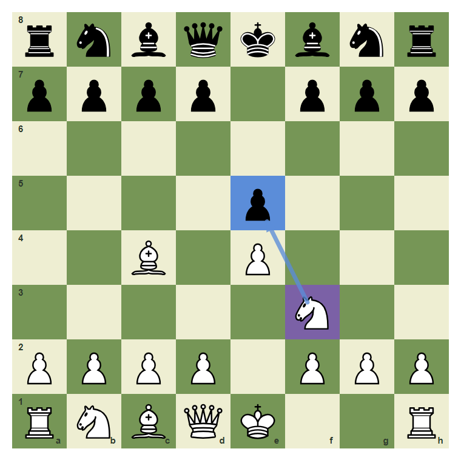
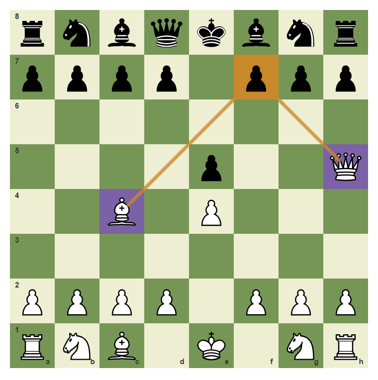
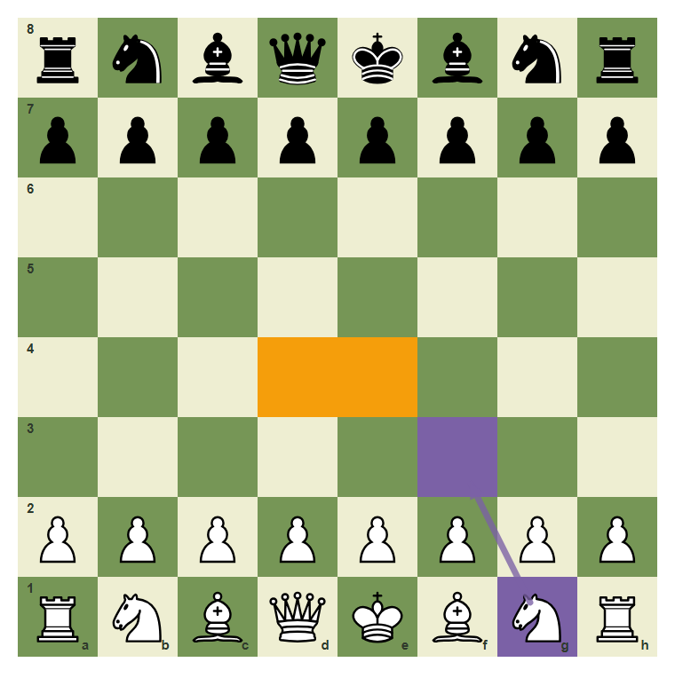
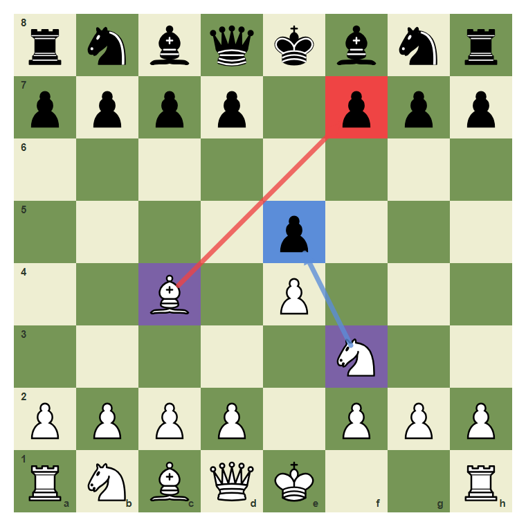
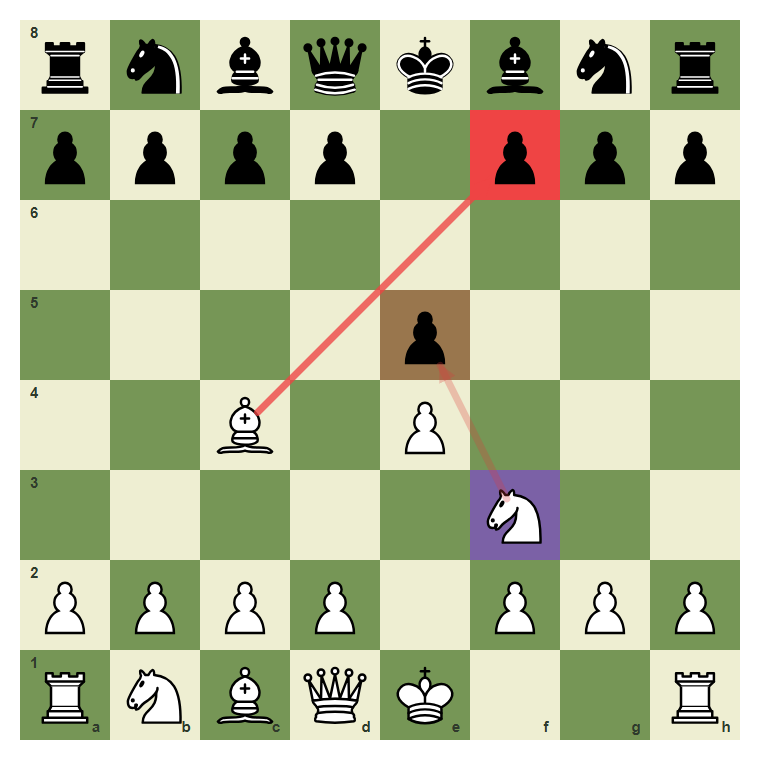

# Review Pack: The Three Questions: Checks, Captures, Threats

Book: Survival Chess
Chapter: 01-checks-captures-threats
Source: ../../../chess-frontend/src/data/ebooks/v2/survival-chess/chapters/01-checks-captures-threats.json
Generated: 2026-05-05T07:36:03.978Z
Status: PASS - deterministic checks clean

## Chapter Intent

ELO range: 300-700
Required tier: free
Estimated minutes: 24

Learning objectives:
- Scan checks before attractive captures.
- Spot free captures and direct threats.
- Use one checklist before choosing a move.

## Quality Gates

| Gate | Result | Detail |
| --- | --- | --- |
| Sections | PASS | 1 |
| Total blocks | PASS | 11 |
| Board-like blocks | PASS | 7 |
| Generated PNG exports | PASS | 7 |
| Interactive/check blocks | PASS | 4 |
| Deterministic warnings | PASS | 0 |
| minimum_board_diagrams >= 5 | PASS | 5 board_diagram block(s) |
| minimum_guided_moves >= 1 | PASS | 1 guided_move block(s) |
| minimum_quizzes >= 3 | PASS | 3 quiz block(s) |
| tier_allowed <= free | PASS | chapter tier is free |

## Block Review

### b02-c01-p01 - prose

Section: The Scan Comes First
Type: prose

Text under review:

```text
Survival chess begins before you touch a piece. Ask three questions in order: **What checks exist? What captures exist? What threats exist?** This habit stops many beginner losses immediately.
```

Reviewer flags: none from deterministic checks.

### b02-c01-d01 - Check candidate on f7

Section: The Scan Comes First
Type: board_diagram
FEN: `rnbqkbnr/pppp1ppp/8/4p3/2B1P3/5N2/PPPP1PPP/RNBQK2R w KQkq - 1 3`
Orientation: white
Arrows: c4-f7 (check)
Highlights: c4 (candidate), f7 (check), e8 (check)
Assertions: piece_on white_bishop c4, highlight_exists f7, arrow_exists c4-f7
Text square claims: f7
Text move claims: none
Visual square evidence: a8, b8, c8, d8, e8, f8, g8, h8, a7, b7, c7, d7, f7, g7, h7, e5, c4, e4, f3, a2, b2, c2, d2, f2, g2, h2, a1, b1, c1, d1, e1, h1



PNG hash: `39a15b2b6ae9d397dce46428e4bbd20629c2f84f94dbfb5de3cf7a471d9e81ef`

Text under review:

```text
Check candidate on f7
The bishop can check on f7. Checks must be seen before quieter moves.
```

Reviewer flags: none from deterministic checks.

### b02-c01-d02 - Capture candidate on e5

Section: The Scan Comes First
Type: board_diagram
FEN: `rnbqkbnr/pppp1ppp/8/4p3/2B1P3/5N2/PPPP1PPP/RNBQK2R w KQkq - 1 3`
Orientation: white
Arrows: f3-e5 (capture)
Highlights: f3 (candidate), e5 (capture)
Assertions: piece_on white_knight f3, highlight_exists e5, arrow_exists f3-e5
Text square claims: e5
Text move claims: none
Visual square evidence: a8, b8, c8, d8, e8, f8, g8, h8, a7, b7, c7, d7, f7, g7, h7, e5, c4, e4, f3, a2, b2, c2, d2, f2, g2, h2, a1, b1, c1, d1, e1, h1



PNG hash: `5234ddd782315cb2d3aac5b5a4f431dd610e517134545b7db5595c16c82b5a8c`

Text under review:

```text
Capture candidate on e5
The knight also sees e5, but a capture is checked after checks.
```

Reviewer flags: none from deterministic checks.

### b02-c01-d03 - Threat target on f7

Section: The Scan Comes First
Type: board_diagram
FEN: `rnbqkbnr/pppp1ppp/8/4p2Q/2B1P3/8/PPPP1PPP/RNB1K1NR w KQkq - 1 3`
Orientation: white
Arrows: h5-f7 (threat), c4-f7 (threat)
Highlights: h5 (candidate), c4 (candidate), f7 (threat)
Assertions: piece_on white_queen h5, piece_on white_bishop c4, highlight_exists f7
Text square claims: f7
Text move claims: none
Visual square evidence: a8, b8, c8, d8, e8, f8, g8, h8, a7, b7, c7, d7, f7, g7, h7, e5, h5, c4, e4, a2, b2, c2, d2, f2, g2, h2, a1, b1, c1, e1, g1, h1



PNG hash: `6d0dbd220fe7ddbb0f9e62860eb8763d7c0739520104457c6e22e63d5778ca52`

Text under review:

```text
Threat target on f7
Queen and bishop both point at f7. That is a threat map.
```

Reviewer flags: none from deterministic checks.

### b02-c01-d04 - A quiet start still needs a scan

Section: The Scan Comes First
Type: board_diagram
FEN: `rnbqkbnr/pppppppp/8/8/8/8/PPPPPPPP/RNBQKBNR w KQkq - 0 1`
Orientation: white
Arrows: g1-f3 (candidate)
Highlights: e4 (target), d4 (target), g1 (candidate), f3 (candidate)
Assertions: highlight_exists e4, highlight_exists d4, arrow_exists g1-f3
Text square claims: none
Text move claims: none
Visual square evidence: a8, b8, c8, d8, e8, f8, g8, h8, a7, b7, c7, d7, e7, f7, g7, h7, a2, b2, c2, d2, e2, f2, g2, h2, a1, b1, c1, d1, e1, f1, g1, h1, e4, d4, f3



PNG hash: `4998d4fc785d058e6a0ab6727d10701047a37a7f49b7ec176b40f74af505cb61`

Text under review:

```text
A quiet start still needs a scan
Even the first move should be chosen after seeing the center and development squares.
```

Reviewer flags: none from deterministic checks.

### b02-c01-d05 - Rank the forcing moves

Section: The Scan Comes First
Type: board_diagram
FEN: `rnbqkbnr/pppp1ppp/8/4p3/2B1P3/5N2/PPPP1PPP/RNBQK2R w KQkq - 1 3`
Orientation: white
Arrows: c4-f7 (check), f3-e5 (capture)
Highlights: c4 (candidate), f7 (check), f3 (candidate), e5 (capture)
Assertions: highlight_exists f7, highlight_exists e5, arrow_exists c4-f7
Text square claims: c4, f7, f3, e5
Text move claims: none
Visual square evidence: a8, b8, c8, d8, e8, f8, g8, h8, a7, b7, c7, d7, f7, g7, h7, e5, c4, e4, f3, a2, b2, c2, d2, f2, g2, h2, a1, b1, c1, d1, e1, h1



PNG hash: `7da77b66eb6a4256e11375ec374bd1739a6037e6f2b359cceaa2b7043313b375`

Text under review:

```text
Rank the forcing moves
The scan finds both c4-f7 and f3-e5. The check has priority.
```

Reviewer flags: none from deterministic checks.

### b02-c01-g01 - Play the forcing check

Section: The Scan Comes First
Type: guided_move
FEN: `rnbqkbnr/pppp1ppp/8/4p3/2B1P3/5N2/PPPP1PPP/RNBQK2R w KQkq - 1 3`
Orientation: white
Arrows: c4-f7 (check)
Highlights: c4 (candidate), f7 (check)
Assertions: legal_move c4f7, piece_on white_bishop c4, highlight_exists f7, arrow_exists c4-f7
Text square claims: c4, f7
Text move claims: none
Visual square evidence: a8, b8, c8, d8, e8, f8, g8, h8, a7, b7, c7, d7, f7, g7, h7, e5, c4, e4, f3, a2, b2, c2, d2, f2, g2, h2, a1, b1, c1, d1, e1, h1


PNG hash: `cd7bf58c52f5ce2ea9091dff9d9699e297398d0cca9f00d58024561a62094514`

Text under review:

```text
Play the forcing check
Use the CCT order and play the checking move from c4 to f7.
Correct. You found the safe survival move.
Pause and scan checks, captures, and threats again.
```

Reviewer flags: none from deterministic checks.

### b02-c01-m01 - Common mistake: capture before checking

Section: The Scan Comes First
Type: mistake_refutation
FEN: `rnbqkbnr/pppp1ppp/8/4p3/2B1P3/5N2/PPPP1PPP/RNBQK2R w KQkq - 1 3`
Orientation: white
Arrows: f3-e5 (wrong), c4-f7 (check)
Highlights: f3 (candidate), e5 (wrong), f7 (check)
Assertions: highlight_exists e5, highlight_exists f7, arrow_exists f3-e5
Text square claims: e5, f3, f7
Text move claims: none
Visual square evidence: a8, b8, c8, d8, e8, f8, g8, h8, a7, b7, c7, d7, f7, g7, h7, e5, c4, e4, f3, a2, b2, c2, d2, f2, g2, h2, a1, b1, c1, d1, e1, h1



PNG hash: `b6e5ee8f712c47224640214032005453ca5553360bb5cb0088f8e24e41f013b8`

Text under review:

```text
Common mistake: capture before checking
The natural capture on e5 may be playable, but beginners should train the scan order. Checks first, then captures, then threats.
The wrong order starts with f3-e5 while the forcing check on f7 waits.
```

Reviewer flags: none from deterministic checks.

### b02-c01-q01 - Which question comes first in the survival scan?

Section: Chapter Checkpoint
Type: quiz

Text under review:

```text
Which question comes first in the survival scan?
Which question comes first in the survival scan?
```

Quiz options:
- [wrong] a: Captures
- [correct] b: Checks
- [wrong] c: Threats

Reviewer flags: none from deterministic checks.

### b02-c01-q02 - A move that attacks the king is called a:

Section: Chapter Checkpoint
Type: quiz

Text under review:

```text
A move that attacks the king is called a:
A move that attacks the king is called a:
```

Quiz options:
- [correct] a: Check
- [wrong] b: Trade
- [wrong] c: Castle

Reviewer flags: none from deterministic checks.

### b02-c01-q03 - After checks and captures, what do you scan?

Section: Chapter Checkpoint
Type: quiz

Text under review:

```text
After checks and captures, what do you scan?
After checks and captures, what do you scan?
```

Quiz options:
- [correct] a: Threats
- [wrong] b: Piece names
- [wrong] c: Clock color

Reviewer flags: none from deterministic checks.

## Human Signoff

- Chess analyst: pending
- Visual reviewer: pending
- Pedagogy reviewer: pending
- Final editor: pending
