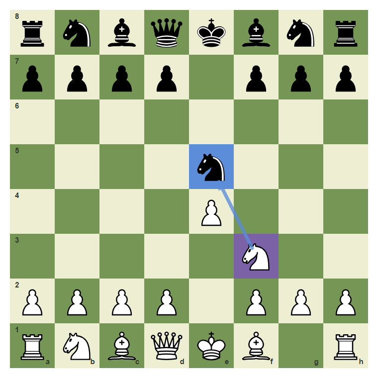
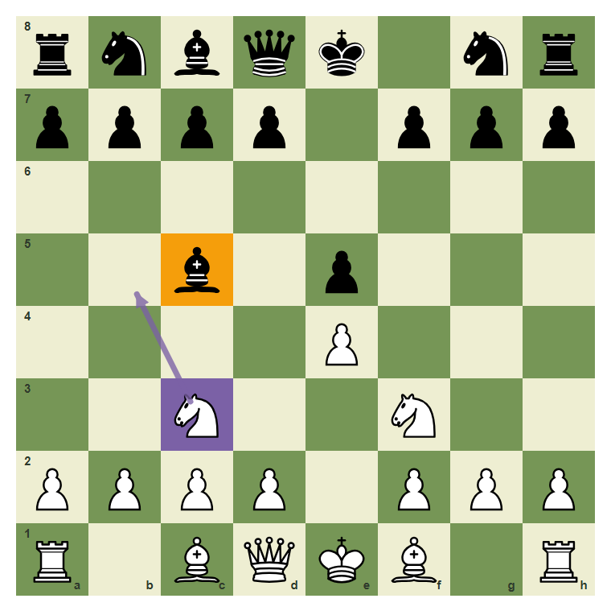
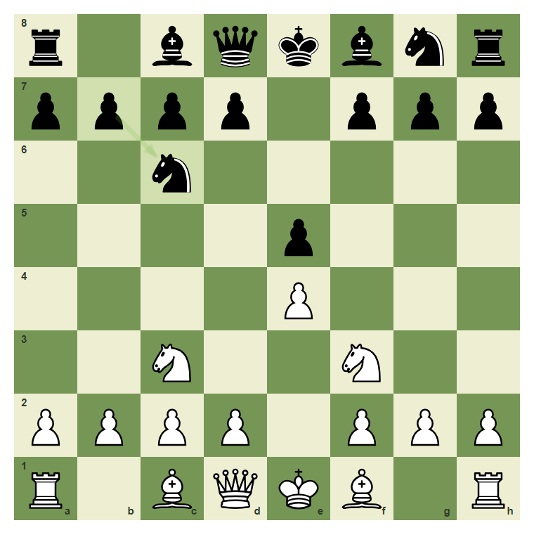
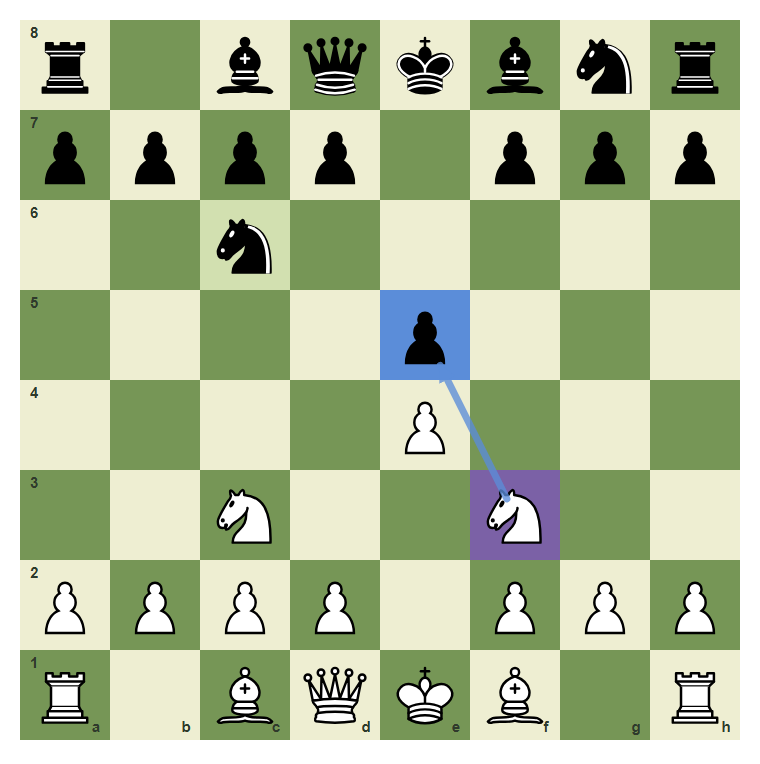
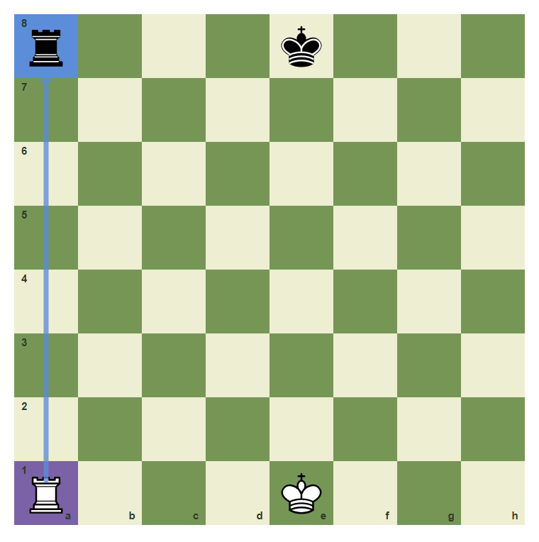

# Review Pack: What Is A Hanging Piece?

Book: Survival Chess
Chapter: 02-hanging-pieces
Source: ../../../chess-frontend/src/data/ebooks/v2/survival-chess/chapters/02-hanging-pieces.json
Generated: 2026-05-05T07:36:03.981Z
Status: PASS - deterministic checks clean

## Chapter Intent

ELO range: 300-700
Required tier: free
Estimated minutes: 24

Learning objectives:
- Define a hanging piece.
- Count whether a target is defended.
- Capture loose material without rushing.

## Quality Gates

| Gate | Result | Detail |
| --- | --- | --- |
| Sections | PASS | 1 |
| Total blocks | PASS | 11 |
| Board-like blocks | PASS | 7 |
| Generated PNG exports | PASS | 7 |
| Interactive/check blocks | PASS | 4 |
| Deterministic warnings | PASS | 0 |
| minimum_board_diagrams >= 5 | PASS | 5 board_diagram block(s) |
| minimum_guided_moves >= 1 | PASS | 1 guided_move block(s) |
| minimum_quizzes >= 3 | PASS | 3 quiz block(s) |
| tier_allowed <= free | PASS | chapter tier is free |

## Block Review

### b02-c02-p01 - prose

Section: Loose Pieces Fall
Type: prose

Text under review:

```text
A hanging piece is attacked and not safely defended. At beginner level, many games are decided by one loose knight, bishop, rook, or queen.
```

Reviewer flags: none from deterministic checks.

### b02-c02-d01 - The knight on e5 is loose

Section: Loose Pieces Fall
Type: board_diagram
FEN: `rnbqkbnr/pppp1ppp/8/4n3/4P3/5N2/PPPP1PPP/RNBQKB1R w KQkq - 0 3`
Orientation: white
Arrows: f3-e5 (capture)
Highlights: f3 (candidate), e5 (capture)
Assertions: piece_on white_knight f3, piece_on black_knight e5, highlight_exists e5, arrow_exists f3-e5
Text square claims: e5
Text move claims: none
Visual square evidence: a8, b8, c8, d8, e8, f8, g8, h8, a7, b7, c7, d7, f7, g7, h7, e5, e4, f3, a2, b2, c2, d2, f2, g2, h2, a1, b1, c1, d1, e1, f1, h1



PNG hash: `27289613f3c66af5eec00bd72d3287377b53446efe5c66ed4392391e6a65cbbc`

Text under review:

```text
The knight on e5 is loose
White can capture e5 because the knight is sitting in the open.
```

Reviewer flags: none from deterministic checks.

### b02-c02-d02 - The bishop on c5 needs checking

Section: Loose Pieces Fall
Type: board_diagram
FEN: `rnbqk1nr/pppp1ppp/8/2b1p3/4P3/2N2N2/PPPP1PPP/R1BQKB1R w KQkq - 3 3`
Orientation: white
Arrows: c3-b5 (candidate)
Highlights: c5 (target), c3 (candidate)
Assertions: piece_on black_bishop c5, highlight_exists c5, arrow_exists c3-b5
Text square claims: c5
Text move claims: none
Visual square evidence: a8, b8, c8, d8, e8, g8, h8, a7, b7, c7, d7, f7, g7, h7, c5, e5, e4, c3, f3, a2, b2, c2, d2, f2, g2, h2, a1, c1, d1, e1, f1, h1, b5



PNG hash: `ab432f1448d078f6dec274fac45ca6370cc4c0f39fed6664a6e1c1fde1c9882e`

Text under review:

```text
The bishop on c5 needs checking
Do not call a piece loose until you count attackers and defenders.
```

Reviewer flags: none from deterministic checks.

### b02-c02-d03 - Defended is different from hanging

Section: Loose Pieces Fall
Type: board_diagram
FEN: `r1bqkbnr/pppp1ppp/2n5/4p3/4P3/2N2N2/PPPP1PPP/R1BQKB1R w KQkq - 2 3`
Orientation: white
Arrows: b7-c6 (safe)
Highlights: c6 (safe), b7 (safe)
Assertions: piece_on black_knight c6, highlight_exists c6, arrow_exists b7-c6
Text square claims: c6
Text move claims: none
Visual square evidence: a8, c8, d8, e8, f8, g8, h8, a7, b7, c7, d7, f7, g7, h7, c6, e5, e4, c3, f3, a2, b2, c2, d2, f2, g2, h2, a1, c1, d1, e1, f1, h1



PNG hash: `5077d5c700fd824ba88fea2bd6173da3924cad6574f75783caaa7e50483bd9f5`

Text under review:

```text
Defended is different from hanging
The knight on c6 has defenders. A target is not automatically free.
```

Reviewer flags: none from deterministic checks.

### b02-c02-d04 - Count before collecting

Section: Loose Pieces Fall
Type: board_diagram
FEN: `r1bqkbnr/pppp1ppp/2n5/4p3/4P3/2N2N2/PPPP1PPP/R1BQKB1R w KQkq - 2 3`
Orientation: white
Arrows: f3-e5 (capture)
Highlights: e5 (capture), c6 (safe), f3 (candidate)
Assertions: highlight_exists e5, highlight_exists c6, arrow_exists f3-e5
Text square claims: e5, c6
Text move claims: none
Visual square evidence: a8, c8, d8, e8, f8, g8, h8, a7, b7, c7, d7, f7, g7, h7, c6, e5, e4, c3, f3, a2, b2, c2, d2, f2, g2, h2, a1, c1, d1, e1, f1, h1



PNG hash: `4750e033cd71131a6abe16847da9910e81fdded94a46b4eff0985eec5e3518d0`

Text under review:

```text
Count before collecting
The e5 pawn is a clearer target than the defended c6 knight.
```

Reviewer flags: none from deterministic checks.

### b02-c02-d05 - Open lines create loose rooks

Section: Loose Pieces Fall
Type: board_diagram
FEN: `r3k3/8/8/8/8/8/8/R3K3 w Qq - 0 1`
Orientation: white
Arrows: a1-a8 (capture)
Highlights: a1 (candidate), a8 (capture)
Assertions: piece_on white_rook a1, piece_on black_rook a8, highlight_exists a8, arrow_exists a1-a8
Text square claims: a8, a1
Text move claims: none
Visual square evidence: a8, e8, a1, e1



PNG hash: `1ab42af2706e1d1c0ccca10082ccda79812fc68b58b60a6e577ae8b8ed480701`

Text under review:

```text
Open lines create loose rooks
The rook on a8 is exposed on the same file as White rook on a1.
```

Reviewer flags: none from deterministic checks.

### b02-c02-g01 - Capture the hanging knight

Section: Loose Pieces Fall
Type: guided_move
FEN: `rnbqkbnr/pppp1ppp/8/4n3/4P3/5N2/PPPP1PPP/RNBQKB1R w KQkq - 0 3`
Orientation: white
Arrows: f3-e5 (capture)
Highlights: f3 (candidate), e5 (capture)
Assertions: legal_move f3e5, piece_on white_knight f3, highlight_exists e5, arrow_exists f3-e5
Text square claims: e5, f3
Text move claims: none
Visual square evidence: a8, b8, c8, d8, e8, f8, g8, h8, a7, b7, c7, d7, f7, g7, h7, e5, e4, f3, a2, b2, c2, d2, f2, g2, h2, a1, b1, c1, d1, e1, f1, h1


PNG hash: `27289613f3c66af5eec00bd72d3287377b53446efe5c66ed4392391e6a65cbbc`

Text under review:

```text
Capture the hanging knight
The black knight on e5 is loose. Play f3 to e5.
Correct. You found the safe survival move.
Pause and scan checks, captures, and threats again.
```

Reviewer flags: none from deterministic checks.

### b02-c02-m01 - Common mistake: every attacked piece is not free

Section: Loose Pieces Fall
Type: mistake_refutation
FEN: `r1bqkbnr/pppp1ppp/2n5/4p3/4P3/2N2N2/PPPP1PPP/R1BQKB1R w KQkq - 2 3`
Orientation: white
Arrows: b7-c6 (safe)
Highlights: c6 (safe), b7 (safe)
Assertions: highlight_exists c6, arrow_exists b7-c6
Text square claims: c6, b7
Text move claims: none
Visual square evidence: a8, c8, d8, e8, f8, g8, h8, a7, b7, c7, d7, f7, g7, h7, c6, e5, e4, c3, f3, a2, b2, c2, d2, f2, g2, h2, a1, c1, d1, e1, f1, h1


PNG hash: `5077d5c700fd824ba88fea2bd6173da3924cad6574f75783caaa7e50483bd9f5`

Text under review:

```text
Common mistake: every attacked piece is not free
If a piece is defended, a capture may only trade instead of win. Count before you grab.
The c6 knight is marked safe because b7 helps defend it.
```

Reviewer flags: none from deterministic checks.

### b02-c02-q01 - A hanging piece is:

Section: Chapter Checkpoint
Type: quiz

Text under review:

```text
A hanging piece is:
A hanging piece is:
```

Quiz options:
- [wrong] a: Attacked and safely defended
- [correct] b: Attacked and not safely defended
- [wrong] c: A king in check

Reviewer flags: none from deterministic checks.

### b02-c02-q02 - Before capturing a target, you should count:

Section: Chapter Checkpoint
Type: quiz

Text under review:

```text
Before capturing a target, you should count:
Before capturing a target, you should count:
```

Quiz options:
- [correct] a: Attackers and defenders
- [wrong] b: Only piece color
- [wrong] c: Only move number

Reviewer flags: none from deterministic checks.

### b02-c02-q03 - A defended piece is always free material.

Section: Chapter Checkpoint
Type: quiz

Text under review:

```text
A defended piece is always free material.
A defended piece is always free material.
```

Quiz options:
- [wrong] a: True
- [correct] b: False

Reviewer flags: none from deterministic checks.

## Human Signoff

- Chess analyst: pending
- Visual reviewer: pending
- Pedagogy reviewer: pending
- Final editor: pending
