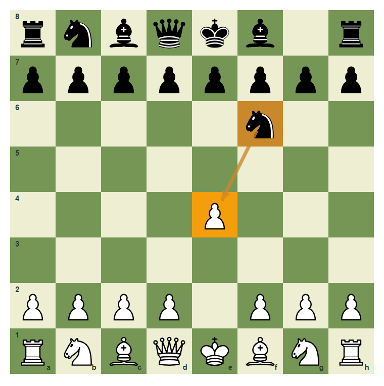
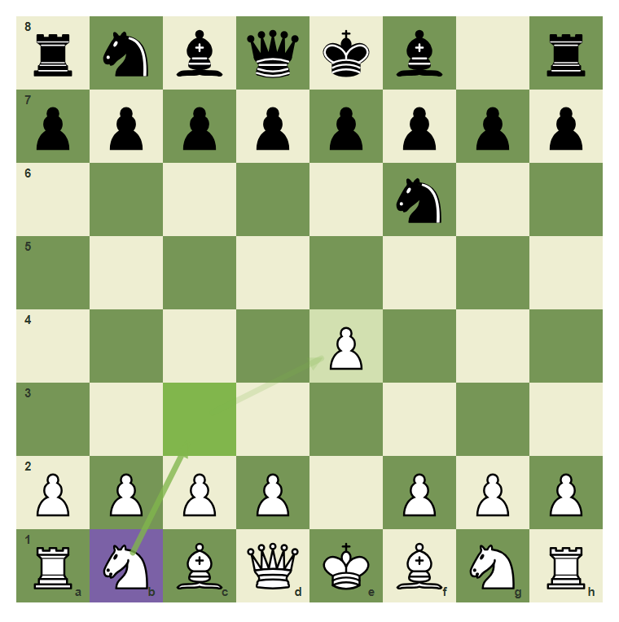
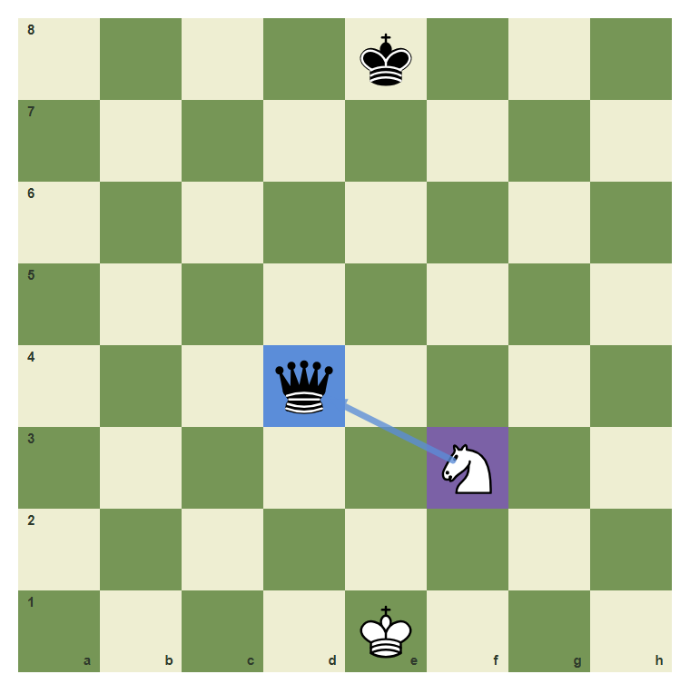
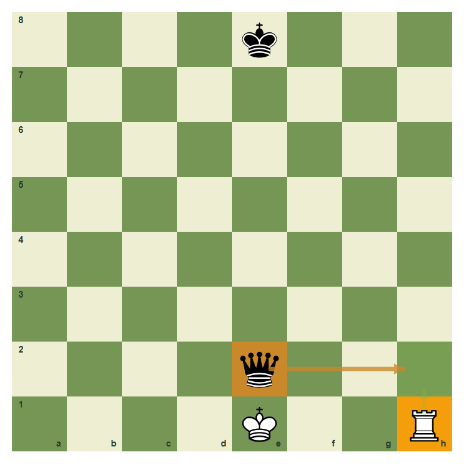
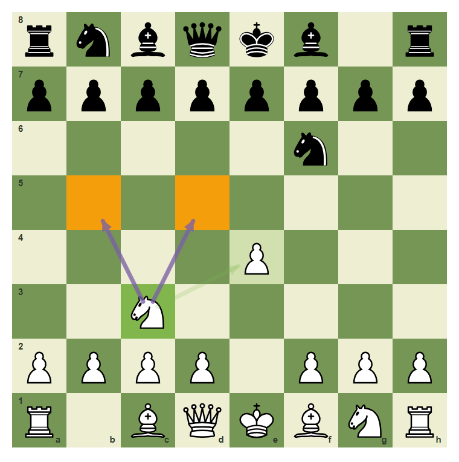
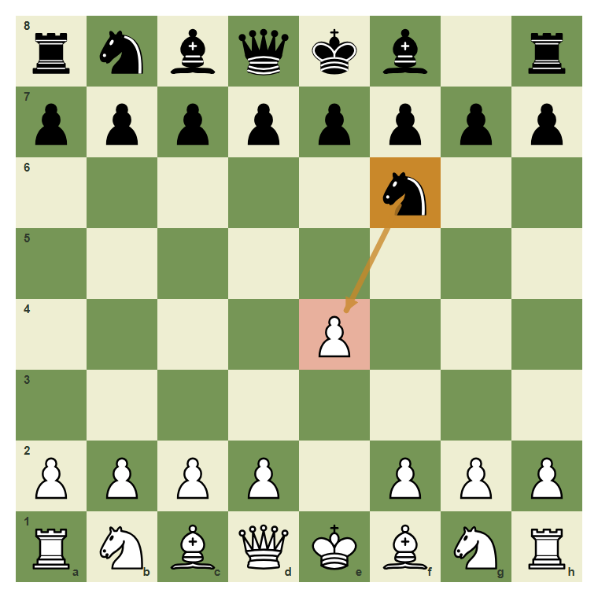

# Review Pack: One-Move Attacks And One-Move Defenses

Book: Survival Chess
Chapter: 03-one-move-attacks-defenses
Source: ../../../chess-frontend/src/data/ebooks/v2/survival-chess/chapters/03-one-move-attacks-defenses.json
Generated: 2026-05-05T07:36:03.985Z
Status: PASS - deterministic checks clean

## Chapter Intent

ELO range: 300-700
Required tier: free
Estimated minutes: 25

Learning objectives:
- Notice direct one-move attacks.
- Choose a simple defense.
- Find moves that attack and defend at the same time.

## Quality Gates

| Gate | Result | Detail |
| --- | --- | --- |
| Sections | PASS | 1 |
| Total blocks | PASS | 11 |
| Board-like blocks | PASS | 7 |
| Generated PNG exports | PASS | 7 |
| Interactive/check blocks | PASS | 4 |
| Deterministic warnings | PASS | 0 |
| minimum_board_diagrams >= 5 | PASS | 5 board_diagram block(s) |
| minimum_guided_moves >= 1 | PASS | 1 guided_move block(s) |
| minimum_quizzes >= 3 | PASS | 3 quiz block(s) |
| tier_allowed <= free | PASS | chapter tier is free |

## Block Review

### b02-c03-p01 - prose

Section: One Move Is Enough
Type: prose

Text under review:

```text
A beginner blunder often has a one-move story: one piece attacks, one piece is attacked, and nobody answered. Your job is to notice the story before it becomes material loss.
```

Reviewer flags: none from deterministic checks.

### b02-c03-d01 - The e4 pawn is attacked

Section: One Move Is Enough
Type: board_diagram
FEN: `rnbqkb1r/pppppppp/5n2/8/4P3/8/PPPP1PPP/RNBQKBNR w KQkq - 1 2`
Orientation: white
Arrows: f6-e4 (threat)
Highlights: f6 (threat), e4 (target)
Assertions: piece_on black_knight f6, piece_on white_pawn e4, highlight_exists e4, arrow_exists f6-e4
Text square claims: e4, f6
Text move claims: none
Visual square evidence: a8, b8, c8, d8, e8, f8, h8, a7, b7, c7, d7, e7, f7, g7, h7, f6, e4, a2, b2, c2, d2, f2, g2, h2, a1, b1, c1, d1, e1, f1, g1, h1



PNG hash: `bd2cc68f3ec8ddf5fc4f9f8a5f53d28d029f8b538011f56ed358f7c37e33f888`

Text under review:

```text
The e4 pawn is attacked
The knight on f6 points at e4. White should notice the attack.
```

Reviewer flags: none from deterministic checks.

### b02-c03-d02 - Defend with b1-c3

Section: One Move Is Enough
Type: board_diagram
FEN: `rnbqkb1r/pppppppp/5n2/8/4P3/8/PPPP1PPP/RNBQKBNR w KQkq - 1 2`
Orientation: white
Arrows: b1-c3 (best), c3-e4 (safe)
Highlights: b1 (candidate), c3 (best), e4 (safe)
Assertions: piece_on white_knight b1, highlight_exists c3, arrow_exists b1-c3
Text square claims: b1, c3, e4
Text move claims: none
Visual square evidence: a8, b8, c8, d8, e8, f8, h8, a7, b7, c7, d7, e7, f7, g7, h7, f6, e4, a2, b2, c2, d2, f2, g2, h2, a1, b1, c1, d1, e1, f1, g1, h1, c3



PNG hash: `4c0e4fdf8fd12f7c11c13cec0cac92632e8ebe775e30af1c14288714e8417d0a`

Text under review:

```text
Defend with b1-c3
The move b1-c3 adds a defender to e4 while developing a knight.
```

Reviewer flags: none from deterministic checks.

### b02-c03-d03 - A loose queen can be attacked

Section: One Move Is Enough
Type: board_diagram
FEN: `4k3/8/8/8/3q4/5N2/8/4K3 w - - 0 1`
Orientation: white
Arrows: f3-d4 (capture)
Highlights: f3 (candidate), d4 (capture)
Assertions: piece_on white_knight f3, piece_on black_queen d4, highlight_exists d4, arrow_exists f3-d4
Text square claims: f3, d4
Text move claims: none
Visual square evidence: e8, d4, f3, e1



PNG hash: `2295e6f115a35b53c98d9856db51dd592588f14c1b39e638969a9b304adb4c30`

Text under review:

```text
A loose queen can be attacked
The knight on f3 attacks d4. Big targets count too.
```

Reviewer flags: none from deterministic checks.

### b02-c03-d04 - Moving away is a defense

Section: One Move Is Enough
Type: board_diagram
FEN: `4k3/8/8/8/8/8/4q3/4K2R w K - 0 1`
Orientation: white
Arrows: e2-h2 (threat), h1-h2 (safe)
Highlights: h1 (target), h2 (safe), e2 (threat)
Assertions: piece_on white_rook h1, piece_on black_queen e2, highlight_exists h2, arrow_exists h1-h2
Text square claims: none
Text move claims: none
Visual square evidence: e8, e2, e1, h1, h2



PNG hash: `64705bed7409fc90384082ab04c017e0a4b529c8100f974c4f4aaf23155b0144`

Text under review:

```text
Moving away is a defense
If the rook is attacked, one answer is to move it to a safe square.
```

Reviewer flags: none from deterministic checks.

### b02-c03-d05 - Attack and defend together

Section: One Move Is Enough
Type: board_diagram
FEN: `rnbqkb1r/pppppppp/5n2/8/4P3/2N5/PPPP1PPP/R1BQKBNR b KQkq - 2 2`
Orientation: white
Arrows: c3-e4 (safe), c3-d5 (candidate), c3-b5 (candidate)
Highlights: c3 (best), e4 (safe), d5 (target), b5 (target)
Assertions: piece_on white_knight c3, highlight_exists e4, arrow_exists c3-e4
Text square claims: c3, e4, d5, b5
Text move claims: none
Visual square evidence: a8, b8, c8, d8, e8, f8, h8, a7, b7, c7, d7, e7, f7, g7, h7, f6, e4, c3, a2, b2, c2, d2, f2, g2, h2, a1, c1, d1, e1, f1, g1, h1, d5, b5



PNG hash: `55adc140894aceb41298331f5b5903e2fdec212d15ee6d8341f596aecc5b36eb`

Text under review:

```text
Attack and defend together
The knight on c3 defends e4 and also looks toward d5 and b5.
```

Reviewer flags: none from deterministic checks.

### b02-c03-g01 - Defend the attacked pawn

Section: One Move Is Enough
Type: guided_move
FEN: `rnbqkb1r/pppppppp/5n2/8/4P3/8/PPPP1PPP/RNBQKBNR w KQkq - 1 2`
Orientation: white
Arrows: b1-c3 (best), c3-e4 (safe)
Highlights: b1 (candidate), c3 (best), e4 (safe)
Assertions: legal_move b1c3, piece_on white_knight b1, highlight_exists c3, arrow_exists b1-c3
Text square claims: e4, b1, c3
Text move claims: none
Visual square evidence: a8, b8, c8, d8, e8, f8, h8, a7, b7, c7, d7, e7, f7, g7, h7, f6, e4, a2, b2, c2, d2, f2, g2, h2, a1, b1, c1, d1, e1, f1, g1, h1, c3


PNG hash: `4c0e4fdf8fd12f7c11c13cec0cac92632e8ebe775e30af1c14288714e8417d0a`

Text under review:

```text
Defend the attacked pawn
The pawn on e4 is attacked. Develop the knight from b1 to c3.
Correct. You found the safe survival move.
Pause and scan checks, captures, and threats again.
```

Reviewer flags: none from deterministic checks.

### b02-c03-m01 - Common mistake: ignore the direct attack

Section: One Move Is Enough
Type: mistake_refutation
FEN: `rnbqkb1r/pppppppp/5n2/8/4P3/8/PPPP1PPP/RNBQKBNR w KQkq - 1 2`
Orientation: white
Arrows: f6-e4 (threat)
Highlights: f6 (threat), e4 (wrong)
Assertions: highlight_exists e4, arrow_exists f6-e4
Text square claims: e4, f6
Text move claims: none
Visual square evidence: a8, b8, c8, d8, e8, f8, h8, a7, b7, c7, d7, e7, f7, g7, h7, f6, e4, a2, b2, c2, d2, f2, g2, h2, a1, b1, c1, d1, e1, f1, g1, h1



PNG hash: `3e4c2b340760f5233e83b4b2e98ab83392d95a3e0c879c7fc27d4ad1ea12f0d5`

Text under review:

```text
Common mistake: ignore the direct attack
If White plays a random move, Black can take e4. One-move threats must be answered.
The arrow from f6 to e4 is the warning.
```

Reviewer flags: none from deterministic checks.

### b02-c03-q01 - A simple defense can be:

Section: Chapter Checkpoint
Type: quiz

Text under review:

```text
A simple defense can be:
A simple defense can be:
```

Quiz options:
- [correct] a: Move the attacked piece
- [wrong] b: Pretend there is no threat
- [wrong] c: Always move the queen

Reviewer flags: none from deterministic checks.

### b02-c03-q02 - A developing move is especially good when it also:

Section: Chapter Checkpoint
Type: quiz

Text under review:

```text
A developing move is especially good when it also:
A developing move is especially good when it also:
```

Quiz options:
- [correct] a: Defends something important
- [wrong] b: Loses a rook
- [wrong] c: Blocks your king forever

Reviewer flags: none from deterministic checks.

### b02-c03-q03 - If your opponent attacks a pawn, you should:

Section: Chapter Checkpoint
Type: quiz

Text under review:

```text
If your opponent attacks a pawn, you should:
If your opponent attacks a pawn, you should:
```

Quiz options:
- [correct] a: Scan ways to defend or move it
- [wrong] b: Always resign
- [wrong] c: Move instantly

Reviewer flags: none from deterministic checks.

## Human Signoff

- Chess analyst: pending
- Visual reviewer: pending
- Pedagogy reviewer: pending
- Final editor: pending
