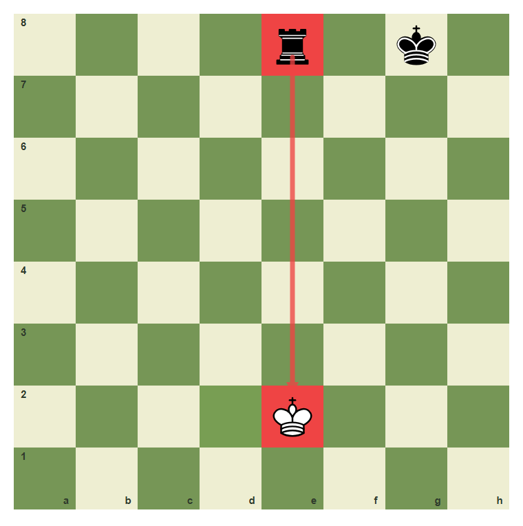
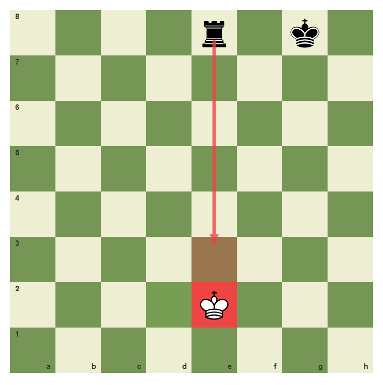
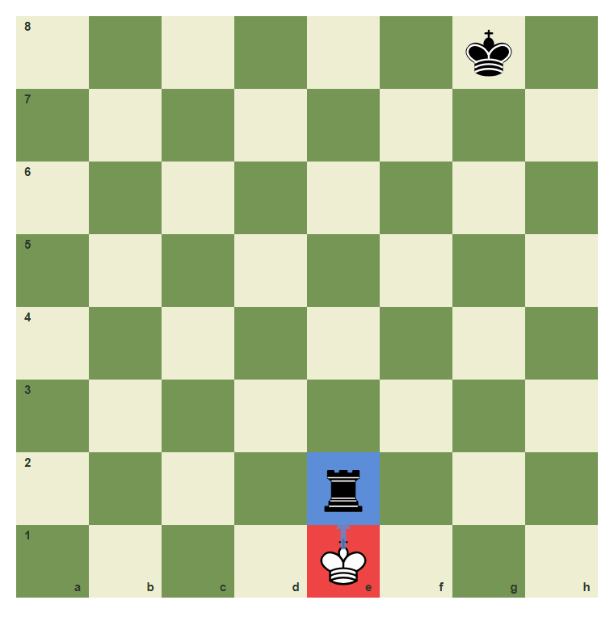
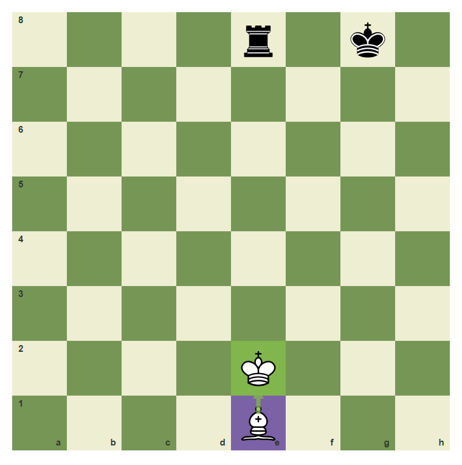
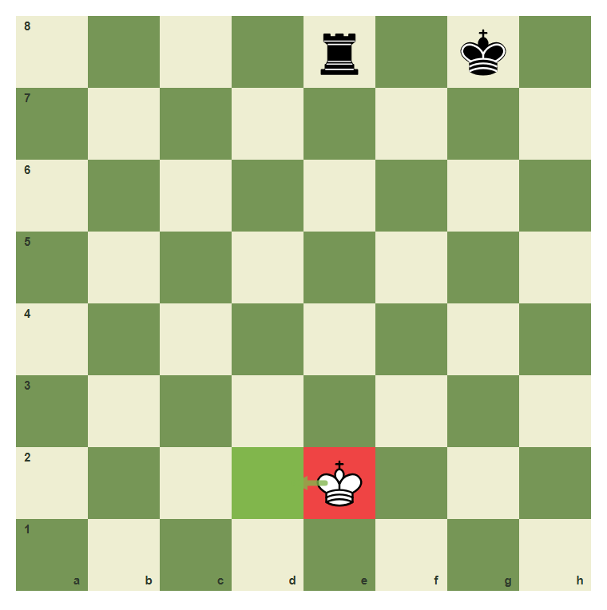
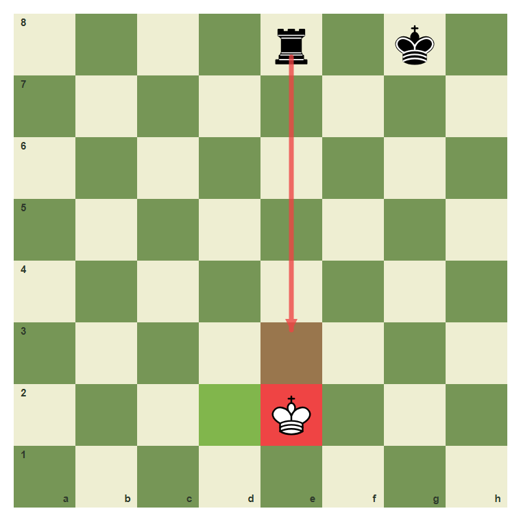

# Review Pack: Safe Squares For The King

Book: Survival Chess
Chapter: 04-safe-king-squares
Source: ../../../chess-frontend/src/data/ebooks/v2/survival-chess/chapters/04-safe-king-squares.json
Generated: 2026-05-05T07:36:03.988Z
Status: PASS - deterministic checks clean

## Chapter Intent

ELO range: 300-700
Required tier: free
Estimated minutes: 25

Learning objectives:
- Identify the line of check.
- Choose king moves that leave danger behind.
- Compare moving, blocking, and capturing the checking piece.

## Quality Gates

| Gate | Result | Detail |
| --- | --- | --- |
| Sections | PASS | 1 |
| Total blocks | PASS | 11 |
| Board-like blocks | PASS | 7 |
| Generated PNG exports | PASS | 7 |
| Interactive/check blocks | PASS | 4 |
| Deterministic warnings | PASS | 0 |
| minimum_board_diagrams >= 5 | PASS | 5 board_diagram block(s) |
| minimum_guided_moves >= 1 | PASS | 1 guided_move block(s) |
| minimum_quizzes >= 3 | PASS | 3 quiz block(s) |
| tier_allowed <= free | PASS | chapter tier is free |

## Block Review

### b02-c04-p01 - prose

Section: The King Needs Legal Air
Type: prose

Text under review:

```text
When your king is in check, normal plans stop. You must get out of check by moving the king, blocking the line, or capturing the checking piece.
```

Reviewer flags: none from deterministic checks.

### b02-c04-d01 - The e-file check

Section: The King Needs Legal Air
Type: board_diagram
FEN: `4r1k1/8/8/8/8/8/4K3/8 w - - 0 1`
Orientation: white
Arrows: e8-e2 (check)
Highlights: e8 (check), e2 (check), d2 (safe)
Assertions: piece_on black_rook e8, piece_on white_king e2, highlight_exists d2, arrow_exists e8-e2
Text square claims: e2
Text move claims: none
Visual square evidence: e8, g8, e2, d2



PNG hash: `8e9c57fb9119f9bb88cb79f7fa944909d7528cccabb8e5f05d5e311cadf89714`

Text under review:

```text
The e-file check
The rook checks down the e-file. The king on e2 must leave the line.
```

Reviewer flags: none from deterministic checks.

### b02-c04-d02 - The e-file is still unsafe

Section: The King Needs Legal Air
Type: board_diagram
FEN: `4r1k1/8/8/8/8/8/4K3/8 w - - 0 1`
Orientation: white
Arrows: e8-e3 (check)
Highlights: e2 (check), e3 (wrong), d2 (safe)
Assertions: highlight_exists e3, highlight_exists d2, arrow_exists e8-e3
Text square claims: none
Text move claims: none
Visual square evidence: e8, g8, e2, e3, d2



PNG hash: `f57bb9d525448e271994cb23ca01d9cd0530d637c2f13404c22c5640a34277e1`

Text under review:

```text
The e-file is still unsafe
Moving along the same file can remain dangerous. Look for a square off the line.
```

Reviewer flags: none from deterministic checks.

### b02-c04-d03 - Step to d2

Section: The King Needs Legal Air
Type: board_diagram
FEN: `4r1k1/8/8/8/8/8/4K3/8 w - - 0 1`
Orientation: white
Arrows: e2-d2 (best)
Highlights: e2 (check), d2 (best)
Assertions: piece_on white_king e2, highlight_exists d2, arrow_exists e2-d2
Text square claims: d2
Text move claims: none
Visual square evidence: e8, g8, e2, d2


PNG hash: `6e9ed5e63c992156c83446d5a536621ec56f94b198e04515557068e0e2501570`

Text under review:

```text
Step to d2
The square d2 is not on the rook line.
```

Reviewer flags: none from deterministic checks.

### b02-c04-d04 - Sometimes capture the checker

Section: The King Needs Legal Air
Type: board_diagram
FEN: `6k1/8/8/8/8/8/4r3/4K3 w - - 0 1`
Orientation: white
Arrows: e1-e2 (capture)
Highlights: e1 (check), e2 (capture)
Assertions: piece_on white_king e1, piece_on black_rook e2, highlight_exists e2, arrow_exists e1-e2
Text square claims: none
Text move claims: none
Visual square evidence: g8, e2, e1



PNG hash: `bb4a08b288a28ce0ab5d024691f8a8802fbc229582b776e9ad693587a1940e83`

Text under review:

```text
Sometimes capture the checker
If the checking piece is close and undefended, the king may capture it.
```

Reviewer flags: none from deterministic checks.

### b02-c04-d05 - A block can also work

Section: The King Needs Legal Air
Type: board_diagram
FEN: `4r1k1/8/8/8/8/8/4K3/4B3 w - - 0 1`
Orientation: white
Arrows: e1-e2 (best)
Highlights: e1 (candidate), e2 (best)
Assertions: piece_on white_bishop e1, highlight_exists e2, arrow_exists e1-e2
Text square claims: e2
Text move claims: none
Visual square evidence: e8, g8, e2, e1



PNG hash: `a0c65cb2b9fb7caa0589d1ccaf21b56eb1350b8100664c17840fdc1e26599e60`

Text under review:

```text
A block can also work
A bishop can block the rook line on e2 only if the square and piece movement allow it.
```

Reviewer flags: none from deterministic checks.

### b02-c04-g01 - Escape the rook check

Section: The King Needs Legal Air
Type: guided_move
FEN: `4r1k1/8/8/8/8/8/4K3/8 w - - 0 1`
Orientation: white
Arrows: e2-d2 (best)
Highlights: e2 (check), d2 (best)
Assertions: legal_move e2d2, piece_on white_king e2, highlight_exists d2, arrow_exists e2-d2
Text square claims: e2, d2
Text move claims: none
Visual square evidence: e8, g8, e2, d2



PNG hash: `6e9ed5e63c992156c83446d5a536621ec56f94b198e04515557068e0e2501570`

Text under review:

```text
Escape the rook check
Move the king from e2 to d2.
Correct. You found the safe survival move.
Pause and scan checks, captures, and threats again.
```

Reviewer flags: none from deterministic checks.

### b02-c04-m01 - Common mistake: stay on the checking line

Section: The King Needs Legal Air
Type: mistake_refutation
FEN: `4r1k1/8/8/8/8/8/4K3/8 w - - 0 1`
Orientation: white
Arrows: e8-e3 (check)
Highlights: e2 (check), e3 (wrong), d2 (best)
Assertions: highlight_exists e3, highlight_exists d2, arrow_exists e8-e3
Text square claims: e3
Text move claims: none
Visual square evidence: e8, g8, e2, e3, d2



PNG hash: `9fede2ef382e0063053a091260b5b0e41b4f50909fcd261c892643e119556d93`

Text under review:

```text
Common mistake: stay on the checking line
If the rook controls the e-file, the king should not stay on that file.
The unsafe square e3 is still on the rook line.
```

Reviewer flags: none from deterministic checks.

### b02-c04-q01 - When in check, you may:

Section: Chapter Checkpoint
Type: quiz

Text under review:

```text
When in check, you may:
When in check, you may:
```

Quiz options:
- [wrong] a: Ignore it
- [correct] b: Move, block, or capture the checker
- [wrong] c: Only move a pawn

Reviewer flags: none from deterministic checks.

### b02-c04-q02 - A safe king square must be:

Section: Chapter Checkpoint
Type: quiz

Text under review:

```text
A safe king square must be:
A safe king square must be:
```

Quiz options:
- [correct] a: Not controlled by enemy pieces
- [wrong] b: On the same line as a rook check
- [wrong] c: Chosen quickly

Reviewer flags: none from deterministic checks.

### b02-c04-q03 - The first priority in check is:

Section: Chapter Checkpoint
Type: quiz

Text under review:

```text
The first priority in check is:
The first priority in check is:
```

Quiz options:
- [wrong] a: Win material
- [correct] b: Get legally out of check
- [wrong] c: Castle later

Reviewer flags: none from deterministic checks.

## Human Signoff

- Chess analyst: pending
- Visual reviewer: pending
- Pedagogy reviewer: pending
- Final editor: pending
