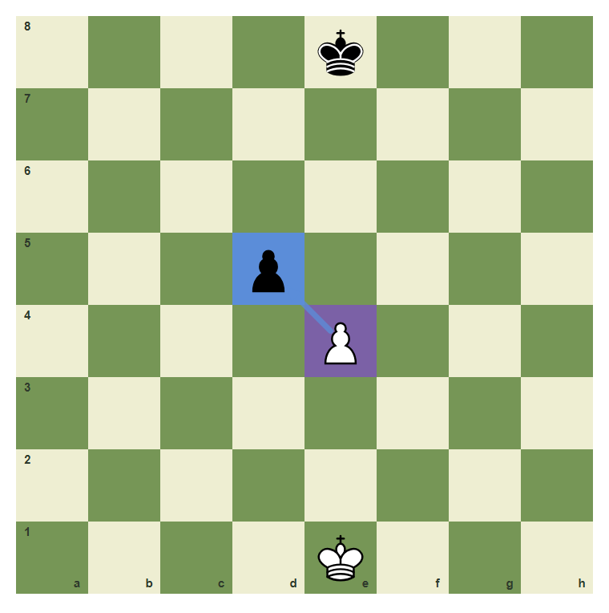
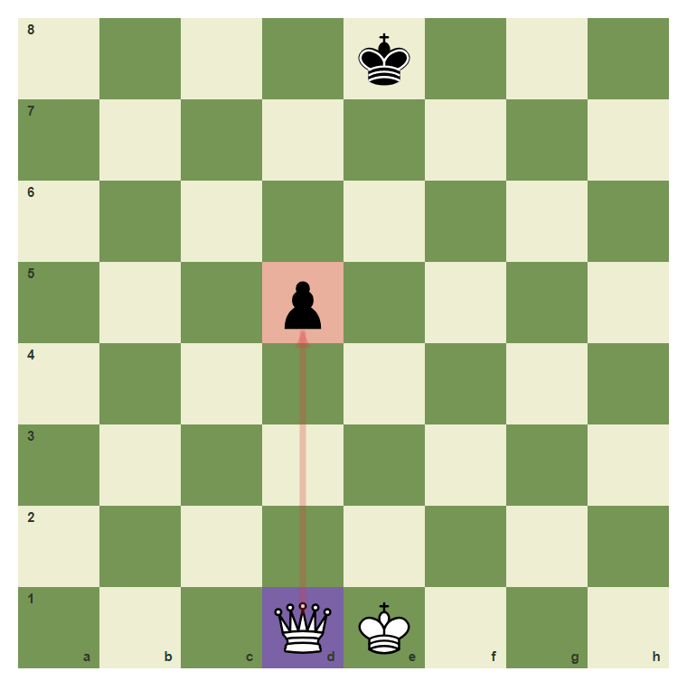
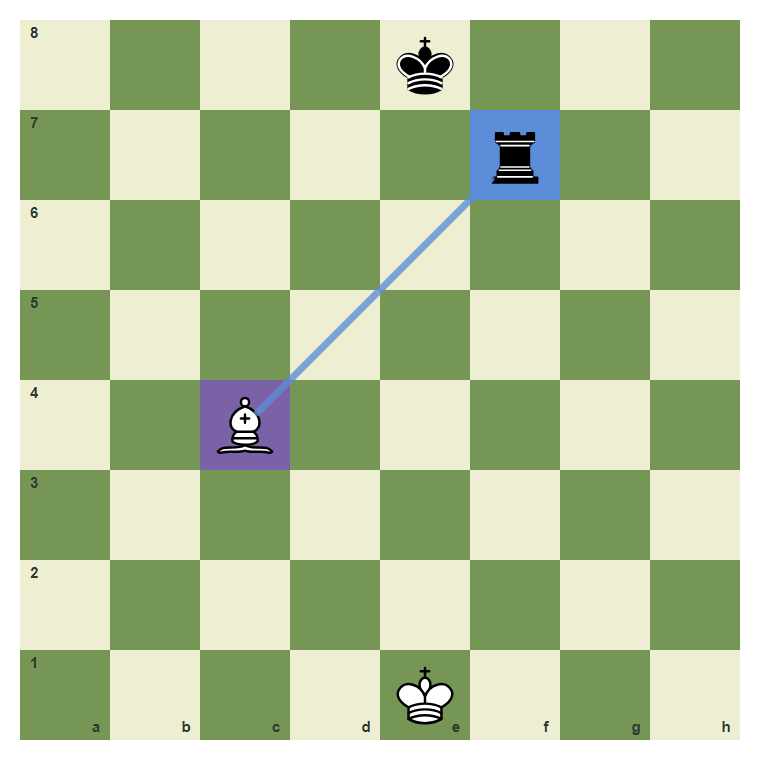
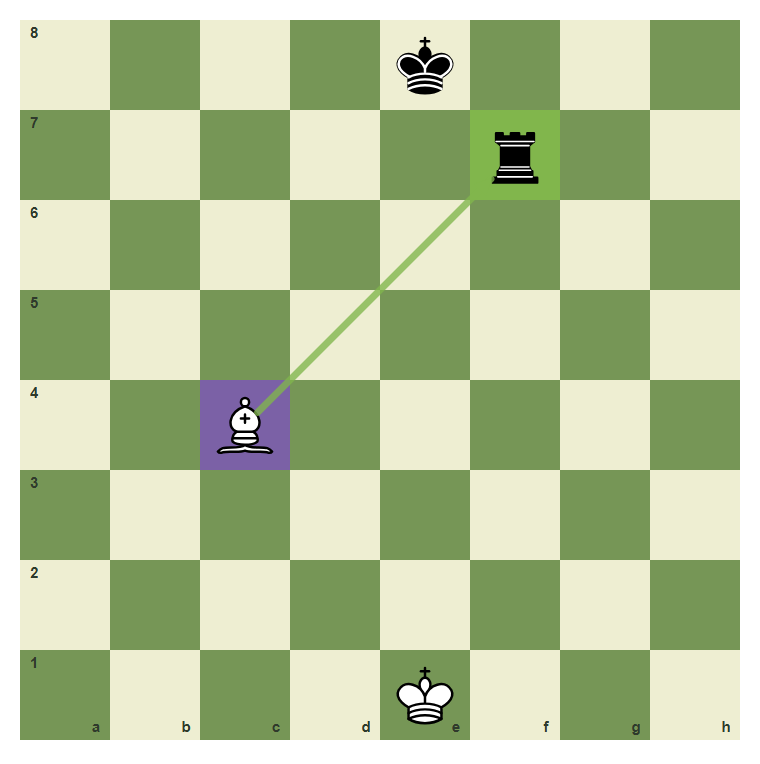
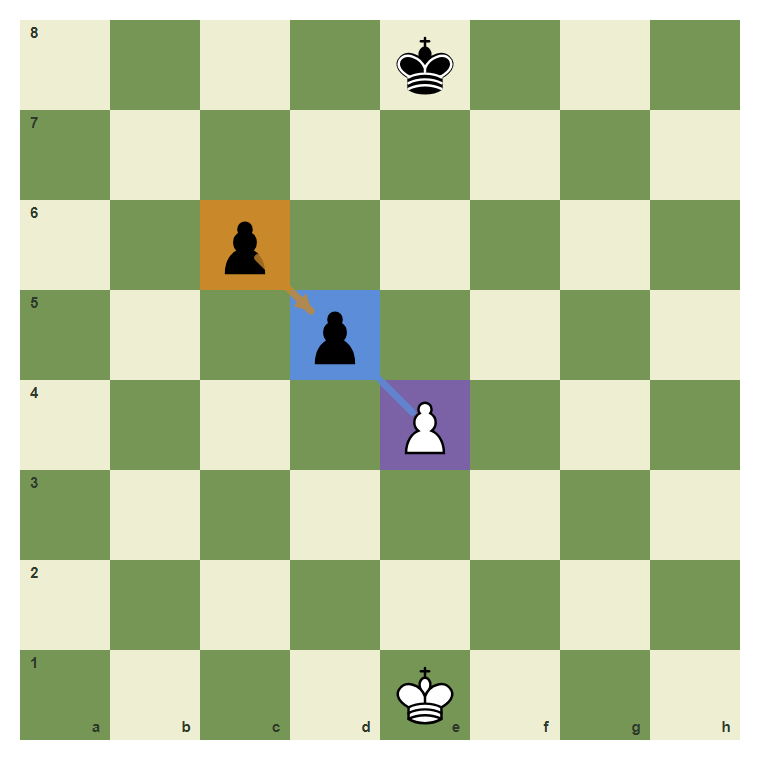
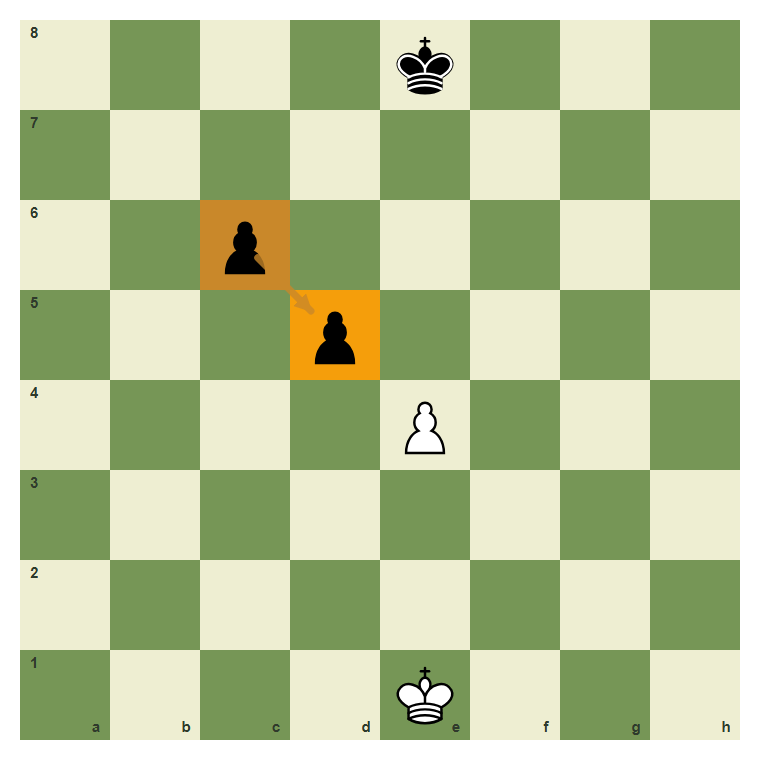

# Review Pack: Capturing Wisely: Good Trades And Bad Trades

Book: Survival Chess
Chapter: 05-good-trades-bad-trades
Source: ../../../chess-frontend/src/data/ebooks/v2/survival-chess/chapters/05-good-trades-bad-trades.json
Generated: 2026-05-05T07:36:03.991Z
Status: PASS - deterministic checks clean

## Chapter Intent

ELO range: 300-700
Required tier: free
Estimated minutes: 26

Learning objectives:
- Compare simple material values.
- Separate winning material from equal trades.
- Notice recaptures before taking.

## Quality Gates

| Gate | Result | Detail |
| --- | --- | --- |
| Sections | PASS | 1 |
| Total blocks | PASS | 11 |
| Board-like blocks | PASS | 7 |
| Generated PNG exports | PASS | 7 |
| Interactive/check blocks | PASS | 4 |
| Deterministic warnings | PASS | 0 |
| minimum_board_diagrams >= 5 | PASS | 5 board_diagram block(s) |
| minimum_guided_moves >= 1 | PASS | 1 guided_move block(s) |
| minimum_quizzes >= 3 | PASS | 3 quiz block(s) |
| tier_allowed <= free | PASS | chapter tier is free |

## Block Review

### b02-c05-p01 - prose

Section: A Capture Is A Decision
Type: prose

Text under review:

```text
Captures feel satisfying, but not every capture is good. Ask: what do I win, what can recapture me, and what is the value exchange?
```

Reviewer flags: none from deterministic checks.

### b02-c05-d01 - A simple pawn capture

Section: A Capture Is A Decision
Type: board_diagram
FEN: `4k3/8/8/3p4/4P3/8/8/4K3 w - - 0 1`
Orientation: white
Arrows: e4-d5 (capture)
Highlights: e4 (candidate), d5 (capture)
Assertions: piece_on white_pawn e4, piece_on black_pawn d5, highlight_exists d5, arrow_exists e4-d5
Text square claims: e4, d5
Text move claims: none
Visual square evidence: e8, d5, e4, e1



PNG hash: `0dafec3d3955a1cf02fea322c880eb7686177ebd5a0f796bb74be5867df9b88f`

Text under review:

```text
A simple pawn capture
The e4 pawn can capture d5. Pawns often trade evenly.
```

Reviewer flags: none from deterministic checks.

### b02-c05-d02 - Do not risk a queen for a pawn

Section: A Capture Is A Decision
Type: board_diagram
FEN: `4k3/8/8/3p4/8/8/8/3QK3 w - - 0 1`
Orientation: white
Arrows: d1-d5 (wrong)
Highlights: d1 (candidate), d5 (wrong)
Assertions: piece_on white_queen d1, highlight_exists d5, arrow_exists d1-d5
Text square claims: d5
Text move claims: none
Visual square evidence: e8, d5, d1, e1



PNG hash: `f05ced13b0a69afa2e9727c50f4c523b1748b69fa953e8c5ae3a1d59af25aa5d`

Text under review:

```text
Do not risk a queen for a pawn
The pawn on d5 is small. A queen move to d5 must be checked for danger.
```

Reviewer flags: none from deterministic checks.

### b02-c05-d03 - A bishop can win a rook

Section: A Capture Is A Decision
Type: board_diagram
FEN: `4k3/5r2/8/8/2B5/8/8/4K3 w - - 0 1`
Orientation: white
Arrows: c4-f7 (capture)
Highlights: c4 (candidate), f7 (capture)
Assertions: piece_on white_bishop c4, piece_on black_rook f7, highlight_exists f7, arrow_exists c4-f7
Text square claims: c4, f7
Text move claims: none
Visual square evidence: e8, f7, c4, e1



PNG hash: `6c3f1aa1351b46f2a79de2c5dcde3392e6af96c2b9e78dc48d8dc41c90a1c1e2`

Text under review:

```text
A bishop can win a rook
The bishop on c4 can capture the rook on f7.
```

Reviewer flags: none from deterministic checks.

### b02-c05-d04 - Count value before capture

Section: A Capture Is A Decision
Type: board_diagram
FEN: `4k3/5r2/8/8/2B5/8/8/4K3 w - - 0 1`
Orientation: white
Arrows: c4-f7 (best)
Highlights: c4 (candidate), f7 (best)
Assertions: highlight_exists f7, arrow_exists c4-f7
Text square claims: none
Text move claims: none
Visual square evidence: e8, f7, c4, e1



PNG hash: `7550d1df7ab430c456e0a6f377c57abe4c104c9fc5024420d3aa03900d641a6d`

Text under review:

```text
Count value before capture
Bishop for rook is usually profitable because rook value is higher.
```

Reviewer flags: none from deterministic checks.

### b02-c05-d05 - Look for the recapture

Section: A Capture Is A Decision
Type: board_diagram
FEN: `4k3/8/2p5/3p4/4P3/8/8/4K3 w - - 0 1`
Orientation: white
Arrows: e4-d5 (capture), c6-d5 (threat)
Highlights: e4 (candidate), d5 (capture), c6 (threat)
Assertions: highlight_exists d5, highlight_exists c6, arrow_exists c6-d5
Text square claims: c6
Text move claims: none
Visual square evidence: e8, c6, d5, e4, e1



PNG hash: `3c68630c9fbbe34e123e55201b04d1ceccef3164c9a977f0a73a086550b26993`

Text under review:

```text
Look for the recapture
After e4xd5, the c6 pawn may recapture. Notice the second move.
```

Reviewer flags: none from deterministic checks.

### b02-c05-g01 - Make the equal pawn capture

Section: A Capture Is A Decision
Type: guided_move
FEN: `4k3/8/8/3p4/4P3/8/8/4K3 w - - 0 1`
Orientation: white
Arrows: e4-d5 (capture)
Highlights: e4 (candidate), d5 (capture)
Assertions: legal_move e4d5, piece_on white_pawn e4, highlight_exists d5, arrow_exists e4-d5
Text square claims: e4, d5
Text move claims: none
Visual square evidence: e8, d5, e4, e1


PNG hash: `0dafec3d3955a1cf02fea322c880eb7686177ebd5a0f796bb74be5867df9b88f`

Text under review:

```text
Make the equal pawn capture
Capture from e4 to d5.
Correct. You found the safe survival move.
Pause and scan checks, captures, and threats again.
```

Reviewer flags: none from deterministic checks.

### b02-c05-m01 - Common mistake: forget the recapture

Section: A Capture Is A Decision
Type: mistake_refutation
FEN: `4k3/8/2p5/3p4/4P3/8/8/4K3 w - - 0 1`
Orientation: white
Arrows: c6-d5 (threat)
Highlights: c6 (threat), d5 (target)
Assertions: highlight_exists c6, highlight_exists d5, arrow_exists c6-d5
Text square claims: c6, d5
Text move claims: none
Visual square evidence: e8, c6, d5, e4, e1



PNG hash: `38cdc367bd0101688ac41a488ab68eaa5d32e21520b380c8506441b891d59379`

Text under review:

```text
Common mistake: forget the recapture
If another pawn can recapture, the first capture may only be a trade.
The c6 pawn points back to d5.
```

Reviewer flags: none from deterministic checks.

### b02-c05-q01 - Before a capture, ask what can:

Section: Chapter Checkpoint
Type: quiz

Text under review:

```text
Before a capture, ask what can:
Before a capture, ask what can:
```

Quiz options:
- [correct] a: Recapture
- [wrong] b: Rename the board
- [wrong] c: Change the clock color

Reviewer flags: none from deterministic checks.

### b02-c05-q02 - Winning a rook for a bishop is usually:

Section: Chapter Checkpoint
Type: quiz

Text under review:

```text
Winning a rook for a bishop is usually:
Winning a rook for a bishop is usually:
```

Quiz options:
- [correct] a: Good
- [wrong] b: Always illegal
- [wrong] c: The same as losing a queen

Reviewer flags: none from deterministic checks.

### b02-c05-q03 - A pawn capture may simply be:

Section: Chapter Checkpoint
Type: quiz

Text under review:

```text
A pawn capture may simply be:
A pawn capture may simply be:
```

Quiz options:
- [correct] a: An equal trade
- [wrong] b: Always checkmate
- [wrong] c: Always a blunder

Reviewer flags: none from deterministic checks.

## Human Signoff

- Chess analyst: pending
- Visual reviewer: pending
- Pedagogy reviewer: pending
- Final editor: pending
