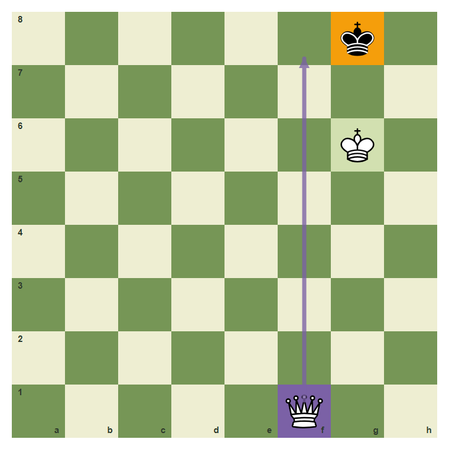
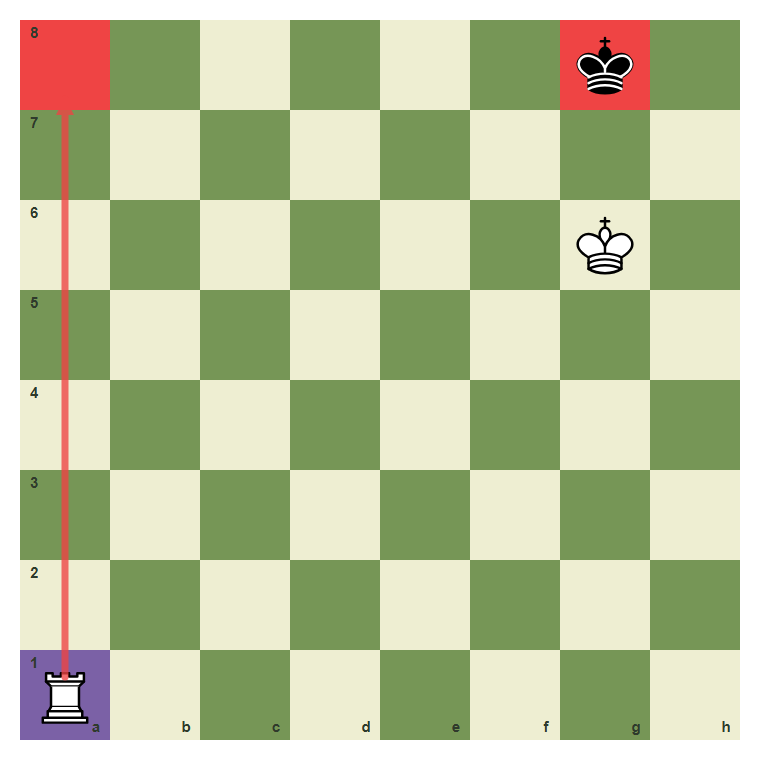
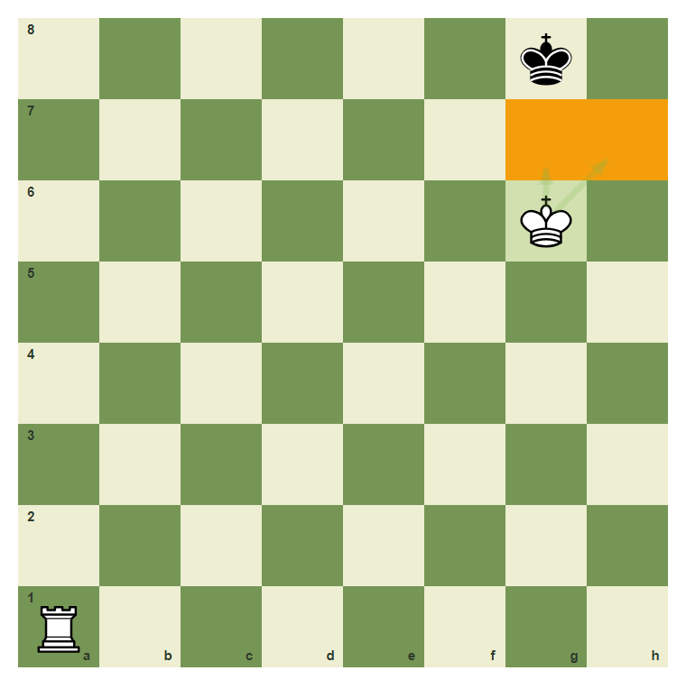
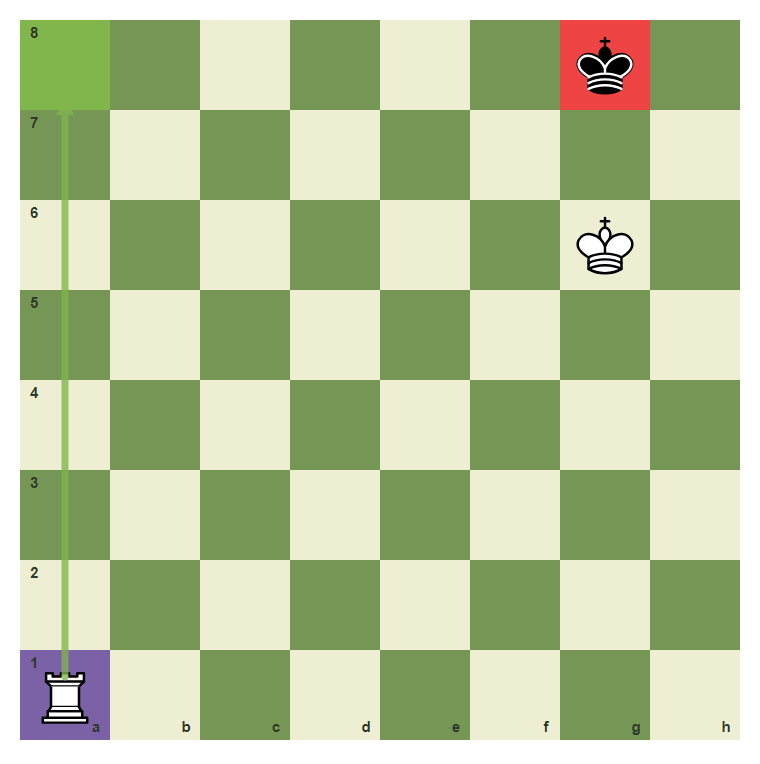
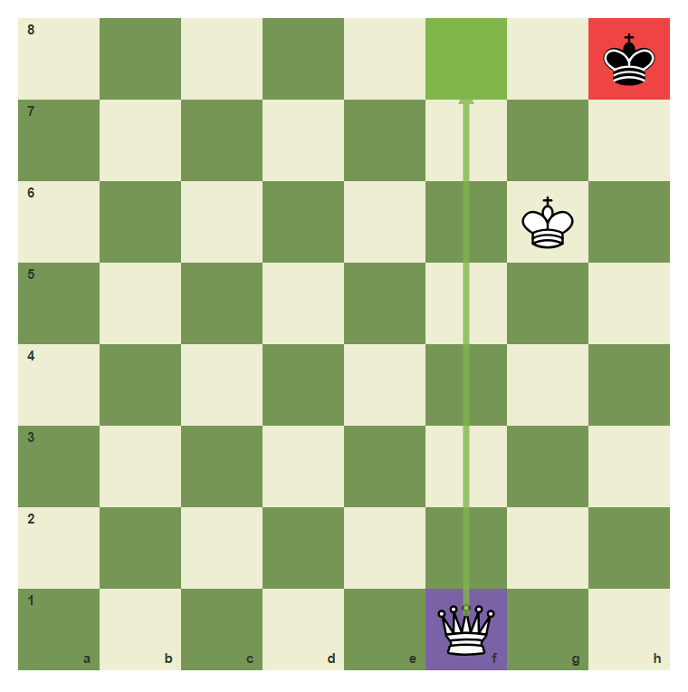
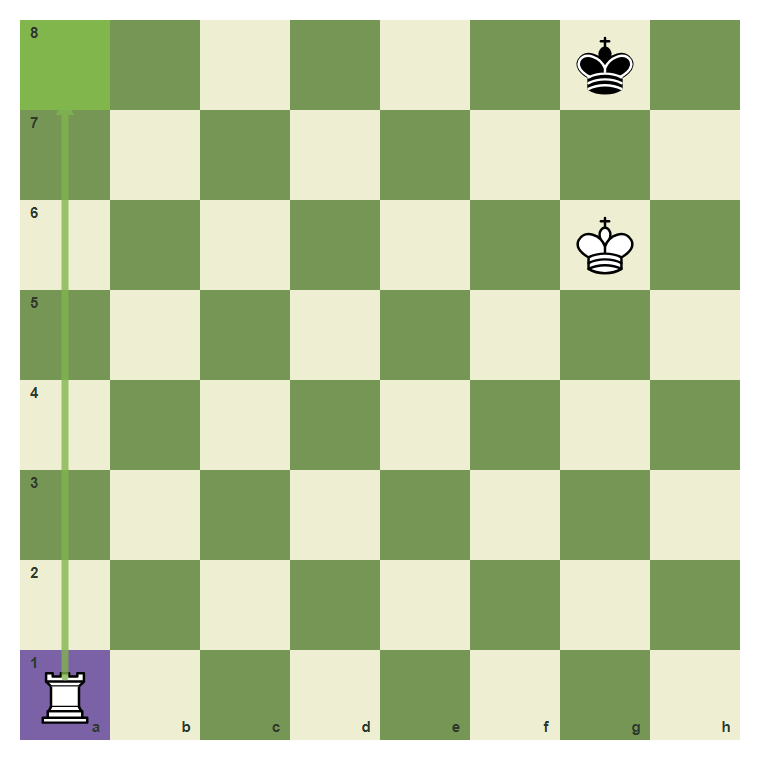
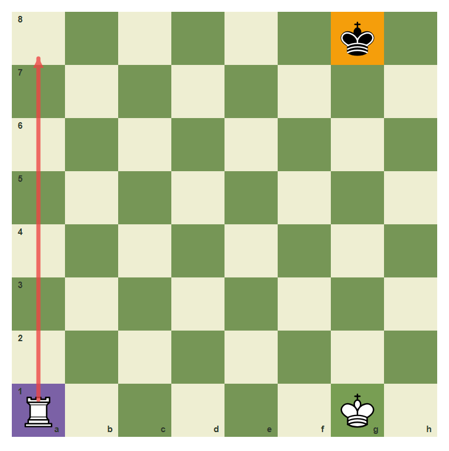

# Review Pack: Basic Checkmates With Queen And Rook

Book: Survival Chess
Chapter: 06-basic-queen-rook-checkmates
Source: ../../../chess-frontend/src/data/ebooks/v2/survival-chess/chapters/06-basic-queen-rook-checkmates.json
Generated: 2026-05-05T07:36:03.994Z
Status: PASS - deterministic checks clean

## Chapter Intent

ELO range: 300-700
Required tier: free
Estimated minutes: 28

Learning objectives:
- Use the queen or rook to cut off the king.
- Bring your king close enough to support mate.
- Deliver a final checking move.

## Quality Gates

| Gate | Result | Detail |
| --- | --- | --- |
| Sections | PASS | 1 |
| Total blocks | PASS | 11 |
| Board-like blocks | PASS | 7 |
| Generated PNG exports | PASS | 7 |
| Interactive/check blocks | PASS | 4 |
| Deterministic warnings | PASS | 0 |
| minimum_board_diagrams >= 5 | PASS | 5 board_diagram block(s) |
| minimum_guided_moves >= 1 | PASS | 1 guided_move block(s) |
| minimum_quizzes >= 3 | PASS | 3 quiz block(s) |
| tier_allowed <= free | PASS | chapter tier is free |

## Block Review

### b02-c06-p01 - prose

Section: Win The Won Game
Type: prose

Text under review:

```text
A big material advantage is not enough. You still need checkmate. Queen and rook mates work by making a box, bringing the king closer, and giving the final check.
```

Reviewer flags: none from deterministic checks.

### b02-c06-d01 - The queen builds a box

Section: Win The Won Game
Type: board_diagram
FEN: `6k1/8/6K1/8/8/8/8/5Q2 w - - 0 1`
Orientation: white
Arrows: f1-f8 (candidate)
Highlights: f1 (candidate), g6 (safe), g8 (target)
Assertions: piece_on white_queen f1, piece_on white_king g6, highlight_exists g8, arrow_exists f1-f8
Text square claims: none
Text move claims: none
Visual square evidence: g8, g6, f1, f8



PNG hash: `5fa0ea668449a8c1ffc35c691ed08473dcfe7c19667cf977be3d1a5c37dbe9c4`

Text under review:

```text
The queen builds a box
The queen can cut files and ranks while the king gives support.
```

Reviewer flags: none from deterministic checks.

### b02-c06-d02 - The rook checks along a rank

Section: Win The Won Game
Type: board_diagram
FEN: `6k1/8/6K1/8/8/8/8/R7 w - - 0 1`
Orientation: white
Arrows: a1-a8 (check)
Highlights: a1 (candidate), a8 (check), g8 (check)
Assertions: piece_on white_rook a1, highlight_exists a8, arrow_exists a1-a8
Text square claims: a8
Text move claims: none
Visual square evidence: g8, g6, a1, a8



PNG hash: `a4197a464e49a7f52a959fc17aaaae477d716cc0d262653704f8074dc67159ab`

Text under review:

```text
The rook checks along a rank
The rook can travel to a8 and check across the 8th rank.
```

Reviewer flags: none from deterministic checks.

### b02-c06-d03 - The king takes escape squares

Section: Win The Won Game
Type: board_diagram
FEN: `6k1/8/6K1/8/8/8/8/R7 w - - 0 1`
Orientation: white
Arrows: g6-g7 (safe), g6-h7 (safe)
Highlights: g6 (safe), g7 (target), h7 (target)
Assertions: piece_on white_king g6, highlight_exists g7, highlight_exists h7
Text square claims: g6, g7, h7
Text move claims: none
Visual square evidence: g8, g6, a1, g7, h7



PNG hash: `fce4636d80512806e0dd83cda5c2c161a9c34ab0305c6a9553eb9c863a3da3eb`

Text under review:

```text
The king takes escape squares
The king on g6 controls g7 and h7, so the enemy king has fewer exits.
```

Reviewer flags: none from deterministic checks.

### b02-c06-d04 - Final rook mate pattern

Section: Win The Won Game
Type: board_diagram
FEN: `6k1/8/6K1/8/8/8/8/R7 w - - 0 1`
Orientation: white
Arrows: a1-a8 (best)
Highlights: a1 (candidate), a8 (best), g8 (check)
Assertions: highlight_exists a8, highlight_exists g8, arrow_exists a1-a8
Text square claims: a8
Text move claims: none
Visual square evidence: g8, g6, a1, a8



PNG hash: `f17c414335ee645337f196c5ee24e51eea32ab7da684572d2a9776505457b47e`

Text under review:

```text
Final rook mate pattern
Rook to a8 is the final checking move in this pattern.
```

Reviewer flags: none from deterministic checks.

### b02-c06-d05 - Queen mate uses the same idea

Section: Win The Won Game
Type: board_diagram
FEN: `7k/8/6K1/8/8/8/8/5Q2 w - - 0 1`
Orientation: white
Arrows: f1-f8 (best)
Highlights: f1 (candidate), f8 (best), h8 (check)
Assertions: piece_on white_queen f1, highlight_exists f8, arrow_exists f1-f8
Text square claims: none
Text move claims: none
Visual square evidence: h8, g6, f1, f8



PNG hash: `e503619902f3452ba36d6c3892d75c7d9dc03953a9932df693f08b3e159da9cc`

Text under review:

```text
Queen mate uses the same idea
The queen should cut the king while your own king guards escape.
```

Reviewer flags: none from deterministic checks.

### b02-c06-g01 - Deliver rook mate

Section: Win The Won Game
Type: guided_move
FEN: `6k1/8/6K1/8/8/8/8/R7 w - - 0 1`
Orientation: white
Arrows: a1-a8 (best)
Highlights: a1 (candidate), a8 (best)
Assertions: legal_move a1a8, piece_on white_rook a1, highlight_exists a8, arrow_exists a1-a8
Text square claims: a1, a8
Text move claims: none
Visual square evidence: g8, g6, a1, a8



PNG hash: `6df86f814dc15522f8d02a6f658057cc8a36b83f6c49ff20b85260cb25326726`

Text under review:

```text
Deliver rook mate
Move the rook from a1 to a8.
Correct. You found the safe survival move.
Pause and scan checks, captures, and threats again.
```

Reviewer flags: none from deterministic checks.

### b02-c06-m01 - Common mistake: check without a box

Section: Win The Won Game
Type: mistake_refutation
FEN: `6k1/8/8/8/8/8/8/R5K1 w - - 0 1`
Orientation: white
Arrows: a1-a8 (check)
Highlights: a1 (candidate), g1 (safe), g8 (target)
Assertions: highlight_exists g8, arrow_exists a1-a8
Text square claims: none
Text move claims: none
Visual square evidence: g8, a1, g1, a8



PNG hash: `895cc5b7efedff7aed20800fe65c3513c1b87aef5a632fef706b457cb83961de`

Text under review:

```text
Common mistake: check without a box
Random checks let the king run. First make a box and bring support.
The rook checks, but the white king is too far to control escape squares.
```

Reviewer flags: none from deterministic checks.

### b02-c06-q01 - Queen and rook mates usually need:

Section: Chapter Checkpoint
Type: quiz

Text under review:

```text
Queen and rook mates usually need:
Queen and rook mates usually need:
```

Quiz options:
- [correct] a: A box and king support
- [wrong] b: Only random checks
- [wrong] c: No king

Reviewer flags: none from deterministic checks.

### b02-c06-q02 - The final mating move must give:

Section: Chapter Checkpoint
Type: quiz

Text under review:

```text
The final mating move must give:
The final mating move must give:
```

Quiz options:
- [correct] a: Check
- [wrong] b: A draw offer
- [wrong] c: A pawn value

Reviewer flags: none from deterministic checks.

### b02-c06-q03 - Your king helps mate by:

Section: Chapter Checkpoint
Type: quiz

Text under review:

```text
Your king helps mate by:
Your king helps mate by:
```

Quiz options:
- [correct] a: Controlling escape squares
- [wrong] b: Standing far away forever
- [wrong] c: Leaving the board

Reviewer flags: none from deterministic checks.

## Human Signoff

- Chess analyst: pending
- Visual reviewer: pending
- Pedagogy reviewer: pending
- Final editor: pending
