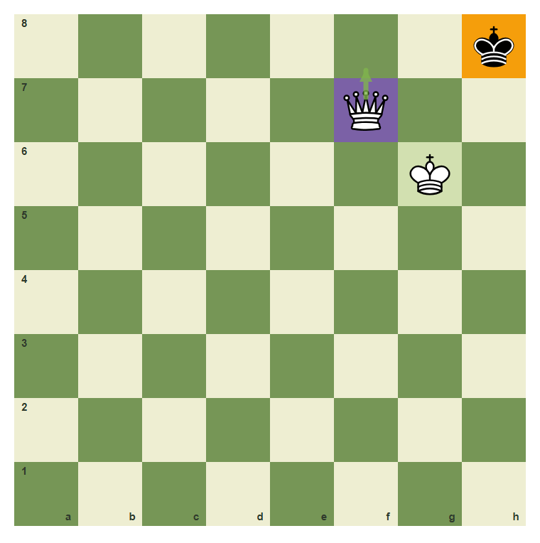
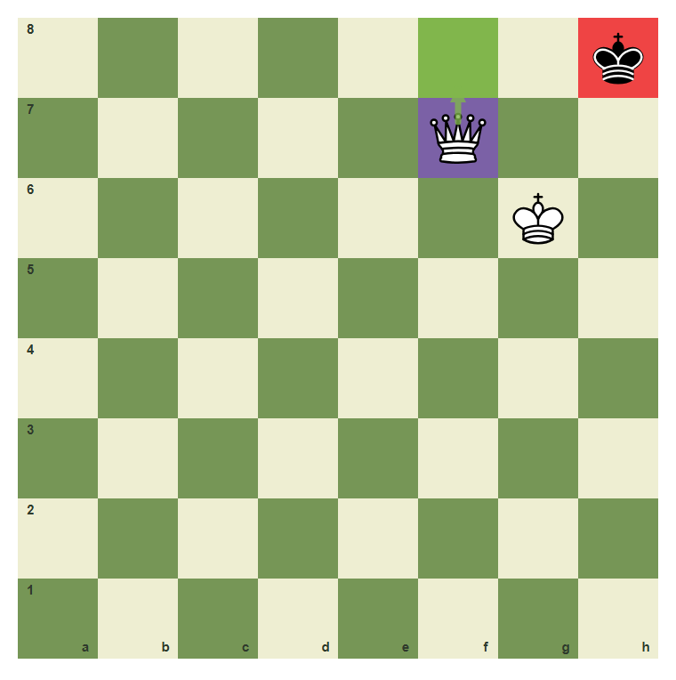
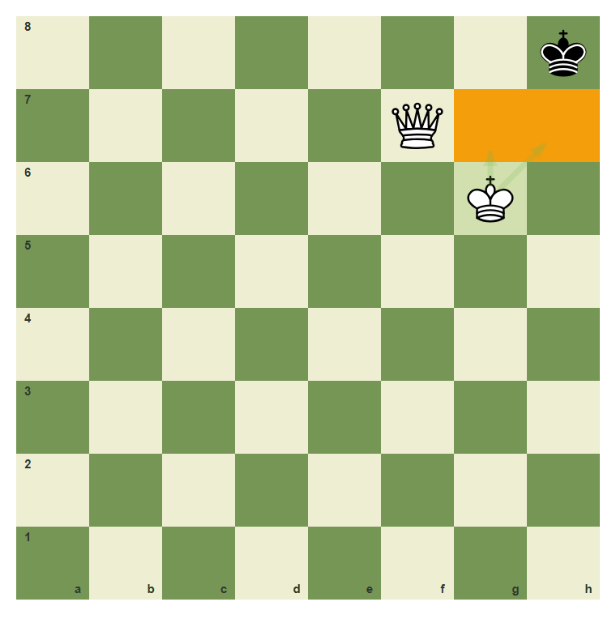
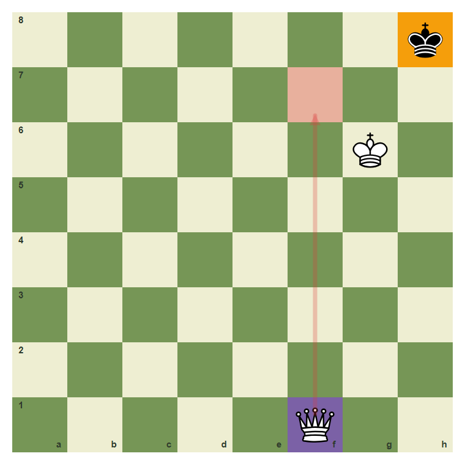
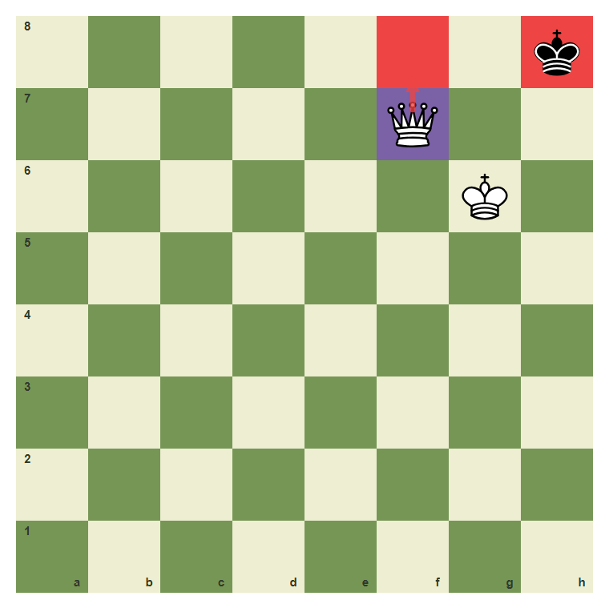

# Review Pack: Avoiding Stalemate

Book: Survival Chess
Chapter: 07-avoiding-stalemate
Source: ../../../chess-frontend/src/data/ebooks/v2/survival-chess/chapters/07-avoiding-stalemate.json
Generated: 2026-05-05T07:36:03.996Z
Status: PASS - deterministic checks clean

## Chapter Intent

ELO range: 300-700
Required tier: free
Estimated minutes: 26

Learning objectives:
- Recognize stalemate danger.
- Prefer checking moves in winning king hunts.
- Leave the defender legal moves until mate is ready.

## Quality Gates

| Gate | Result | Detail |
| --- | --- | --- |
| Sections | PASS | 1 |
| Total blocks | PASS | 11 |
| Board-like blocks | PASS | 7 |
| Generated PNG exports | PASS | 7 |
| Interactive/check blocks | PASS | 4 |
| Deterministic warnings | PASS | 0 |
| minimum_board_diagrams >= 5 | PASS | 5 board_diagram block(s) |
| minimum_guided_moves >= 1 | PASS | 1 guided_move block(s) |
| minimum_quizzes >= 3 | PASS | 3 quiz block(s) |
| tier_allowed <= free | PASS | chapter tier is free |

## Block Review

### b02-c07-p01 - prose

Section: Winning Still Needs Care
Type: prose

Text under review:

```text
Stalemate happens when the side to move has no legal move but is not in check. Beginners often stalemate with a queen because they take every escape square without giving check.
```

Reviewer flags: none from deterministic checks.

### b02-c07-d01 - The danger around h8

Section: Winning Still Needs Care
Type: board_diagram
FEN: `7k/5Q2/6K1/8/8/8/8/8 w - - 0 1`
Orientation: white
Arrows: f7-f8 (best)
Highlights: h8 (target), f7 (candidate), g6 (safe)
Assertions: piece_on black_king h8, highlight_exists h8, arrow_exists f7-f8
Text square claims: h8
Text move claims: none
Visual square evidence: h8, f7, g6, f8



PNG hash: `7c36eda9bb91c532b0abafd0416ad99b779f5e5a25ce64444bbed204e677e678`

Text under review:

```text
The danger around h8
The black king has very little room. White must use checks carefully.
```

Reviewer flags: none from deterministic checks.

### b02-c07-d02 - Give a checking move

Section: Winning Still Needs Care
Type: board_diagram
FEN: `7k/5Q2/6K1/8/8/8/8/8 w - - 0 1`
Orientation: white
Arrows: f7-f8 (best)
Highlights: f7 (candidate), f8 (best), h8 (check)
Assertions: piece_on white_queen f7, highlight_exists f8, arrow_exists f7-f8
Text square claims: f8
Text move claims: none
Visual square evidence: h8, f7, g6, f8



PNG hash: `d7cd98c25669d54c99372da70f24005effa3b885b72bebd287ba10e43de7e9a5`

Text under review:

```text
Give a checking move
Queen f8 gives check instead of merely taking squares.
```

Reviewer flags: none from deterministic checks.

### b02-c07-d03 - The king controls escape squares

Section: Winning Still Needs Care
Type: board_diagram
FEN: `7k/5Q2/6K1/8/8/8/8/8 w - - 0 1`
Orientation: white
Arrows: g6-h7 (safe), g6-g7 (safe)
Highlights: g6 (safe), h7 (target), g7 (target)
Assertions: piece_on white_king g6, highlight_exists h7, highlight_exists g7
Text square claims: g6, h7, g7
Text move claims: none
Visual square evidence: h8, f7, g6, h7, g7



PNG hash: `12da0b39b29148d417f543fb900672a990b9ae333cd9a6967059acb3c7622af3`

Text under review:

```text
The king controls escape squares
The white king on g6 controls h7 and g7.
```

Reviewer flags: none from deterministic checks.

### b02-c07-d04 - A quiet squeeze can stalemate

Section: Winning Still Needs Care
Type: board_diagram
FEN: `7k/8/6K1/8/8/8/8/5Q2 w - - 0 1`
Orientation: white
Arrows: f1-f7 (wrong)
Highlights: f1 (candidate), f7 (wrong), h8 (target)
Assertions: piece_on white_queen f1, highlight_exists f7, arrow_exists f1-f7
Text square claims: none
Text move claims: none
Visual square evidence: h8, g6, f1, f7



PNG hash: `c7fd38106fab2fc1ab625abdd25ef507d5252990bdfdc21809488447ca3fdc79`

Text under review:

```text
A quiet squeeze can stalemate
If you only take squares and do not check, you may give the defender no legal move.
```

Reviewer flags: none from deterministic checks.

### b02-c07-d05 - The survival rule: check before the box closes

Section: Winning Still Needs Care
Type: board_diagram
FEN: `7k/5Q2/6K1/8/8/8/8/8 w - - 0 1`
Orientation: white
Arrows: f7-f8 (check)
Highlights: f7 (candidate), f8 (check), h8 (check)
Assertions: highlight_exists f8, highlight_exists h8, arrow_exists f7-f8
Text square claims: none
Text move claims: none
Visual square evidence: h8, f7, g6, f8



PNG hash: `71b8e5a981bdf9adbd9305ed53e5c95abc0d9d01b4d75a1931318e55197cb318`

Text under review:

```text
The survival rule: check before the box closes
When the enemy king is trapped, choose a move that gives check.
```

Reviewer flags: none from deterministic checks.

### b02-c07-g01 - Avoid stalemate with check

Section: Winning Still Needs Care
Type: guided_move
FEN: `7k/5Q2/6K1/8/8/8/8/8 w - - 0 1`
Orientation: white
Arrows: f7-f8 (best)
Highlights: f7 (candidate), f8 (best), h8 (check)
Assertions: legal_move f7f8, piece_on white_queen f7, highlight_exists f8, arrow_exists f7-f8
Text square claims: f7, f8
Text move claims: none
Visual square evidence: h8, f7, g6, f8


PNG hash: `d7cd98c25669d54c99372da70f24005effa3b885b72bebd287ba10e43de7e9a5`

Text under review:

```text
Avoid stalemate with check
Move the queen from f7 to f8.
Correct. You found the safe survival move.
Pause and scan checks, captures, and threats again.
```

Reviewer flags: none from deterministic checks.

### b02-c07-m01 - Common mistake: squeeze without check

Section: Winning Still Needs Care
Type: mistake_refutation
FEN: `7k/8/6K1/8/8/8/8/5Q2 w - - 0 1`
Orientation: white
Arrows: f1-f7 (wrong)
Highlights: f1 (candidate), f7 (wrong), h8 (target)
Assertions: highlight_exists f7, highlight_exists h8, arrow_exists f1-f7
Text square claims: none
Text move claims: none
Visual square evidence: h8, g6, f1, f7


PNG hash: `c7fd38106fab2fc1ab625abdd25ef507d5252990bdfdc21809488447ca3fdc79`

Text under review:

```text
Common mistake: squeeze without check
A quiet queen move can remove all moves without checking. In a won ending, ask if the defender is in check.
The wrong arrow shows a queen move that focuses only on the box.
```

Reviewer flags: none from deterministic checks.

### b02-c07-q01 - Stalemate is:

Section: Chapter Checkpoint
Type: quiz

Text under review:

```text
Stalemate is:
Stalemate is:
```

Quiz options:
- [correct] a: No legal moves and not in check
- [wrong] b: Any checkmate
- [wrong] c: A pawn trade

Reviewer flags: none from deterministic checks.

### b02-c07-q02 - Near a trapped king, prefer moves that:

Section: Chapter Checkpoint
Type: quiz

Text under review:

```text
Near a trapped king, prefer moves that:
Near a trapped king, prefer moves that:
```

Quiz options:
- [correct] a: Give check
- [wrong] b: Only take squares quietly
- [wrong] c: Lose the queen

Reviewer flags: none from deterministic checks.

### b02-c07-q03 - Stalemate makes a won game become:

Section: Chapter Checkpoint
Type: quiz

Text under review:

```text
Stalemate makes a won game become:
Stalemate makes a won game become:
```

Quiz options:
- [correct] a: A draw
- [wrong] b: A bigger win
- [wrong] c: An illegal board

Reviewer flags: none from deterministic checks.

## Human Signoff

- Chess analyst: pending
- Visual reviewer: pending
- Pedagogy reviewer: pending
- Final editor: pending
