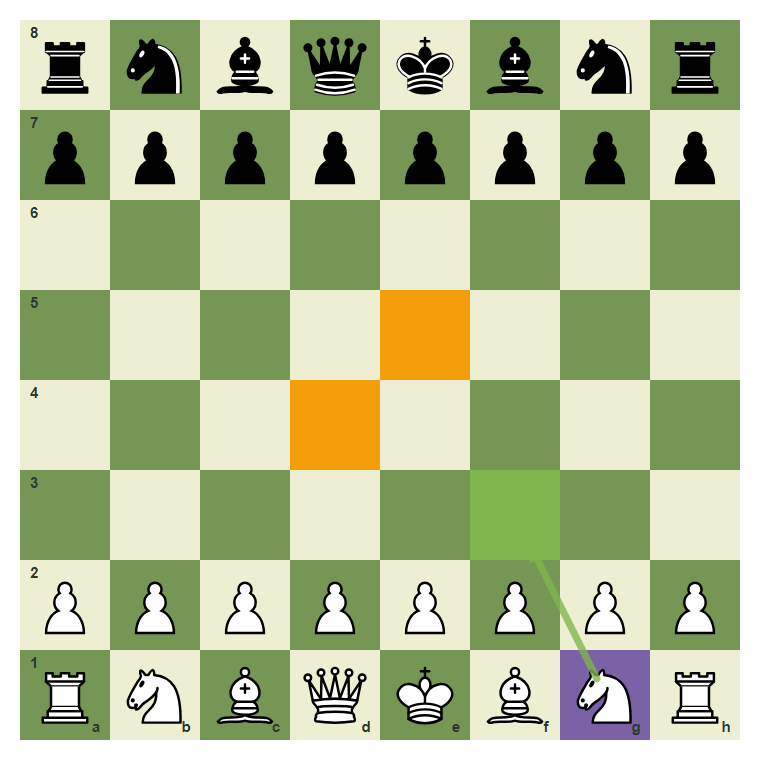
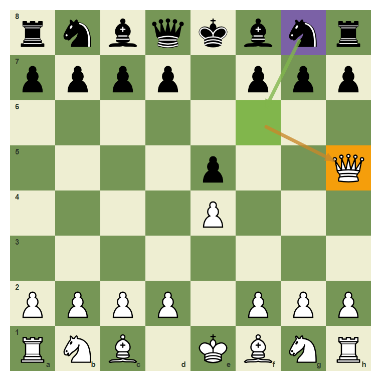
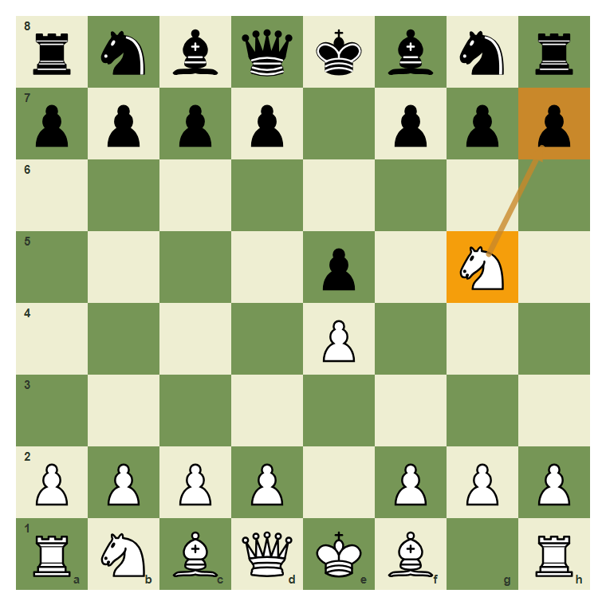
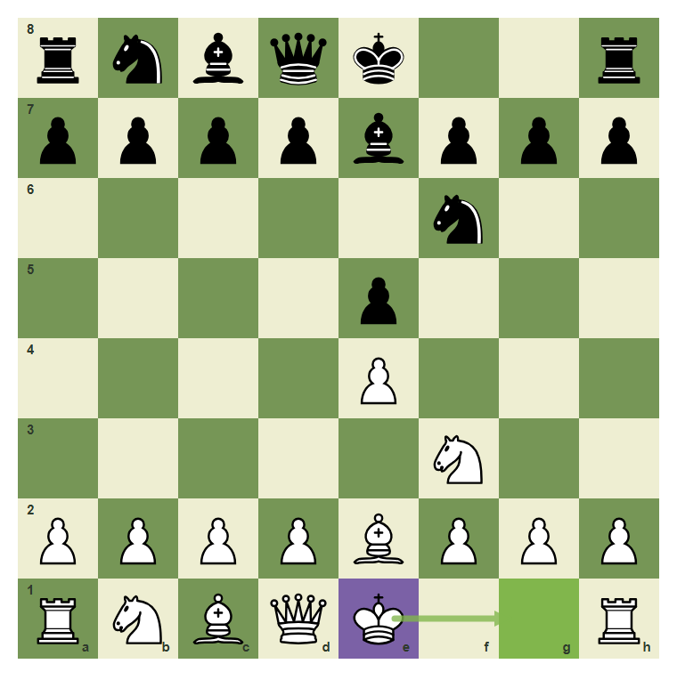
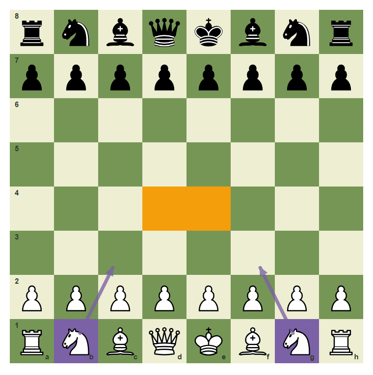

# Review Pack: Opening Safety: Stop Moving The Same Piece

Book: Survival Chess
Chapter: 08-opening-safety
Source: ../../../chess-frontend/src/data/ebooks/v2/survival-chess/chapters/08-opening-safety.json
Generated: 2026-05-05T07:36:03.999Z
Status: PASS - deterministic checks clean

## Chapter Intent

ELO range: 300-700
Required tier: free
Estimated minutes: 24

Learning objectives:
- Develop pieces toward useful squares.
- Avoid moving one piece repeatedly without reason.
- Recognize why early queen moves can lose time.

## Quality Gates

| Gate | Result | Detail |
| --- | --- | --- |
| Sections | PASS | 1 |
| Total blocks | PASS | 11 |
| Board-like blocks | PASS | 7 |
| Generated PNG exports | PASS | 7 |
| Interactive/check blocks | PASS | 4 |
| Deterministic warnings | PASS | 0 |
| minimum_board_diagrams >= 5 | PASS | 5 board_diagram block(s) |
| minimum_guided_moves >= 1 | PASS | 1 guided_move block(s) |
| minimum_quizzes >= 3 | PASS | 3 quiz block(s) |
| tier_allowed <= free | PASS | chapter tier is free |

## Block Review

### b02-c08-p01 - prose

Section: Do Not Lose Before The Game Starts
Type: prose

Text under review:

```text
Opening survival is simple: control the center, develop pieces, protect the king, and do not chase tricks with the same piece again and again.
```

Reviewer flags: none from deterministic checks.

### b02-c08-d01 - Develop toward the center

Section: Do Not Lose Before The Game Starts
Type: board_diagram
FEN: `rnbqkbnr/pppppppp/8/8/8/8/PPPPPPPP/RNBQKBNR w KQkq - 0 1`
Orientation: white
Arrows: g1-f3 (best)
Highlights: g1 (candidate), f3 (best), e5 (target), d4 (target)
Assertions: piece_on white_knight g1, highlight_exists f3, arrow_exists g1-f3
Text square claims: g1, f3
Text move claims: none
Visual square evidence: a8, b8, c8, d8, e8, f8, g8, h8, a7, b7, c7, d7, e7, f7, g7, h7, a2, b2, c2, d2, e2, f2, g2, h2, a1, b1, c1, d1, e1, f1, g1, h1, f3, e5, d4



PNG hash: `bc152c6156f4c8f819a2562ae6904f909107174364936e20a60fcbf0242fa18b`

Text under review:

```text
Develop toward the center
The knight move g1-f3 helps control central squares.
```

Reviewer flags: none from deterministic checks.

### b02-c08-d02 - Early queen moves invite tempo

Section: Do Not Lose Before The Game Starts
Type: board_diagram
FEN: `rnbqkbnr/pppp1ppp/8/4p2Q/4P3/8/PPPP1PPP/RNB1KBNR b KQkq - 1 2`
Orientation: white
Arrows: g8-f6 (best), f6-h5 (threat)
Highlights: h5 (target), g8 (candidate), f6 (best)
Assertions: piece_on white_queen h5, highlight_exists f6, arrow_exists g8-f6
Text square claims: h5
Text move claims: none
Visual square evidence: a8, b8, c8, d8, e8, f8, g8, h8, a7, b7, c7, d7, f7, g7, h7, e5, h5, e4, a2, b2, c2, d2, f2, g2, h2, a1, b1, c1, e1, f1, g1, h1, f6



PNG hash: `c08bb8be55c76e3c7148672c86468f5a1e92d75e1d64cff34773dc1b4d92907d`

Text under review:

```text
Early queen moves invite tempo
The queen on h5 can be attacked by a developing knight.
```

Reviewer flags: none from deterministic checks.

### b02-c08-d03 - Moving one piece repeatedly costs time

Section: Do Not Lose Before The Game Starts
Type: board_diagram
FEN: `rnbqkbnr/pppp1ppp/8/4p1N1/4P3/8/PPPP1PPP/RNBQKB1R b KQkq - 2 2`
Orientation: white
Arrows: g5-h7 (threat)
Highlights: g5 (target), h7 (threat)
Assertions: piece_on white_knight g5, highlight_exists g5, arrow_exists g5-h7
Text square claims: g5
Text move claims: none
Visual square evidence: a8, b8, c8, d8, e8, f8, g8, h8, a7, b7, c7, d7, f7, g7, h7, e5, g5, e4, a2, b2, c2, d2, f2, g2, h2, a1, b1, c1, d1, e1, f1, h1



PNG hash: `ef06f59034013b34f9f204dc6dd96ea617f830827a1761cbb86725442af89b85`

Text under review:

```text
Moving one piece repeatedly costs time
The knight on g5 moved early and can become a target.
```

Reviewer flags: none from deterministic checks.

### b02-c08-d04 - King safety is part of development

Section: Do Not Lose Before The Game Starts
Type: board_diagram
FEN: `rnbqk2r/ppppbppp/5n2/4p3/4P3/5N2/PPPPBPPP/RNBQK2R w KQkq - 4 4`
Orientation: white
Arrows: e1-g1 (best)
Highlights: e1 (candidate), g1 (best)
Assertions: piece_on white_king e1, highlight_exists g1, arrow_exists e1-g1
Text square claims: none
Text move claims: none
Visual square evidence: a8, b8, c8, d8, e8, h8, a7, b7, c7, d7, e7, f7, g7, h7, f6, e5, e4, f3, a2, b2, c2, d2, e2, f2, g2, h2, a1, b1, c1, d1, e1, h1, g1



PNG hash: `9fbadaa6e8e232bea6a432f4fbd9ce7a73fe15407b9a9ca343cd0c30572fa253`

Text under review:

```text
King safety is part of development
When the path is clear and safe, castling protects the king.
```

Reviewer flags: none from deterministic checks.

### b02-c08-d05 - The opening safety checklist

Section: Do Not Lose Before The Game Starts
Type: board_diagram
FEN: `rnbqkbnr/pppppppp/8/8/8/8/PPPPPPPP/RNBQKBNR w KQkq - 0 1`
Orientation: white
Arrows: g1-f3 (candidate), b1-c3 (candidate)
Highlights: e4 (target), d4 (target), g1 (candidate), b1 (candidate)
Assertions: highlight_exists e4, highlight_exists d4, arrow_exists g1-f3
Text square claims: none
Text move claims: none
Visual square evidence: a8, b8, c8, d8, e8, f8, g8, h8, a7, b7, c7, d7, e7, f7, g7, h7, a2, b2, c2, d2, e2, f2, g2, h2, a1, b1, c1, d1, e1, f1, g1, h1, e4, d4, f3, c3



PNG hash: `84cfdce689c6653f11baa8cd39818ea9eebfc6132f2dc6aaaaed5ca64fbd6522`

Text under review:

```text
The opening safety checklist
Center, development, king safety. These three ideas beat most beginner opening traps.
```

Reviewer flags: none from deterministic checks.

### b02-c08-g01 - Play a safe developing move

Section: Do Not Lose Before The Game Starts
Type: guided_move
FEN: `rnbqkbnr/pppppppp/8/8/8/8/PPPPPPPP/RNBQKBNR w KQkq - 0 1`
Orientation: white
Arrows: g1-f3 (best)
Highlights: g1 (candidate), f3 (best)
Assertions: legal_move g1f3, piece_on white_knight g1, highlight_exists f3, arrow_exists g1-f3
Text square claims: g1, f3
Text move claims: none
Visual square evidence: a8, b8, c8, d8, e8, f8, g8, h8, a7, b7, c7, d7, e7, f7, g7, h7, a2, b2, c2, d2, e2, f2, g2, h2, a1, b1, c1, d1, e1, f1, g1, h1, f3


PNG hash: `d631967b170a2f7ca02d76a728d3c7190daa00728bab1e59032ba234dbb49f52`

Text under review:

```text
Play a safe developing move
Develop the knight from g1 to f3.
Correct. You found the safe survival move.
Pause and scan checks, captures, and threats again.
```

Reviewer flags: none from deterministic checks.

### b02-c08-m01 - Common mistake: bring the queen out too early

Section: Do Not Lose Before The Game Starts
Type: mistake_refutation
FEN: `rnbqkbnr/pppp1ppp/8/4p2Q/4P3/8/PPPP1PPP/RNB1KBNR b KQkq - 1 2`
Orientation: white
Arrows: g8-f6 (best), f6-h5 (threat)
Highlights: g8 (candidate), f6 (best), h5 (target)
Assertions: highlight_exists h5, highlight_exists f6, arrow_exists g8-f6
Text square claims: g8, f6, h5
Text move claims: none
Visual square evidence: a8, b8, c8, d8, e8, f8, g8, h8, a7, b7, c7, d7, f7, g7, h7, e5, h5, e4, a2, b2, c2, d2, f2, g2, h2, a1, b1, c1, e1, f1, g1, h1, f6


PNG hash: `c08bb8be55c76e3c7148672c86468f5a1e92d75e1d64cff34773dc1b4d92907d`

Text under review:

```text
Common mistake: bring the queen out too early
If your queen becomes a target, the opponent develops while attacking it.
The knight move g8-f6 attacks h5 with tempo.
```

Reviewer flags: none from deterministic checks.

### b02-c08-q01 - A safe opening move often:

Section: Chapter Checkpoint
Type: quiz

Text under review:

```text
A safe opening move often:
A safe opening move often:
```

Quiz options:
- [correct] a: Develops a piece
- [wrong] b: Moves the same piece for no reason
- [wrong] c: Hangs the queen

Reviewer flags: none from deterministic checks.

### b02-c08-q02 - Early queen moves can lose:

Section: Chapter Checkpoint
Type: quiz

Text under review:

```text
Early queen moves can lose:
Early queen moves can lose:
```

Quiz options:
- [correct] a: Time
- [wrong] b: The board colors
- [wrong] c: All legal moves immediately

Reviewer flags: none from deterministic checks.

### b02-c08-q03 - Opening survival includes:

Section: Chapter Checkpoint
Type: quiz

Text under review:

```text
Opening survival includes:
Opening survival includes:
```

Quiz options:
- [correct] a: Center, development, king safety
- [wrong] b: Only pawn hunting
- [wrong] c: Never castling

Reviewer flags: none from deterministic checks.

## Human Signoff

- Chess analyst: pending
- Visual reviewer: pending
- Pedagogy reviewer: pending
- Final editor: pending
