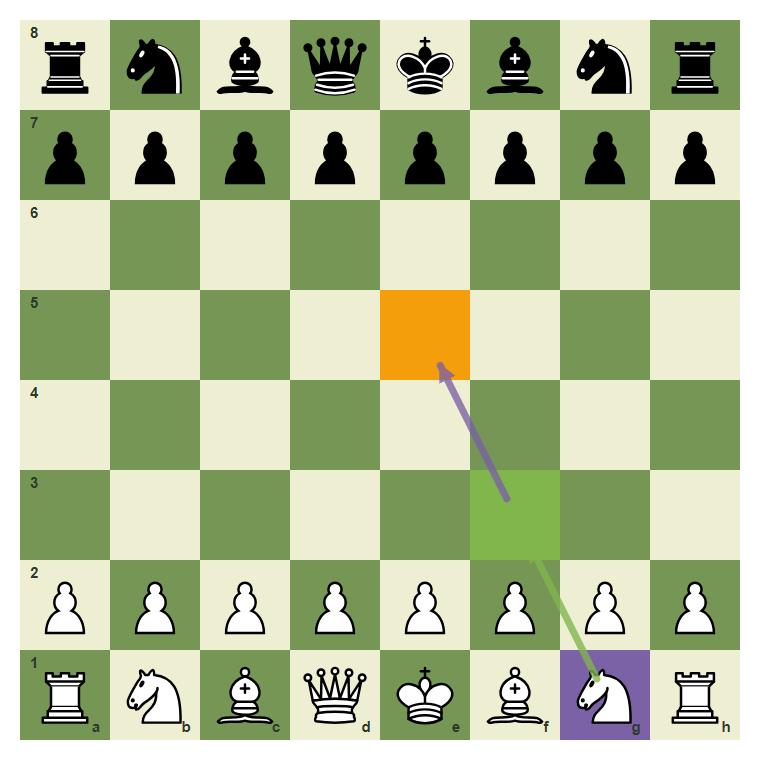
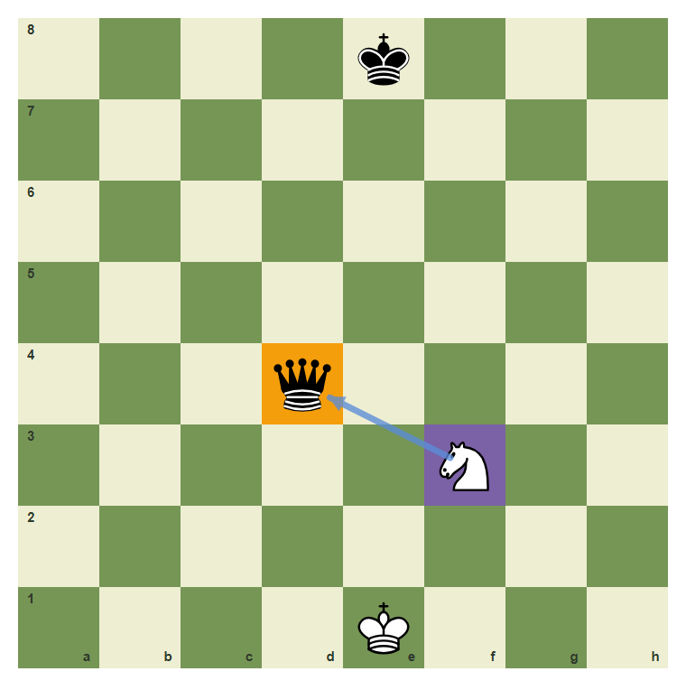
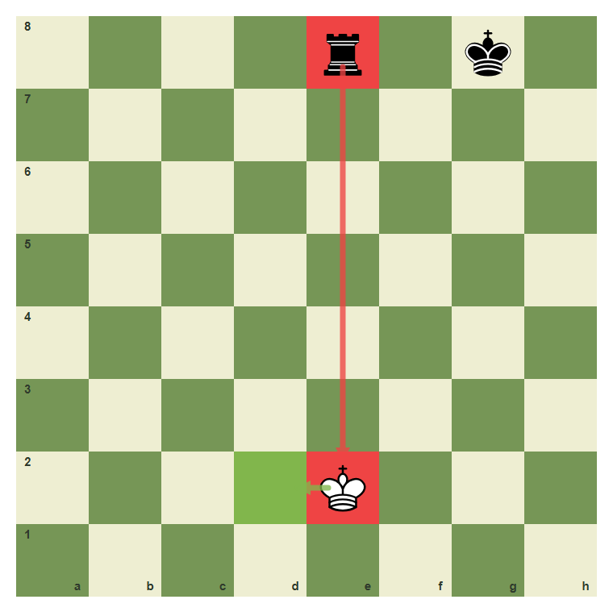
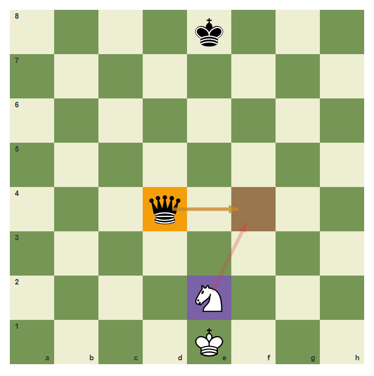
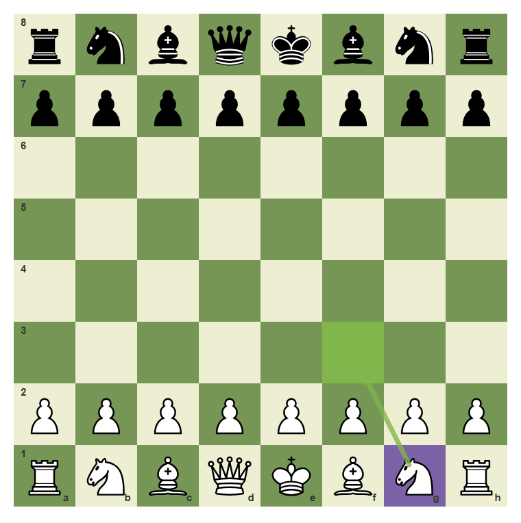
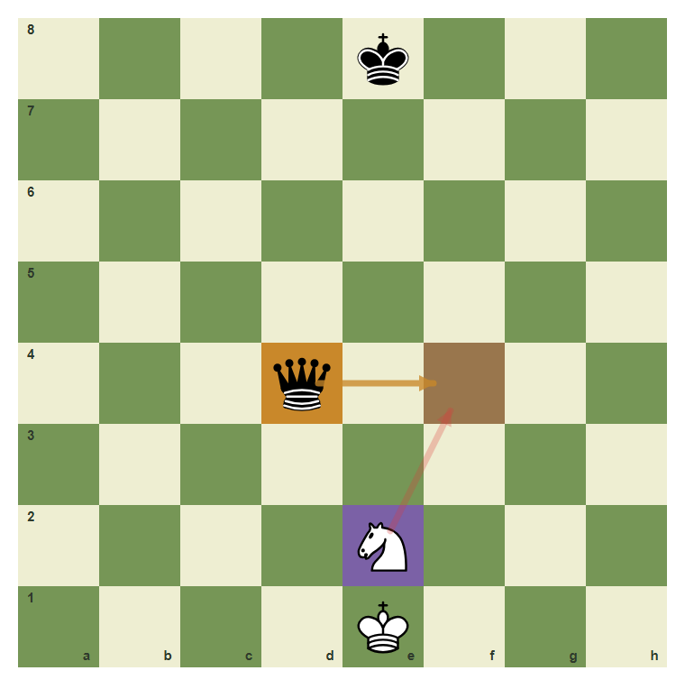

# Review Pack: Blunder-Check Before Every Move

Book: Survival Chess
Chapter: 09-blunder-check
Source: ../../../chess-frontend/src/data/ebooks/v2/survival-chess/chapters/09-blunder-check.json
Generated: 2026-05-05T07:36:04.003Z
Status: PASS - deterministic checks clean

## Chapter Intent

ELO range: 300-700
Required tier: free
Estimated minutes: 24

Learning objectives:
- Ask what your move leaves behind.
- Check whether your moved piece becomes loose.
- Notice immediate checks and captures against you.

## Quality Gates

| Gate | Result | Detail |
| --- | --- | --- |
| Sections | PASS | 1 |
| Total blocks | PASS | 11 |
| Board-like blocks | PASS | 7 |
| Generated PNG exports | PASS | 7 |
| Interactive/check blocks | PASS | 4 |
| Deterministic warnings | PASS | 0 |
| minimum_board_diagrams >= 5 | PASS | 5 board_diagram block(s) |
| minimum_guided_moves >= 1 | PASS | 1 guided_move block(s) |
| minimum_quizzes >= 3 | PASS | 3 quiz block(s) |
| tier_allowed <= free | PASS | chapter tier is free |

## Block Review

### b02-c09-p01 - prose

Section: The One-Second Pause
Type: prose

Text under review:

```text
A blunder-check is the final pause before moving. Ask: after my move, what can my opponent check, capture, or threaten?
```

Reviewer flags: none from deterministic checks.

### b02-c09-d01 - Develop with a final check

Section: The One-Second Pause
Type: board_diagram
FEN: `rnbqkbnr/pppppppp/8/8/8/8/PPPPPPPP/RNBQKBNR w KQkq - 0 1`
Orientation: white
Arrows: g1-f3 (best), f3-e5 (candidate)
Highlights: g1 (candidate), f3 (best), e5 (target)
Assertions: piece_on white_knight g1, highlight_exists f3, arrow_exists g1-f3
Text square claims: g1, f3
Text move claims: none
Visual square evidence: a8, b8, c8, d8, e8, f8, g8, h8, a7, b7, c7, d7, e7, f7, g7, h7, a2, b2, c2, d2, e2, f2, g2, h2, a1, b1, c1, d1, e1, f1, g1, h1, f3, e5



PNG hash: `b51986aa5218d6b9e5b6723628784b15161b721adbf2c45e74ab468c8639229a`

Text under review:

```text
Develop with a final check
Before g1-f3, notice that the knight lands on a protected, useful square.
```

Reviewer flags: none from deterministic checks.

### b02-c09-d02 - Do not leave the queen loose

Section: The One-Second Pause
Type: board_diagram
FEN: `4k3/8/8/8/3q4/5N2/8/4K3 w - - 0 1`
Orientation: white
Arrows: f3-d4 (capture)
Highlights: d4 (target), f3 (candidate)
Assertions: piece_on black_queen d4, highlight_exists d4, arrow_exists f3-d4
Text square claims: d4
Text move claims: none
Visual square evidence: e8, d4, f3, e1



PNG hash: `39629a3e4fa9bfabc8ea6fbeccc006f760bf1996628593719916eee8b7a131d5`

Text under review:

```text
Do not leave the queen loose
The queen on d4 is attacked. If it were your queen, you must notice it.
```

Reviewer flags: none from deterministic checks.

### b02-c09-d03 - Check danger overrides plans

Section: The One-Second Pause
Type: board_diagram
FEN: `4r1k1/8/8/8/8/8/4K3/8 w - - 0 1`
Orientation: white
Arrows: e8-e2 (check), e2-d2 (best)
Highlights: e8 (check), e2 (check), d2 (best)
Assertions: highlight_exists e2, highlight_exists d2, arrow_exists e2-d2
Text square claims: none
Text move claims: none
Visual square evidence: e8, g8, e2, d2



PNG hash: `b30e07e0955de8b7dd1b1049b76950b5b27b47e272a73015eb1c13d7c4fafbcb`

Text under review:

```text
Check danger overrides plans
If your king is checked, the blunder-check has already found the emergency.
```

Reviewer flags: none from deterministic checks.

### b02-c09-d04 - Your moved piece can become loose

Section: The One-Second Pause
Type: board_diagram
FEN: `4k3/8/8/8/3q4/8/4N3/4K3 w - - 0 1`
Orientation: white
Arrows: e2-f4 (wrong), d4-f4 (threat)
Highlights: e2 (candidate), d4 (target), f4 (wrong)
Assertions: piece_on white_knight e2, piece_on black_queen d4, highlight_exists f4, arrow_exists d4-f4
Text square claims: none
Text move claims: none
Visual square evidence: e8, d4, e2, e1, f4



PNG hash: `a646a23a3f0a79cbe4e0020301cb7b3b8a623c758adf7d2a7509e8a6e715bb11`

Text under review:

```text
Your moved piece can become loose
A piece that moves into attack can become the new target.
```

Reviewer flags: none from deterministic checks.

### b02-c09-d05 - A safe move passes the scan

Section: The One-Second Pause
Type: board_diagram
FEN: `rnbqkb1r/pppppppp/5n2/8/4P3/8/PPPP1PPP/RNBQKBNR w KQkq - 1 2`
Orientation: white
Arrows: b1-c3 (best), c3-e4 (safe)
Highlights: b1 (candidate), c3 (best), e4 (safe)
Assertions: highlight_exists c3, highlight_exists e4, arrow_exists b1-c3
Text square claims: b1, c3, e4
Text move claims: none
Visual square evidence: a8, b8, c8, d8, e8, f8, h8, a7, b7, c7, d7, e7, f7, g7, h7, f6, e4, a2, b2, c2, d2, f2, g2, h2, a1, b1, c1, d1, e1, f1, g1, h1, c3


PNG hash: `4c0e4fdf8fd12f7c11c13cec0cac92632e8ebe775e30af1c14288714e8417d0a`

Text under review:

```text
A safe move passes the scan
The move b1-c3 develops and helps e4, so it passes the scan.
```

Reviewer flags: none from deterministic checks.

### b02-c09-g01 - Make a move that passes the scan

Section: The One-Second Pause
Type: guided_move
FEN: `rnbqkbnr/pppppppp/8/8/8/8/PPPPPPPP/RNBQKBNR w KQkq - 0 1`
Orientation: white
Arrows: g1-f3 (best)
Highlights: g1 (candidate), f3 (best)
Assertions: legal_move g1f3, piece_on white_knight g1, highlight_exists f3, arrow_exists g1-f3
Text square claims: g1, f3
Text move claims: none
Visual square evidence: a8, b8, c8, d8, e8, f8, g8, h8, a7, b7, c7, d7, e7, f7, g7, h7, a2, b2, c2, d2, e2, f2, g2, h2, a1, b1, c1, d1, e1, f1, g1, h1, f3



PNG hash: `d631967b170a2f7ca02d76a728d3c7190daa00728bab1e59032ba234dbb49f52`

Text under review:

```text
Make a move that passes the scan
Play g1 to f3 after checking that the piece lands safely.
Correct. You found the safe survival move.
Pause and scan checks, captures, and threats again.
```

Reviewer flags: none from deterministic checks.

### b02-c09-m01 - Common mistake: move without the final pause

Section: The One-Second Pause
Type: mistake_refutation
FEN: `4k3/8/8/8/3q4/8/4N3/4K3 w - - 0 1`
Orientation: white
Arrows: e2-f4 (wrong), d4-f4 (threat)
Highlights: e2 (candidate), f4 (wrong), d4 (threat)
Assertions: highlight_exists f4, arrow_exists d4-f4
Text square claims: f4
Text move claims: none
Visual square evidence: e8, d4, e2, e1, f4



PNG hash: `7c851715e3555fc2820cb6b7937af51ac7b1e70fa547d62f684e8e3aac1d9371`

Text under review:

```text
Common mistake: move without the final pause
A fast move can walk into a simple capture. Slow chess is stronger chess.
The wrong square f4 is marked because it walks into the queen attack.
```

Reviewer flags: none from deterministic checks.

### b02-c09-q01 - A blunder-check asks what the opponent can:

Section: Chapter Checkpoint
Type: quiz

Text under review:

```text
A blunder-check asks what the opponent can:
A blunder-check asks what the opponent can:
```

Quiz options:
- [correct] a: Check, capture, or threaten
- [wrong] b: Eat for lunch
- [wrong] c: Rename the pieces

Reviewer flags: none from deterministic checks.

### b02-c09-q02 - The best time for a blunder-check is:

Section: Chapter Checkpoint
Type: quiz

Text under review:

```text
The best time for a blunder-check is:
The best time for a blunder-check is:
```

Quiz options:
- [correct] a: Before releasing the move
- [wrong] b: After losing the queen
- [wrong] c: Only after checkmate

Reviewer flags: none from deterministic checks.

### b02-c09-q03 - Fast moves are always stronger than checked moves.

Section: Chapter Checkpoint
Type: quiz

Text under review:

```text
Fast moves are always stronger than checked moves.
Fast moves are always stronger than checked moves.
```

Quiz options:
- [wrong] a: True
- [correct] b: False

Reviewer flags: none from deterministic checks.

## Human Signoff

- Chess analyst: pending
- Visual reviewer: pending
- Pedagogy reviewer: pending
- Final editor: pending
