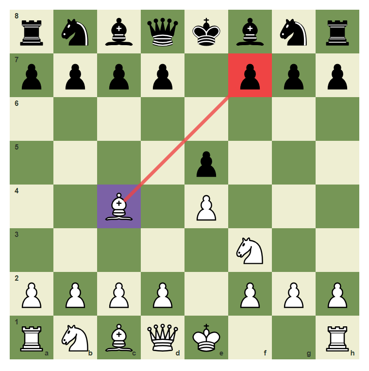
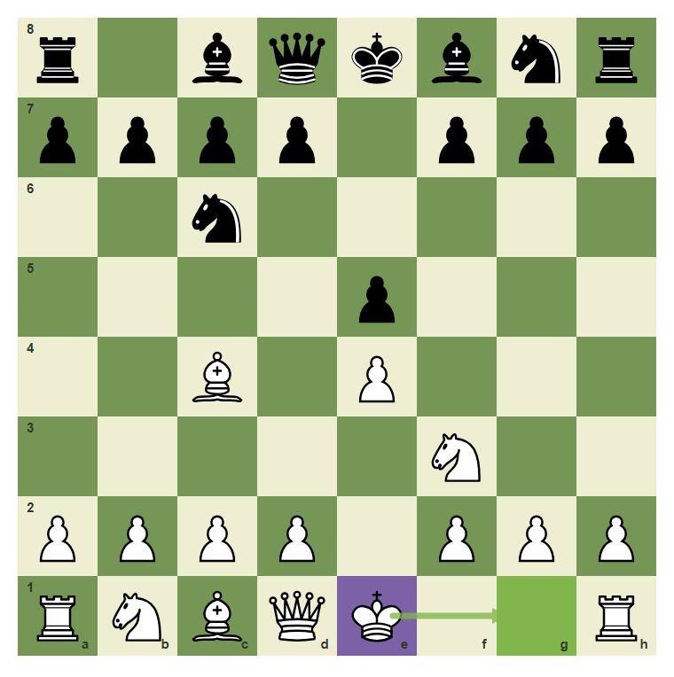

# Review Pack: Ten Survival Games: Find The Safe Move

Book: Survival Chess
Chapter: 10-survival-games
Source: ../../../chess-frontend/src/data/ebooks/v2/survival-chess/chapters/10-survival-games.json
Generated: 2026-05-05T07:36:04.007Z
Status: PASS - deterministic checks clean

## Chapter Intent

ELO range: 300-700
Required tier: free
Estimated minutes: 30

Learning objectives:
- Use CCT in mixed positions.
- Choose safety over impulse.
- Convert advantages without stalemate or loose pieces.

## Quality Gates

| Gate | Result | Detail |
| --- | --- | --- |
| Sections | PASS | 1 |
| Total blocks | PASS | 11 |
| Board-like blocks | PASS | 7 |
| Generated PNG exports | PASS | 7 |
| Interactive/check blocks | PASS | 4 |
| Deterministic warnings | PASS | 0 |
| minimum_board_diagrams >= 5 | PASS | 5 board_diagram block(s) |
| minimum_guided_moves >= 1 | PASS | 1 guided_move block(s) |
| minimum_quizzes >= 3 | PASS | 3 quiz block(s) |
| tier_allowed <= free | PASS | chapter tier is free |

## Block Review

### b02-c10-p01 - prose

Section: Put The Habits Together
Type: prose

Text under review:

```text
This final chapter mixes the whole book. Each position asks for the safest practical move, not the flashiest move.
```

Reviewer flags: none from deterministic checks.

### b02-c10-d01 - Game moment: forcing check

Section: Put The Habits Together
Type: board_diagram
FEN: `rnbqkbnr/pppp1ppp/8/4p3/2B1P3/5N2/PPPP1PPP/RNBQK2R w KQkq - 1 3`
Orientation: white
Arrows: c4-f7 (check)
Highlights: c4 (candidate), f7 (check)
Assertions: highlight_exists f7, arrow_exists c4-f7
Text square claims: f7
Text move claims: none
Visual square evidence: a8, b8, c8, d8, e8, f8, g8, h8, a7, b7, c7, d7, f7, g7, h7, e5, c4, e4, f3, a2, b2, c2, d2, f2, g2, h2, a1, b1, c1, d1, e1, h1



PNG hash: `cd7bf58c52f5ce2ea9091dff9d9699e297398d0cca9f00d58024561a62094514`

Text under review:

```text
Game moment: forcing check
The CCT scan still begins with the check on f7.
```

Reviewer flags: none from deterministic checks.

### b02-c10-d02 - Game moment: loose knight

Section: Put The Habits Together
Type: board_diagram
FEN: `rnbqkbnr/pppp1ppp/8/4n3/4P3/5N2/PPPP1PPP/RNBQKB1R w KQkq - 0 3`
Orientation: white
Arrows: f3-e5 (capture)
Highlights: f3 (candidate), e5 (capture)
Assertions: highlight_exists e5, arrow_exists f3-e5
Text square claims: e5
Text move claims: none
Visual square evidence: a8, b8, c8, d8, e8, f8, g8, h8, a7, b7, c7, d7, f7, g7, h7, e5, e4, f3, a2, b2, c2, d2, f2, g2, h2, a1, b1, c1, d1, e1, f1, h1


PNG hash: `27289613f3c66af5eec00bd72d3287377b53446efe5c66ed4392391e6a65cbbc`

Text under review:

```text
Game moment: loose knight
The knight on e5 can be captured after the scan.
```

Reviewer flags: none from deterministic checks.

### b02-c10-d03 - Game moment: defend e4

Section: Put The Habits Together
Type: board_diagram
FEN: `rnbqkb1r/pppppppp/5n2/8/4P3/8/PPPP1PPP/RNBQKBNR w KQkq - 1 2`
Orientation: white
Arrows: b1-c3 (best), c3-e4 (safe)
Highlights: b1 (candidate), c3 (best), e4 (safe)
Assertions: highlight_exists c3, highlight_exists e4, arrow_exists b1-c3
Text square claims: e4, b1, c3
Text move claims: none
Visual square evidence: a8, b8, c8, d8, e8, f8, h8, a7, b7, c7, d7, e7, f7, g7, h7, f6, e4, a2, b2, c2, d2, f2, g2, h2, a1, b1, c1, d1, e1, f1, g1, h1, c3


PNG hash: `4c0e4fdf8fd12f7c11c13cec0cac92632e8ebe775e30af1c14288714e8417d0a`

Text under review:

```text
Game moment: defend e4
The move b1-c3 develops and defends.
```

Reviewer flags: none from deterministic checks.

### b02-c10-d04 - Game moment: castle when ready

Section: Put The Habits Together
Type: board_diagram
FEN: `r1bqkbnr/pppp1ppp/2n5/4p3/2B1P3/5N2/PPPP1PPP/RNBQK2R w KQkq - 2 3`
Orientation: white
Arrows: e1-g1 (best)
Highlights: e1 (candidate), g1 (best)
Assertions: piece_on white_king e1, highlight_exists g1, arrow_exists e1-g1
Text square claims: none
Text move claims: none
Visual square evidence: a8, c8, d8, e8, f8, g8, h8, a7, b7, c7, d7, f7, g7, h7, c6, e5, c4, e4, f3, a2, b2, c2, d2, f2, g2, h2, a1, b1, c1, d1, e1, h1, g1


PNG hash: `bbcb2c368a0078f539f1c9c47349e2b59046e437076291ef3e230238b0a56aa5`

Text under review:

```text
Game moment: castle when ready
Castling is a survival move when the path is clear.
```

Reviewer flags: none from deterministic checks.

### b02-c10-d05 - Game moment: finish cleanly

Section: Put The Habits Together
Type: board_diagram
FEN: `6k1/8/6K1/8/8/8/8/R7 w - - 0 1`
Orientation: white
Arrows: a1-a8 (best)
Highlights: a1 (candidate), a8 (best)
Assertions: highlight_exists a8, arrow_exists a1-a8
Text square claims: none
Text move claims: none
Visual square evidence: g8, g6, a1, a8


PNG hash: `6df86f814dc15522f8d02a6f658057cc8a36b83f6c49ff20b85260cb25326726`

Text under review:

```text
Game moment: finish cleanly
A won rook ending still needs the final mating check.
```

Reviewer flags: none from deterministic checks.

### b02-c10-g01 - Find the safe game move

Section: Put The Habits Together
Type: guided_move
FEN: `r1bqkbnr/pppp1ppp/2n5/4p3/2B1P3/5N2/PPPP1PPP/RNBQK2R w KQkq - 2 3`
Orientation: white
Arrows: e1-g1 (best)
Highlights: e1 (candidate), g1 (best)
Assertions: legal_move e1g1, piece_on white_king e1, highlight_exists g1, arrow_exists e1-g1
Text square claims: e1, g1
Text move claims: none
Visual square evidence: a8, c8, d8, e8, f8, g8, h8, a7, b7, c7, d7, f7, g7, h7, c6, e5, c4, e4, f3, a2, b2, c2, d2, f2, g2, h2, a1, b1, c1, d1, e1, h1, g1



PNG hash: `bbcb2c368a0078f539f1c9c47349e2b59046e437076291ef3e230238b0a56aa5`

Text under review:

```text
Find the safe game move
The king is ready. Castle from e1 to g1.
Correct. You found the safe survival move.
Pause and scan checks, captures, and threats again.
```

Reviewer flags: none from deterministic checks.

### b02-c10-m01 - Common mistake: skip the survival checklist

Section: Put The Habits Together
Type: mistake_refutation
FEN: `r1bqkbnr/pppp1ppp/2n5/4p3/2B1P3/5N2/PPPP1PPP/RNBQK2R w KQkq - 2 3`
Orientation: white
Arrows: e1-g1 (best)
Highlights: e1 (candidate), g1 (best)
Assertions: highlight_exists g1, arrow_exists e1-g1
Text square claims: e1, g1
Text move claims: none
Visual square evidence: a8, c8, d8, e8, f8, g8, h8, a7, b7, c7, d7, f7, g7, h7, c6, e5, c4, e4, f3, a2, b2, c2, d2, f2, g2, h2, a1, b1, c1, d1, e1, h1, g1


PNG hash: `bbcb2c368a0078f539f1c9c47349e2b59046e437076291ef3e230238b0a56aa5`

Text under review:

```text
Common mistake: skip the survival checklist
In a real game, a safe developing or castling move often beats a pawn grab.
The safe arrow goes from e1 to g1.
```

Reviewer flags: none from deterministic checks.

### b02-c10-q01 - In mixed positions, start with:

Section: Chapter Checkpoint
Type: quiz

Text under review:

```text
In mixed positions, start with:
In mixed positions, start with:
```

Quiz options:
- [correct] a: Checks, captures, threats
- [wrong] b: The prettiest move
- [wrong] c: A random pawn

Reviewer flags: none from deterministic checks.

### b02-c10-q02 - A safe practical move can be:

Section: Chapter Checkpoint
Type: quiz

Text under review:

```text
A safe practical move can be:
A safe practical move can be:
```

Quiz options:
- [correct] a: Castling
- [wrong] b: Hanging the queen
- [wrong] c: Ignoring check

Reviewer flags: none from deterministic checks.

### b02-c10-q03 - The goal of Survival Chess is to:

Section: Chapter Checkpoint
Type: quiz

Text under review:

```text
The goal of Survival Chess is to:
The goal of Survival Chess is to:
```

Quiz options:
- [correct] a: Stop beginner losses
- [wrong] b: Memorize every opening
- [wrong] c: Avoid all captures forever

Reviewer flags: none from deterministic checks.

## Human Signoff

- Chess analyst: pending
- Visual reviewer: pending
- Pedagogy reviewer: pending
- Final editor: pending
